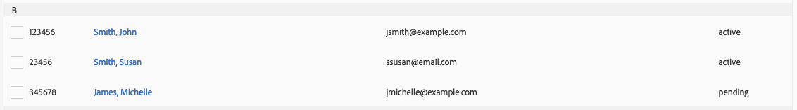

# [!UICONTROL Administration] (controles RBAC) {#administration}

>[!IMPORTANT]
>
> La administración de cuentas de usuario se está trasladando a [Admin Console](https://helpx.adobe.com/es/enterprise/using/admin-console.html). Para iniciar la migración de usuarios, es necesario que todos los clientes de Audience Manager tomen inmediatamente las medidas necesarias que se describen en este artículo: [Migración de usuarios de Audience Manager a Admin Console](admin-console-migration.md).
> 
> Cuando se hayan migrado todos los clientes, las secciones de administración de usuarios de este documento desaparecerán.

>[!IMPORTANT]
>
> Antes de poder usar [!DNL RBAC], esta característica debe habilitarse por Adobe para su organización. Póngase en contacto con el equipo de su cuenta para solicitar la activación de [!DNL RBAC] o póngase en contacto con el Servicio de atención al cliente.

Las opciones del menú [!UICONTROL Administration] le permiten crear usuarios de Audience Manager y asignarlos a grupos. También puede establecer límites de vista (características, segmentos, destinos y modelos).

Los clientes empresariales que usan [!DNL Audience Manager] necesitan una plataforma de administración de datos para todos sus datos, pero deben poder controlar la visibilidad de los diferentes elementos de datos en las unidades de negocio específicas. Puede realizar esto mediante permisos de grupo, también denominados [!UICONTROL Role-Based Access Control] ([!UICONTROL RBAC]).

[!DNL Audience Manager] utiliza grupos para asignar permisos. Los permisos no se asignan al nivel de usuario. Los permisos de grupo están vinculados a objetos ([!UICONTROL traits], segmentos, etc.) y a acciones que se pueden realizar en esos objetos (editar, ver, etc.). Estos controles también están disponibles a través de las API de REST de Audience Manager. Consulte los métodos de API [Administración de usuarios](/help/using/api/rest-api-main/aam-api-user-group-permission/aam-api-user.md), [Administración de grupos](/help/using/api/rest-api-main/aam-api-user-group-permission/aam-api-group.md) y [Administración de permisos](/help/using/api/rest-api-main/aam-api-user-group-permission/aam-api-permissions.md).

## Crear usuarios {#create-users}

<!-- t_create_users.xml -->

>[!IMPORTANT]
>
> La administración de cuentas de usuario se está trasladando a [Admin Console](https://helpx.adobe.com/es/enterprise/using/admin-console.html). Para iniciar la migración de usuarios, es necesario que todos los clientes de Audience Manager tomen inmediatamente las medidas necesarias que se describen en este artículo: [Migración de usuarios de Audience Manager a Admin Console](admin-console-migration.md).
> 
> Una vez migrados todos los clientes, la sección de administración de usuarios de este documento desaparecerá.
> 
Cree usuarios en [!DNL Audience Manager] y especifique los detalles del usuario, el estado de inicio de sesión y asigne usuarios a grupos.

1. Haga clic en **[!UICONTROL Administration]** > **[!UICONTROL Users]**.
1. Haga clic en  para mostrar la página [!UICONTROL Create New User].
1. En **[!UICONTROL User Details]**, rellene los campos:
   * **[!UICONTROL Username]:** Especifique un nombre de usuario único para el Audience Manager.
   * **[!UICONTROL First Name]:** Especifique el nombre del usuario.
   * **[!UICONTROL Last Name]:** Especifique el apellido del usuario.
   * **[!UICONTROL Email Address]:** Especifique la dirección de correo electrónico del usuario. [!DNL Audience Manager] no envía notificaciones regulares a los usuarios. Los administradores de [!DNL Audience Manager] tienen acceso a las direcciones de correo electrónico de los usuarios y pueden enviarles correos electrónicos manuales según sea necesario. Por ejemplo, si un usuario olvida su contraseña, la dirección de correo electrónico especificada en este campo se utiliza para enviar una contraseña temporal e instrucciones para restablecerla.
   * **[!UICONTROL Phone Number]:** Especifique el número de teléfono del usuario.
   * **[!UICONTROL Is Admin]:** Especifique si este usuario es administrador de [!DNL Audience Manager]. Los usuarios administradores pueden administrar usuarios (crear, editar, etc.) y grupos (crear, asignar permisos, etc.). Los usuarios no administradores solo pueden controlar sus propios perfiles de usuario, incluida la edición de sus direcciones de correo electrónico y el restablecimiento de sus propias contraseñas. Para obtener más información, consulte [Editar la configuración de la cuenta](../../features/administration/edit-account-settings.md).
1. En **[!UICONTROL Login]**, seleccione el estado que desee:
   * **[!UICONTROL Active]:** Los usuarios activos pueden obtener acceso a [!DNL Audience Manager] y los miembros del grupo les han concedido los permisos.
   * **[!UICONTROL Deactivated]:** Los usuarios desactivados no pueden acceder a [!DNL Audience Manager] y no tienen permisos. Si desactiva usuarios, su información de usuario permanece en [!DNL Audience Manager] y puede reactivarlos fácilmente, si es necesario. Si quita usuarios, debe volver a crearlos si es necesario que vuelvan a usar [!DNL Audience Manager] en el futuro.
   * **[!UICONTROL Expired]:** La contraseña de un usuario tiene más de 90 días.
   * **[!UICONTROL Pending]:** El usuario tiene una contraseña temporal, ya sea tras restablecer la contraseña o como una cuenta completamente nueva, y aún no ha establecido una contraseña permanente.
   * **[!UICONTROL Locked Out]:** 5 intentos de inicio de sesión incorrectos bloquearán a un usuario.
1. En **[!UICONTROL Assigned Groups]**, en la lista desplegable, seleccione los grupos a los que desee asignar este usuario.
Para obtener más información acerca de los grupos y permisos, vea [Crear un grupo](../../features/administration/administration-overview.md#create-group).
1. Haga clic en **[!UICONTROL Save]**.

## Crear un(a) [!UICONTROL Group] {#create-group}

>[!IMPORTANT]
>
> La administración de cuentas de usuario se está trasladando a [Admin Console](https://helpx.adobe.com/es/enterprise/using/admin-console.html). Para iniciar la migración de usuarios, se recomienda a todos los clientes Audience Manager que tomen inmediatamente las medidas necesarias que se describen en este artículo: [Migración de usuarios Audience Manager a Admin Console](admin-console-migration.md).
> 
> Cuando se hayan migrado todos los clientes, esta sección desaparecerá.

Un *grupo* es una colección de usuarios que comparten derechos de acceso a objetos [!UICONTROL destination], [!UICONTROL segment] y [!UICONTROL trait]. Puede limitar los grupos a objetos únicos o darles un amplio acceso a combinaciones de objetos diferentes.

<!-- t_create_groups.xml -->

Para crear un grupo:

1. Haga clic en **[!UICONTROL Administration]** > **[!UICONTROL Groups]**.
2. Haga clic en  para abrir la página [!UICONTROL Group Settings].
3. En [!UICONTROL Group Details]:
   * Nombre el grupo.
   * Proporcione una breve descripción del grupo.
4. En [!UICONTROL Group Members], haga clic en un usuario de **[!UICONTROL Add Users]** opciones para agregarlo al grupo.
5. En [!UICONTROL Group Permissions], seleccione un [rasgo](../../features/traits/trait-details-page.md), [segmento](../../features/segments/segments-purpose.md) o [destino](../../features/destinations/destinations.md) de **[!UICONTROL Add Object]**.
Se abrirá una ventana de permisos para el objeto seleccionado.
6. Active la casilla de verificación de los permisos que desea que tengan los miembros del grupo.
7. *(Opcional)* Asigne [Permisos de comodín](../../features/administration/administration-overview.md#wild-card-permissions) al grupo.
8. Haga clic en **[!UICONTROL Save Group]**.

## Explicación de [!UICONTROL Wild Card Permissions] {#wild-card-permissions}

>[!IMPORTANT]
>
> La administración de cuentas de usuario se está trasladando a [Admin Console](https://helpx.adobe.com/es/enterprise/using/admin-console.html). Para iniciar la migración de usuarios, se recomienda a todos los clientes Audience Manager que tomen inmediatamente las medidas necesarias que se describen en este artículo: [Migración de usuarios Audience Manager a Admin Console](admin-console-migration.md).
> 
> Cuando se hayan migrado todos los clientes, esta sección desaparecerá.

Simplifique la administración de derechos de grupo con [!UICONTROL Wild Card Permissions].

<!-- c_wildcard_permissions.xml -->

[!UICONTROL Wild Card Permissions] proporciona a los miembros del grupo acceso automático a cada origen de datos asociado a [!UICONTROL segment], [!UICONTROL destination] o [!UICONTROL trait]. En comparación, los permisos regulares solo permiten asignar [!UICONTROL data sources] específicos a uno de estos objetos. Y, cuando se agregan nuevos [!UICONTROL data sources], los miembros del grupo no tienen acceso a esas nuevas fuentes.

Debe abrir los permisos de grupo y asignar los nuevos [!UICONTROL data sources] al grupo. [!UICONTROL Wild Card Permissions] le permite evitar este proceso de actualización manual de [!UICONTROL data source]. Los grupos con [!UICONTROL Wild Card Permissions] obtienen acceso a [!UICONTROL data sources] nuevos sin autorización explícita.

Lea a continuación una descripción del significado de cada [!UICONTROL wildcard permission]:

**[!UICONTROL Trait]**

* `MAP_ALL_TRAITS_TO_MODELS` - Los usuarios pueden seleccionar [!UICONTROL traits] como línea de base para [!UICONTROL models].
* `EDIT_ALL_TRAITS`: los usuarios pueden editar todos los [!UICONTROL traits] configurados en su cuenta de compañía.
* `VIEW_ALL_TRAITS`: los usuarios pueden ver todos los [!UICONTROL traits] configurados en su cuenta de compañía.
* `DELETE_ALL_TRAITS` - Los usuarios pueden eliminar todos los [!UICONTROL traits] configurados en su cuenta de compañía.
* `CREATE_ALL_ALGO_TRAITS` - Los usuarios pueden crear [!UICONTROL algorithmic traits].
* `MAP_ALL_TO_SEGMENTS` - Los usuarios pueden agregar cualquiera de los [!UICONTROL traits] que pertenecen a su compañía a [!UICONTROL segments].
* `CREATE_ALL_TRAITS` - Los usuarios pueden crear [!UICONTROL traits].

**[!UICONTROL Models]**

* `VIEW_MODELS` - Los usuarios tienen permiso para ver [!UICONTROL models] que pertenecen a su compañía.

**[!UICONTROL Derived Signals]**

* `VIEW_DERIVED_SIGNALS`: los usuarios pueden ver todos los [!UICONTROL derived signals] que pertenecen a su compañía.
* `CREATE_DERIVED_SIGNALS` - Los usuarios pueden crear [!UICONTROL derived signals].
* `EDIT_DERIVED_SIGNALS`: los usuarios pueden editar todos los [!UICONTROL derived signals] que pertenecen a su compañía.
* `DELETE_DERIVED_SIGNALS` - Los usuarios pueden eliminar cualquiera de los [!UICONTROL derived signals] que pertenecen a su compañía.

**[!UICONTROL Destination]**

* `EDIT_ALL_DESTINATIONS`: los usuarios pueden editar todos los [!UICONTROL destinations] configurados en su cuenta de compañía.
* `CREATE_DESTINATIONS` - Los usuarios pueden crear [!UICONTROL destinations].
* `VIEW_ALL_DESTINATIONS`: los usuarios pueden ver todos los [!UICONTROL destinations] configurados en su cuenta de compañía.
* `DELETE_ALL_DESTINATIONS`: los usuarios pueden eliminar todos los [!UICONTROL destinations] configurados en su cuenta de compañía.

**[!UICONTROL Tags]**

* `VIEW_TAGS`: los usuarios pueden hacer de todo (ver, crear, editar, eliminar) en su [!UICONTROL Tag Containers].

**[!UICONTROL Audience Lab]**

* `MANAGE_SEGMENT_TEST_GROUPS`: los usuarios pueden hacer de todo (ver, crear, editar, eliminar) en sus [!UICONTROL Audience Lab] grupos de prueba.

**[!UICONTROL Segment]**

* `CREATE_ALL_SEGMENTS`: los usuarios pueden crear segmentos.
* `DELETE_ALL_SEGMENTS`: los usuarios pueden eliminar todos los segmentos configurados en su cuenta de compañía.
* `MAP_ALL_TO_DESTINATIONS`: los usuarios pueden asignar cualquiera de los segmentos que pertenecen a su compañía a destinos.
* `EDIT_ALL_SEGMENTS`: los usuarios pueden editar todos los segmentos configurados en su cuenta de compañía.
* `MAP_ALL_SEGMENTS_TO_MODELS`: los usuarios pueden seleccionar segmentos como línea de base para los modelos.
* `VIEW_ALL_SEGMENTS`: los usuarios pueden ver todos los segmentos configurados en su cuenta de compañía.

**[!UICONTROL Signals]**

* `VIEW_ALL_SIGNALS`: los usuarios pueden ver todas las señales capturadas en [Data Explorer](/help/using/features/data-explorer/data-explorer-overview.md).

## Casos de uso {#use-cases}

### Supervisión del acceso de los usuarios {#monitoring-user-access}

[!UICONTROL Role-Based Access Control] puede ayudarle a supervisar el estado de inicio de sesión del usuario, lo que le ofrece una idea clara de quién puede acceder a la instancia de Audience Manager.

Según los requisitos de su empresa, puede habilitar y deshabilitar cuentas de usuario según sea necesario.

### Garantizar la protección de acceso para los elementos confidenciales [!UICONTROL Data Sources] {#protect-sensitive-data-sources}

Puede configurar [!UICONTROL Role-Based Access Control] en los niveles [!UICONTROL trait], segmento y [!UICONTROL destination] para cada grupo de usuarios.

Esta capacidad le ayuda a administrar la forma en que los usuarios ven, crean, leen, escriben y editan conjuntos de datos específicos, e incluso a restringir el acceso de los usuarios a conjuntos de datos que no deberían estar disponibles para ellos.

