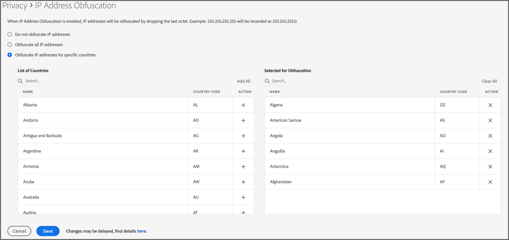

# Complicación de la dirección IP {#ip-obfuscation}

Utilice esta función para confundir las direcciones IP recopiladas en el Audience Manager.

## Información general y metodología {#overview-and-methodology}

Es posible que su empresa desee complicar la dirección IP en muchos países debido a las normativas de privacidad globales. Audience Manager le permite complicar las direcciones IP de los visitantes en forma global o por país.

### Metodología de confusión de IP

Siguiendo los principios de &quot;Privacidad por diseño&quot;, Adobe Audience Manager permite a los clientes habilitar la confusión de IP desde la interfaz de usuario, ya sea globalmente en todas las regiones geográficas o para países específicos. Cuando habilita esta configuración, el último octeto (la última parte) de la dirección IP se descarta inmediatamente cuando la dirección IP se ingesta en Audience Manager. El Audience Manager descarta esta parte de la dirección IP antes del procesamiento (incluso antes de cualquier búsqueda geográfica opcional o registro de la dirección IP). Por ejemplo:

* Antes de la confusión: `255.255.255.255`
* Después de la confusión: `255.255.255.0`

Consulte también Recopilación de direcciones IP y confusión de direcciones IP en nuestra [sección Privacidad de datos](/help/using/overview/data-security-and-privacy/data-privacy.md).

## Requisitos de confusión de direcciones IP {#ip-obfuscation-requirements}

La confusión de direcciones IP solo está disponible para las cuentas de administrador del Audience Manager. Consulte [Crear usuarios](/help/using/features/administration/administration-overview.md#create-users) para comprender cómo asignar privilegios de administrador a un usuario.

>[!NOTE]
>
> Debido al gran volumen de datos procesados por el Audience Manager, los cambios de confusión de IP pueden tardar hasta 4 horas en entrar en vigor, desde el momento en que se actualiza la configuración.

## Configurar la confusión de direcciones IP {#configure-ip-obfuscation}

Siga los pasos a continuación para configurar la confusión de direcciones IP.

1. Inicie sesión en el Audience Manager con una cuenta de administrador y vaya a **Administración > Privacidad**.
2. Elija el tipo de confusión de IP que desee utilizar.
   1. **Proteger todas las direcciones IP:** seleccione esta opción para que el Audience Manager confunda el último octeto de todas las direcciones IP de visitante, independientemente de la región de la que procedan.
   2. **Proteger direcciones IP para países específicos:** seleccione esta opción para que el Audience Manager confunda el último octeto de direcciones IP de visitante para países específicos. Utilice la **Lista de Países** o el campo correspondiente **Buscar** para encontrar los países para habilitar la confusión de IP y haga clic en el icono + para agregarlos a la lista **Seleccionado para confusión**. Una vez que haya agregado todos los países requeridos a la lista **Seleccionado para confusión**, haga clic en **Guardar**.

## Deshabilitar confusión de direcciones IP {#disable-ip-obfuscation}

Para deshabilitar la confusión global de direcciones IP, vaya a **Administración > Privacidad**, seleccione **No confundir direcciones IP** y haga clic en **Guardar**.

Para desactivar la confusión de direcciones IP para países específicos, busque los países en la lista **Seleccionado para confusión** y haga clic en su icono **X** correspondiente. Haga clic en **Guardar** cuando haya terminado.

## Conceptos relacionados {#related-concepts}

* [Privacidad de datos](/help/using/overview/data-security-and-privacy/data-privacy.md)
* Demostración en vídeo de confusión de direcciones IP
>[!VIDEO](https://video.tv.adobe.com/v/27218/)

