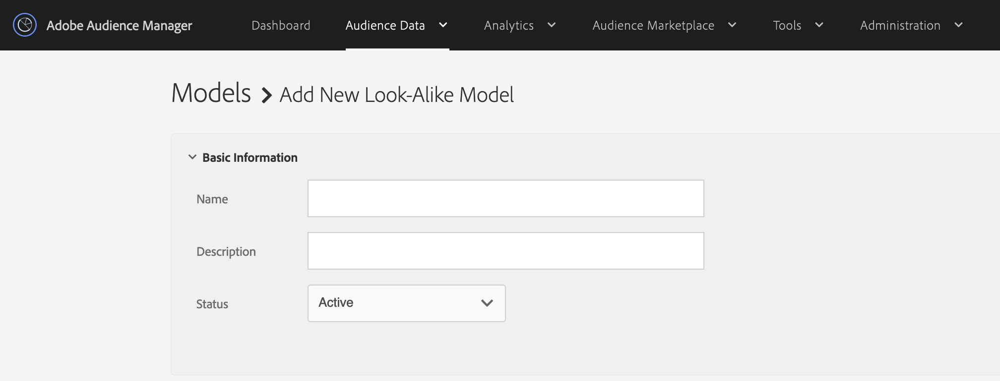

# Creación de un modelo de similitud {#create-an-algorithmic-model}

Describe los pasos opcionales y requeridos para crear un(a) [!UICONTROL Look-Alike Model].

## Sección del creador de modelos

[!UICONTROL Model Builder] consta de [!UICONTROL Basic Information] y [!UICONTROL Configuration] secciones. Para crear un modelo, complete los campos obligatorios en estas dos secciones. Guarde el modelo para iniciar el algoritmo. [!DNL Audience Manager] le envía una notificación automatizada una vez finalizada la primera ejecución de datos. Después de recibir el correo electrónico, puedes ir a [Generador de rasgos](../../features/traits/about-trait-builder.md) y crear rasgos algorítmicos.

>[!NOTE]
>
>* El proceso de modelado se ejecuta solo una vez si crea un modelo y no genera ningún rasgo con él.
>* Generar modelos a partir de fuentes de datos que contengan una cantidad significativa de información. Los modelos con datos insuficientes se ejecutarán, pero no devolverán resultados.
>* *No* cree modelos con otros rasgos o segmentos algorítmicos.
>* La notificación automática por correo electrónico se envía una sola vez (después de la primera ejecución de datos).

## Creación del modelo

Siga los pasos a continuación para generar un [!UICONTROL Look-Alike Model]:

1. Vaya a **[!UICONTROL Audience Data]** > **[!UICONTROL Models]** y haga clic en **[!UICONTROL Add New]** en la sección [!UICONTROL Look-Alike Modeling].
   
1. En la sección [Información básica](../../features/algorithmic-models/create-model.md#basic-information)
   * Asigne un nombre al modelo.
   * *(Opcional)* Proporcione una breve descripción sobre el modelo.
   * Establezca el estado del modelo en **[!UICONTROL Active]** o **[!UICONTROL Inactive]**. Los modelos inactivos no se ejecutarán y no producirán ningún dato.

     
1. En la sección [Configuración](../../features/algorithmic-models/create-model.md#configuration):
   * Haga clic en **[!UICONTROL Browse All Traits]** o **[!UICONTROL Browse All Segments]** para seleccionar un rasgo o segmento con el que desee modelar. Busque rasgos por nombre, ID, descripción o fuente de datos. Haga clic en una carpeta mientras busca para limitar los resultados a esa carpeta y sus subcarpetas. También puede filtrar características por tipo de característica ([!UICONTROL Folder Trait], [!UICONTROL Rule-based], [!UICONTROL Onboarded] y [!UICONTROL Algorithmic]) o tipo de población ([ID de dispositivo](../../reference/ids-in-aam.md) e [ID entre dispositivos](../../reference/ids-in-aam.md)).

     
   * Elija un periodo retrospectivo de 30, 60 o 90 días. Esto establece un intervalo de tiempo para el modelo.
   * El algoritmo [!UICONTROL TraitWeight] está seleccionado de manera predeterminada.
   * Seleccione un origen de datos de la lista [!UICONTROL Available Data].
   * Haga clic en **[!UICONTROL Save]** cuando termine.

     

Vea el siguiente vídeo para obtener una visión detallada de cómo funcionan las métricas entre dispositivos.

>[!VIDEO](https://experienceleague.adobe.com/docs/audience-manager-learn/tutorials/build-and-manage-audiences/profile-merge/understanding-cross-device-metrics-in-audience-manager.html)

## Información básica para modelos algorítmicos {#basic-information}

<!-- r_model_basic.xml -->

En [!UICONTROL Model Builder], la configuración de [!UICONTROL Basic Information] le permite crear modelos nuevos o editar los existentes. Para crear un nuevo modelo, proporcione un nombre y continúe con la configuración de [!UICONTROL Configuration]. El campo de descripción es opcional.

| Campo | Descripción |
|---|---|
| **[!UICONTROL Name]** | Asigne al modelo un nombre corto y lógico que describa su función o propósito. Evite las abreviaciones, los caracteres especiales y los acentos. |
| **[!UICONTROL Description]** | Campo para obtener información descriptiva adicional sobre el modelo. |
| **[!UICONTROL Status]** | Activa o desactiva el modelo (activo de forma predeterminada). |

## Configuración {#configuration}

En [!UICONTROL Model Builder], la sección [!UICONTROL Configuration] permite agregar características o segmentos al modelo. En esta sección, seleccione un rasgo o segmento de línea de base, un período retroactivo y datos de las fuentes de datos de origen y de terceros.

<!-- r_model_configuration.xml -->

### Requisitos previos

Rellene primero los campos obligatorios de la sección [!UICONTROL Basic Information].

<table id="table_7A6BE5E5498D4776A30323B743954150"> 
 <thead> 
  <tr> 
   <th colname="col1" class="entry"> Campo </th> 
   <th colname="col2" class="entry"> Descripción </th> 
  </tr> 
 </thead>
 <tbody> 
  <tr> 
   <td colname="col1"> 
<b>Seleccionar un rasgo o segmento de línea de base (1)</b> 
 </td> 
   <td colname="col2"> 
Haga clic en el botón rasgo o segmento para ver una lista de todos sus rasgos o segmentos. El segmento o rasgo seleccionado se convierte en la línea de base que los algoritmos del sistema utilizan para el modelado. 
 
 
<b>Nota</b>: selecciona un rasgo incorporado, un rasgo basado en reglas o un segmento como línea de base. De lo contrario, los modelos no se ejecutarán. 
 
 </td> 
  </tr> 
  <tr> 
   <td colname="col1"> 
<b>Seleccionar período retrospectivo (2)</b> 
 </td> 
   <td colname="col2"> 
Define un intervalo de tiempo para el modelo. En función de su selección, el algoritmo incluye y evalúa los datos de los 30, 60 o 90 días anteriores. 
 </td> 
  </tr> 
  <tr> 
   <td colname="col1"> 
<b>Seleccionar algoritmo (3)</b> 
 </td> 
   <td colname="col2"> 
En este momento, el Generador de modelos funciona únicamente con nuestro algoritmo  de propiedad exclusiva de peso de rasgos. El Audience Manager   puede agregar otras funciones algorítmicas en versiones posteriores. 
 </td>
  </tr>
  <tr> 
   <td colname="col1"> 
<b>Seleccionar datos de modelo del Source de datos (4)</b> 
 </td> 
   <td colname="col2"> 
Permite seleccionar las fuentes de datos iniciales y de terceros que desea utilizar en el modelo. 
 </td>
  </tr> 
  <tr> 
   <td colname="col1"> 
<b>Exclusiones (5)</b> 
 </td> 
   <td colname="col2"> 
Puede excluir rasgos de las fuentes de datos seleccionadas para el modelado. Utilice la lista  Exclusiones y lea <a href="../../features/algorithmic-models/trait-exclusion-algo-models.md"> Modelos algorítmicos: Exclusión de rasgos</a> para obtener más información. 
 </td>
  </tr> 
 </tbody>
</table>

Vea el siguiente vídeo para aprender a crear un modelo de similitud de origen, de modo que pueda encontrar más visitantes propios que se parezcan a sus convertidores.

>[!VIDEO](https://video.tv.adobe.com/v/23504/)

>[!MORELIKETHIS]
>
>* [Explicación de TraitWeight](../../features/algorithmic-models/understanding-models.md#understanding-traitweight)
