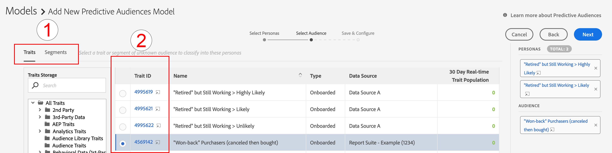

# Introducción a las Predictive Audiences {#predictive-audiences-getting-started}

>[!IMPORTANT]
>Este artículo contiene documentación del producto que le guiará a través de la configuración y el uso de esta función. Nada de lo que contiene aquí es asesoramiento legal. Por favor, consulte a su propio asesor legal para obtener orientación legal.

## Creación de un modelo de Predictive Audiences {#create-predictive-audiences}

Antes de crear un [!UICONTROL Predictive Audiences] , debe decidir qué fuente de datos de origen desea asignar a su [!UICONTROL Predictive Audiences] rasgos y segmentos para. Puede utilizar una fuente de datos de origen existente o crear una nueva. Consulte [Administrar fuentes de datos](https://experienceleague.adobe.com/docs/audience-manager/user-guide/features/data-sources/manage-datasources.html) para obtener más información sobre cómo crear un nuevo origen de datos.

Una vez que sepa qué fuente de datos va a utilizar, siga los pasos a continuación.

1. Ir a **[!UICONTROL Audience Data]** > **[!UICONTROL Models]**.
1. En el [!UICONTROL Predictive Audiences] , haga clic en **[!UICONTROL Add New]**.

   

1. A continuación, defina los perfiles por los que desea clasificar la audiencia. Puede hacerlo eligiendo características o segmentos desde los cuales crear personalidades. Utilice el [!UICONTROL Traits] y [!UICONTROL Segments] pestañas en la esquina superior izquierda de la pantalla para cambiar entre el catálogo de rasgos y segmentos. Una vez identificados los rasgos o segmentos que desea utilizar como perfiles, haga clic en el **[!UICONTROL Add]** en el menú [!UICONTROL Action] columna.
   
   >[!NOTE]
   >Debe elegir un mínimo de dos rasgos o dos segmentos para los perfiles de línea de base. No se puede utilizar una combinación de rasgos y segmentos.
1. Clic **[!UICONTROL Next]** después de definir las personalidades.
1. A continuación, seleccione la audiencia de origen que desee clasificar eligiendo un rasgo o segmento de origen para esta audiencia. Utilice el [!UICONTROL Traits] y [!UICONTROL Segments] pestañas en la esquina superior izquierda de la pantalla para cambiar entre el catálogo de rasgos y segmentos. Seleccione el rasgo o segmento de origen que desee utilizar como audiencia para agregarlo al modelo.
   
1. Clic **[!UICONTROL Next]** después de elegir la audiencia.
1. Rellene los detalles del modelo:
   * **[!UICONTROL Model Name]**: introduzca un nombre descriptivo para el modelo, que le ayudará a identificarlo más adelante. Los nombres de los segmentos generados por el modelo empezarán por el nombre del modelo.
   * **[!UICONTROL Description]**: introduzca una descripción del modelo que le ayudará a identificar su caso de uso.
   * **[!UICONTROL Data Source]**: seleccione la fuente de datos de origen que desea que el [!UICONTROL Predictive Audiences] segmentos de este modelo a los que asignar.
   * **[!UICONTROL Profile Merge Rule]**: seleccione la [!UICONTROL Profile Merge Rule] para asignar a todos los elementos predictivos [!UICONTROL segments] creado por este modelo. Si la audiencia de destino seleccionada es un [!UICONTROL segment], recomendamos seleccionar lo mismo [!UICONTROL Profile Merge Rule] de la audiencia de destino.
      
1. Haga clic **[!UICONTROL Save]**.

## Clonación y edición de modelos de Predictive Audience {#clone-predictive-audiences}

El Audience Manager no admite la edición de archivos existentes [!UICONTROL Predictive Audiences] modelos. Para cambiar la configuración de un modelo, puede crear un clon de un modelo existente y editarlo. A continuación se muestra cómo puede hacer esto:

1. Ir a **[!UICONTROL Audience Data]** > **[!UICONTROL Models]**.
2. Haga clic en el nombre del [!UICONTROL Predictive Audiences] modelo que desea clonar.
3. Haga clic en **[!UICONTROL Clone]** en la parte superior izquierda de la pantalla.
   
4. Una vez clonado el modelo, se le redirige a [!DNL Save & Configure] del modelo clonado. En esta página, puede cambiar el [!UICONTROL data source] y el asignado[!UICONTROL Profile Merge Rule] del modelo. Para editar las personalidades y la audiencia de destino del modelo clonado, utilice el [!UICONTROL Back] y [!UICONTROL Next] para desplazarse entre las tres pestañas o hacer clic en los tres nombres de las pestañas

   

5. Cuando haya terminado de editar un modelo, haga clic en **[!UICONTROL Save]**.

## Eliminación de Predictive Audiences {#delete-predictive-audiences}

Para eliminar una [!UICONTROL Predictive Audiences] modelo, vaya a **[!UICONTROL Audience Data]** > **[!UICONTROL Models]**, busque el modelo que desea eliminar y haga clic en el botón **[!UICONTROL Delete]** icono.
