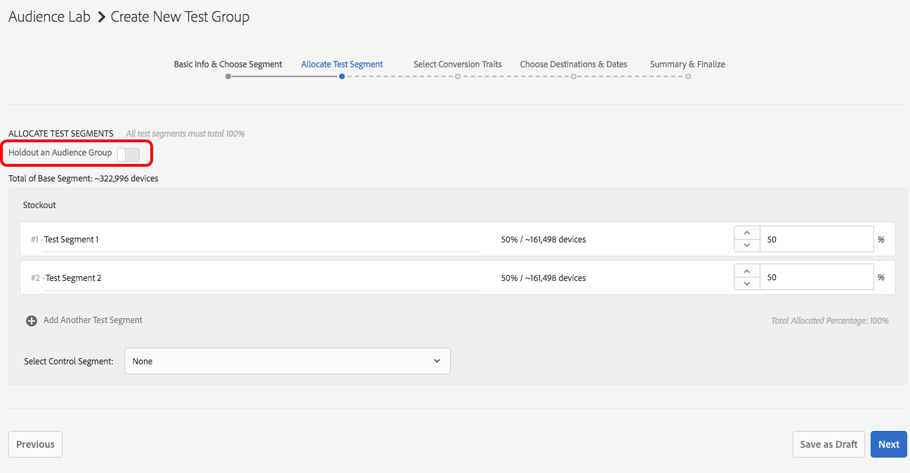

# [!DNL Audience Lab] funcionalidad avanzada {#audience-lab-advanced-functionality}

Este artículo describe dos características que proporcionan funcionalidad avanzada para [!DNL Audience Lab]: [!DNL Duplicate Allocation Template] y [!DNL Segment Holdout].

## Duplicar plantilla de asignación {#duplicate-allocation-template}

<!-- 

The <b>Allocation Template</b> represents how you split a test group into test segments and the way the test segments are mapped to destinations. 

 -->

En [!DNL Audience Lab], [!DNL Allocation Template] representa las distintas selecciones que realiza al crear un grupo de prueba:

* la distribución de los dispositivos entre los segmentos de ensayo;
* la asignación de segmentos de prueba a destinos;
* Los rasgos de conversión utilizados para un grupo de prueba;
* Intervalo de fecha en el que el grupo de prueba publica en los destinos seleccionados.

Al duplicar una plantilla de asignación, puede reutilizar la misma distribución de segmentos y destinos de prueba para un segmento base diferente en un nuevo grupo de prueba. A continuación se muestra un ejemplo de plantilla de asignación. La imagen se ha tomado del paso [!UICONTROL Summary & Finalize] del flujo de trabajo **Crear grupo de prueba**.

<!--
With the option to duplicate allocation templates, you can increase your productivity when running multivariate tests as part of multivariate campaigns.
-->

### Uso de la plantilla de asignación duplicada

Cree un grupo de prueba inicial y, a continuación, seleccione **[!UICONTROL Duplicate Allocation Template]** para reutilizar la misma configuración en varios grupos de prueba. Por ejemplo, puede utilizar esta función si está realizando una prueba en la que desea determinar la eficacia de varios destinos para varios segmentos.

1. En la vista principal de Audience Lab, busque el grupo de prueba cuya plantilla de asignación desee reproducir en un nuevo grupo de prueba. En el cuadro desplegable, seleccione **[!UICONTROL Duplicate Allocation Template]**.

   

2. En el asistente [!UICONTROL Create Test Group], puede especificar un segmento base y cambiar el nombre de los segmentos de prueba, si lo desea.
3. Usted *no puede* modificar:

   * la distribución de los dispositivos entre los segmentos de ensayo;
   * Los rasgos de conversión;
   * Asignación de segmentos de prueba a destinos. Solo puede rellenar la clave de asignación para los destinos que requieran uno.
   * Intervalo de fechas en el que el grupo de prueba publicará en los destinos seleccionados.

4. Revise la información que agregó en los pasos anteriores y seleccione **[!UICONTROL Finalize Group]**.

## Holdout del segmento de prueba {#test-segment-holdout}

>[!NOTE]
>
>[!UICONTROL Test Segment Holdout] es una funcionalidad avanzada activada a petición del cliente. Póngase en contacto con [!DNL Customer Care] o [!DNL Adobe Consulting] para activar esta característica.

Utilice esta función para evitar que parte de la audiencia se incluya en la prueba. El porcentaje que seleccione se excluirá de la prueba. De este modo, puede medir y comparar el número de conversiones de audiencias de destino (activadas en destinos) y sin objetivo (grupo de exclusión).

<!--

Note that this option is different to the control segment because it subtracts the percentage ................. You can withhold an audience group and still use a control segment. 

-->

### Uso del Holdout de segmentos de prueba

1. Cree un nuevo grupo de prueba con el asistente [!UICONTROL Create Test Group].
1. En el paso **[!UICONTROL Allocate Test Segment]**, puede seleccionar una parte de la audiencia que no se probará.

   

1. Utilice el control deslizante para ajustar cuántos dispositivos desea retener en las pruebas. Observe cómo el Segmento de prueba 1 y el Segmento de prueba 2 ahora solo representan el 70 % del total de dispositivos.

   

1. Siga los demás pasos del flujo de trabajo **[!UICONTROL Create Test Group]** y seleccione **[!UICONTROL Finalize Group]** cuando esté satisfecho con la selección. Ahora tiene un grupo de prueba con parte de la audiencia bloqueada en la prueba.
