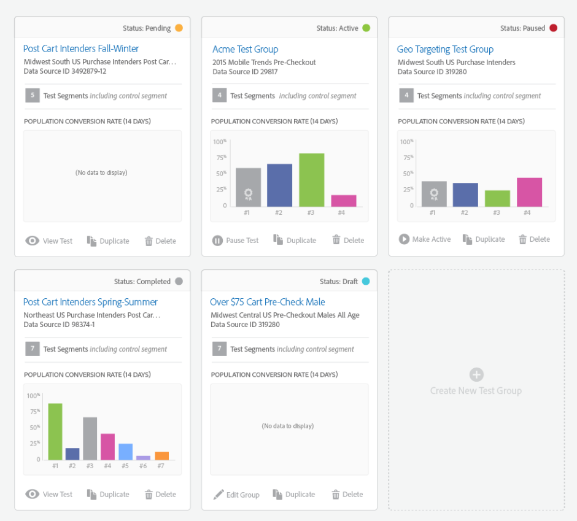

# [!UICONTROL Audience Lab] {#audience-lab}

Cree segmentos de prueba mutuamente excluyentes en [!UICONTROL Segment Test Groups] para comparar y medir la efectividad de diferentes destinos. Puede apartar un grupo de control y dividir el segmento en porcentajes de un todo para probar la eficacia.

## Información general {#audience-lab-overview}

[!UICONTROL Audience Lab] usa [vínculo de perfil](../../features/profile-merge-rules/merge-rules-overview.md) para las pruebas entre dispositivos. Esto ayuda a garantizar que un usuario cumpla los requisitos del mismo segmento de prueba y reciba el mismo tratamiento en todos los dispositivos. Los segmentos de prueba de los grupos de prueba heredarán la [regla de combinación de perfiles](../../features/profile-merge-rules/merge-rules-dashboard.md) que el segmento base le haya asignado.

La vista predeterminada [!UICONTROL Audience Lab] muestra una tarjeta para cada uno de los grupos de prueba. Haga clic en una tarjeta para acceder a la vista **[!UICONTROL Test Group]**. Esta vista incluye la siguiente información:

* **[Información del grupo de prueba](../../features/audience-lab/audience-lab-information-view.md)**
* **[Sistema de informes de grupo de prueba](../../features/audience-lab/audience-lab-reporting-view.md)**

Puede crear **hasta 10 grupos de prueba**, cada uno con **hasta 15 segmentos de prueba**.

## Buscar y filtrar grupos de prueba {#search-and-filter}

Una vez que comience a crear varios grupos de pruebas con varios segmentos de prueba, puede resultar más fácil utilizar el cuadro de búsqueda para encontrar un grupo de pruebas específico. Para buscar un grupo de prueba, haga lo siguiente:

* el nombre del grupo de prueba;
* El nombre de cualquiera de los segmentos de prueba del grupo de prueba;
* Descripción del grupo de prueba.

También puede filtrar los grupos de prueba por estado. Todos los estados disponibles se describen en la sección [Estado](../../features/audience-lab/audience-lab.md#status) a continuación.

## [!UICONTROL Status] {#status}

El estado de un grupo de prueba puede ser activo, programado, pausado, en borrador o completado. En la tabla siguiente se proporciona más información sobre cada uno de ellos:

<table id="table_7A0388BA02E045AC971C06A22DAC2C63"> 
 <thead> 
  <tr> 
   <th colname="col1" class="entry"> Estado </th> 
   <th colname="col2" class="entry"> Descripción </th> 
  </tr> 
 </thead>
 <tbody> 
  <tr> 
   <td colname="col1"> 
 <b> activo </b> 
 </td> 
   <td colname="col2"> 
Un grupo de prueba <i>active</i> significa que los datos se están enviando a los destinos. Pulse <b> Pausar prueba </b> en la tarjeta del grupo de prueba <b> de </b> para suspender el envío de datos a los destinos. 
 </td> 
  </tr> 
  <tr> 
   <td colname="col1"> 
 <b> programado </b> 
 </td> 
   <td colname="col2"> 
Un grupo de prueba <i>programado</i> aún no está activo, pero ya no se puede editar. Se activará en la fecha de inicio seleccionada en el asistente <b>Crear grupos de prueba</b>. 
 </td> 
  </tr> 
  <tr> 
   <td colname="col1"> 
 <b> pausó </b> 
 </td> 
   <td colname="col2"> 
Un grupo de prueba <i>pausado</i> no envía datos actualmente a los destinos. Pulse <b> Hacer activo </b> en la tarjeta del grupo de prueba <b> de </b> para reanudar el envío de características. 
 </td> 
  </tr> 
  <tr> 
   <td colname="col1"> 
 <b> borrador </b> 
 </td> 
   <td colname="col2"> 
Un grupo de prueba <i>borrador</i> aún no está activo y se puede editar. Todavía no envía datos a los destinos asignados. 
 </td> 
  </tr> 
  <tr> 
   <td colname="col1"> 
 <b> completó </b> 
 </td> 
   <td colname="col2"> 
Un grupo de prueba <i>completado</i> ha alcanzado la fecha de finalización seleccionada en el asistente <b> Crear grupos de prueba </b> y ha dejado de enviar datos de informes. 
 </td>
  </tr>
 </tbody>
</table>

## [!UICONTROL Actions] {#actions}

<table id="table_481A411E2D2F4FE891595D00E775CF60"> 
 <thead> 
  <tr> 
   <th colname="col1" class="entry"> Acciones </th> 
   <th colname="col2" class="entry"> Descripción </th>
  </tr>
 </thead>
 <tbody> 
  <tr> 
   <td colname="col1"> 
 <b> Editar </b> 
 </td>
   <td colname="col2"> 
Disponible <b>solamente</b> para los grupos de prueba de borrador. Permite reanudar el asistente <b> Crear nuevo grupo de prueba </b>. 
 </td>
  </tr>
  <tr> 
   <td colname="col1"> 
 <b> Pausar </b> 
 </td>
   <td colname="col2"> 
Disponible para grupos de prueba activos. Permite pausar el envío de segmentos de prueba a destinos. 
 </td>
  </tr>
  <tr> 
   <td colname="col1"> 
 <b> Hacer Activo </b> 
 </td>
   <td colname="col2"> 
Disponible para grupos de prueba en pausa. Permite reanudar el envío de segmentos de prueba a destinos. 
 </td>
  </tr>
  <tr> 
   <td colname="col1"> 
 <b> vista </b> 
 </td>
   <td colname="col2"> 
Disponible para grupos de prueba completados. Permite ver la información de informes que ha generado la prueba. 
 </td>
  </tr>
  <tr> 
   <td colname="col1"> 
 <b> duplicado </b> 
 </td>
   <td colname="col2"> 
Permite crear un nuevo grupo de prueba con la misma configuración que el que está duplicando. 
 </td>
  </tr>
  <tr> 
   <td colname="col1"> 
 <b> Eliminar </b> 
 </td>
   <td colname="col2"> 
Permite eliminar un grupo de prueba. Los segmentos de prueba se desasignarán de los destinos, el segmento de línea de base y los rasgos de conversión asociados al grupo de prueba se pueden editar por completo. Una alerta le pedirá que descargue el archivo CSV cuando elimine un grupo de prueba para guardar los informes si lo desea. 
 </td>
  </tr>
 </tbody>
</table>
