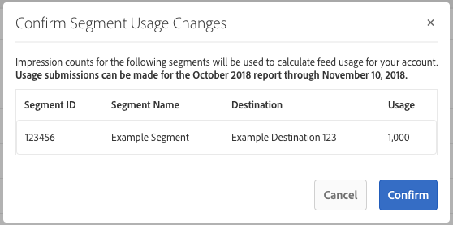

# Facturación para compradores de fuentes de datos {#billing-for-data-feed-buyers}

Los compradores de datos Audience Marketplace aceptan informar de todas las impresiones de publicidad servidas mediante las características incluidas en la fuente de datos con un precio de coste por cada mil impresiones de publicidad ([!DNL CPM]) base. [!DNL CPM] el uso vence el quinto día de cada mes calendario e incluye datos del mes anterior. Los suscriptores de tarifa plana no necesitan informar sobre el uso.

  

## Cómo informar sobre el uso de CPM {#report-cpm-usage}

<!-- t_marketplace_report_cpm_usage.xml -->

[!UICONTROL Audience Marketplace] los compradores de datos acuerdan informar de todas las impresiones de publicidad servidas mediante características incluidas en la fuente de datos con un precio de coste por cada mil impresiones de publicidad ([!DNL CPM]) base. [!DNL CPM] el uso vence el día 5 de cada mes calendario e incluye datos del mes anterior. Los suscriptores de tarifa plana no necesitan informar sobre el uso.

[!UICONTROL Audience Marketplace] ofrece dos formas de informar [!DNL CPM] uso:

* **Creación de informes de nivel de segmento**: este es el recomendado [!DNL CPM] método de informes de uso. Cuando se informa [!DNL CPM] uso en el nivel de segmento, la sección de informes en el nivel de fuente de datos se rellena automáticamente con las cantidades de uso correspondientes, según los algoritmos descritos en [Atribución de costes para fuentes de datos de CPM](#cost-attribution).
* **Informes de nivel de fuente de datos**: este método requiere que informe individualmente del [!DNL CPM] para cada fuente de datos, en función de los algoritmos descritos en [Atribución de costes para fuentes de datos de CPM](#cost-attribution). Sin embargo, este método es más tedioso y propenso a errores que los informes de nivel de segmento.

  

## Informe de uso de CPM en el nivel de segmento {#segment-level-report}

El [!UICONTROL Segment Usage] le permite informar sobre el uso a nivel de segmento, mientras muestra los segmentos agrupados por los destinos a los que están asignados.

Después de informar [!DNL CPM] uso en el nivel de segmento, [!UICONTROL Audience Marketplace] asigna automáticamente las fuentes de datos correspondientes al uso correcto, en función de la variable [Atribución de costes para fuentes de datos de CPM](#cost-attribution).

Para informar [!DNL CPM] uso en el nivel de segmento:

1. Ir a **[!UICONTROL Audience Marketplace > Payables]**.
1. Seleccione el **[!UICONTROL Segment Usage]** pestaña.
1. Complete el uso de los segmentos. Puede usar el complemento [!UICONTROL Search] para filtrar los segmentos si solo necesita informar del uso de algunos de ellos.
1. Haga clic **[!UICONTROL Edit Segments Usage]**.
1. Introduzca el [!DNL CPM] importe de uso en [!UICONTROL Usage] columna.
1. Clic **[!UICONTROL Save]** cuando haya terminado y revise el cuadro de diálogo de confirmación.

   

1. Haga clic **[!UICONTROL Confirm]**.

Consulte también nuestro vídeo de demostración sobre cómo informar del uso a nivel de segmento:

>[!VIDEO](https://video.tv.adobe.com/v/25522/)

 

## Uso de Report CPM en el nivel de fuente de datos {#feed-level-report}

Los informes de nivel de fuente de datos son un proceso más tedioso y propenso a errores, ya que se deben calcular individualmente [!DNL CPM] uso de para cada fuente de datos. Le recomendamos que [Informe de uso de CPM en el nivel de segmento](#segment-level-report) en su lugar.

Para informar [!DNL CPM] uso en el nivel de segmento:

1. Ir a **[!UICONTROL Audience Marketplace > Payables]**.
2. Seleccione el **[!UICONTROL Feed Usage]** pestaña.
3. Utilice el [!UICONTROL Search] para filtrar las fuentes de datos e identificar las que necesita para informar sobre el uso.
4. Haga clic **[!UICONTROL Edit Feeds Usage]**.
5. Calcule la [!DNL CPM] uso de para cada fuente de datos en función de [Atribución de costes para fuentes de datos de CPM](#cost-attribution)y escríbalo en el campo [!UICONTROL Usage] columna.
6. Clic **[!UICONTROL Save]** cuando haya terminado y revise el cuadro de diálogo de confirmación.

   

7. Haga clic **[!UICONTROL Confirm]**.

  

## Informes en lote

Para reducir los errores y la sobrecarga al crear informes [!DNL CPM] uso de, puede utilizar la opción de informes masivos para descargar una [!DNL CSV] archivo que contiene las fuentes de datos y los segmentos, complete el uso y cárguelo de nuevo en [!DNL Audience Manager]. Puede utilizar los informes masivos para informar sobre el uso de fuentes y segmentos.

Para actualizar [!DNL CPM] uso por lotes:

1. Ir a **[!UICONTROL Audience Marketplace > Payables]**.
1. Seleccione el **[!UICONTROL Feed Usage]** o **[!UICONTROL Segment Usage]** , según el tipo de informe que desee actualizar.
1. Clic **[!UICONTROL Edit Feeds Usage]** o **[!UICONTROL Edit Segments Usage]**.
1. Clic **[!UICONTROL download the current usage]** para asegurarse de que utiliza un archivo CSV válido.
1. Abra el archivo en el equipo y rellene el informe de uso.
1. Clic **[!UICONTROL Choose a CSV file]** para cargar el informe de uso actualizado.

   

1. [!DNL Audience Manager] valida el archivo en cuanto lo carga y le pregunta si detecta errores en el archivo.

  

### Notificación masiva de errores de validación

| Mensaje de error | Descripción | Se corrigió un problema que hacía que se mostrara |
| ------------- | -------------| -----|
| Entrada no válida | [!DNL Audience Manager] ha detectado un cambio en la [!DNL CSV] esquema de archivo, como columnas que faltan o cambios en los títulos de las columnas. | Evite cambiar la estructura de la tabla. |
| No encontrado | Para [!UICONTROL Segment Level Reporting], [!DNL Audience Manager] no se pudo identificar el [!UICONTROL Segment ID] y [!UICONTROL Destination ID] combinación. Para [!UICONTROL Feed Level Reporting], [!DNL Audience Manager] no se pudo identificar el [!UICONTROL Data Provider Name], [!UICONTROL Feed Name], y [!UICONTROL Use Case] combinación. | Para [!UICONTROL Segment Level Reporting], compruebe la validez del [!UICONTROL Segment ID] y [!UICONTROL Destination ID] combinación. Para [!UICONTROL Feed Level Reporting], compruebe la validez del [!UICONTROL Data Provider Name], [!UICONTROL Feed Name], y [!UICONTROL Use Case] combinación. |
| Registros duplicados encontrados | [!DNL Audience Manager] se han detectado registros duplicados con diferentes valores de impresión. | Revise el informe y asegúrese de que no informa de valores de uso diferentes para la misma fuente de datos o segmento. |
| Valores no admitidos | [!DNL Audience Manager] detectados valores no numéricos en [!DNL Audience Manager] columna. | Revise el informe y asegúrese de que solo introduce valores numéricos en [!DNL Audience Manager] columna. |
| Faltan encabezados para los campos obligatorios | [!DNL Audience Manager] se han detectado encabezados de tabla faltantes para campos obligatorios. Para [!UICONTROL Segment Level Reporting], los campos obligatorios son: [!UICONTROL Segment ID], [!UICONTROL Destination ID]. Para [!UICONTROL Feed Level Reporting], los campos obligatorios son: [!UICONTROL Data Provider Name], [!UICONTROL Data Feed Name],  [!UICONTROL Use Case] | Revise el informe y asegúrese de que los encabezados de tabla no se han manipulado. |

>[!NOTE]
>Eliminación de filas de [!DNL CSV] el informe de uso no tiene ningún efecto en el informe de uso existente. [!DNL Audience Manager] solo procesa los campos incluidos en el informe.

  

## [!DNL CPM] Prácticas recomendadas de informes

<table id="table_E68FA2130D1C495FAB8982DFB6A31FD9"> 
 <thead> 
  <tr> 
   <th colname="col1" class="entry"> Recomendaciones </th> 
   <th colname="col2" class="entry"> Descripción </th> 
  </tr>
 </thead>
 <tbody> 
  <tr> 
   <td colname="col1"> 
<b>Informar siempre del número total de impresiones</b> 
 </td> 
   <td colname="col2"> 
Para los totales de impresiones de CPM: 

   
 Notificar el número total de impresiones, sin utilizar decimales. Audience Manager calcula automáticamente el CPM en función del número total del informe.

Si necesita informar de 1.234.567 impresiones, informe exactamente de esa manera. No es necesario dividir el número total de impresiones entre 1000 para calcular el CPM.

Las características utilizadas para optimizar el contenido de su aplicación o web (optimización de contenido) mediante herramientas como Adobe Target o un destino de Analytics no contribuyen a los totales de uso de los planes de CPM. Los proveedores de datos suelen recibir una compensación por la optimización de contenido mediante planes de tarifas fijas.

Consulte <a href="#cost-attribution">Atribución de costes para fuentes de datos de CPM</a> para obtener más información. 
 </td>
  </tr>
  <tr> 
   <td colname="col1"> 
<b>Cumplir el intervalo de informes mensual</b> 
 </td> 
   <td colname="col2"> 
El sistema de informes se cierra a partir del 5 de cada mes. Si no informa del uso de CPM para entonces, debe agregar esa cantidad al informe del mes siguiente. Por ejemplo, supongamos que utiliza 1000 impresiones en octubre, que se pierde la fecha límite de informes de octubre y que utiliza 1000 impresiones en noviembre. En este caso, se informa del total de octubre y noviembre (2000) en diciembre, entre el 1 y el 5.

<b>Sugerencia</b>: Siempre debe intentar informar del uso de CPM del mes anterior entre el primer y el quinto día del mes siguiente.

Puede realizar informes de uso de CPM hasta el día 5 del nuevo mes natural, pero no es recomendable. Informar sobre el uso de CPM antes del 5 de cada mes da al Audience Manager tiempo para comprobar y procesar los datos.
 </td>
  </tr> 
 </tbody> 
</table>

  

## Atribución de costes para fuentes de datos de CPM {#cost-attribution}

Entrada [!UICONTROL Audience Marketplace] debe informar automáticamente de las cantidades de impresiones de cada mes, para cada uno de los segmentos. Recomendamos la creación de informes [!DNL CPM] uso en el nivel de segmento, de modo que la atribución de costes se realice automáticamente.

<!-- marketplace_cpm_billing.xml -->

### Resumen de facturación {#billing-summary}

Debe enviar [!DNL CPM] importes de impresiones de fuentes de datos entre el primer y el quinto día de cada mes natural. Para hacerlo correctamente, le recomendamos que [Informe de uso de CPM en el nivel de segmento](#segment-level-report).

>[!TIP]
>Cuando se informa [!DNL CPM] uso en el nivel de segmento, la sección de informes en el nivel de fuente de datos se rellena automáticamente con las cantidades de uso correspondientes.

Si es necesario [!UICONTROL Report CPM Usage at Data Feed Level], debe compilar individualmente todas las impresiones entregadas para cada fuente en el mes calendario anterior e informarlas de acuerdo con la asignación de facturación descrita en este artículo.

Después de informar [!DNL CPM] número del mes natural anterior, [!DNL Adobe] hará lo siguiente:

* Crear una factura y facturarle según el [!DNL CPM] velocidad de cada fuente de datos suscrita.
* Pagar a los proveedores de datos (vendedores) las tarifas debidas según los informes [!DNL CPM] use.

>[!IMPORTANT]
>
>Como comprador, todos los totales de impresiones notificadas deben ser verdaderos y exactos. Si no comunica los totales de impresiones antes del quinto día de cada mes, debe incluir los totales del mes no informado del mes siguiente.

  

## Asignar impresiones a nivel de fuente según las reglas de calificación de rasgos {#assign-impressions}

El [!UICONTROL Activation] El caso de uso permite utilizar características en la fuente de datos correspondiente para crear segmentos en [Generador de segmentos](../../../features/segments/segment-builder.md) y asigne esos segmentos a un destino. Los operadores booleanos [!UICONTROL AND], [!UICONTROL OR], y [!UICONTROL NOT] le permite establecer las condiciones para la clasificación de rasgos y segmentos.

Cuando usted [Uso de Report CPM en el nivel de fuente de datos](#feed-level-report), las impresiones se deben asignar proporcionalmente a cada fuente de datos según la variable [!DNL Boolean] operadores utilizados en las reglas de clasificación de rasgos. En la tabla siguiente se muestra cómo asignar correctamente las impresiones por regla booleana o tipo de rasgo.

>[!TIP]
>[Informe de uso de CPM en el nivel de segmento](#segment-level-report) para que el Audience Manager realice automáticamente los informes de nivel de fuente de datos.

<table id="table_BF00FE6740D2459DAFA62F2478492586"> 
 <thead> 
  <tr> 
   <th colname="col1" class="entry"> Tipo o lógica de calificación de reglas </th> 
   <th colname="col2" class="entry"> Distribución de facturación </th> 
  </tr> 
 </thead>
 <tbody> 
  <tr> 
   <td colname="col1"> 
 Y 
 </td> 
   <td colname="col2"> 
Aplique el 100% de los totales de impresiones enviadas a todos los rasgos del proveedor en un segmento basado en reglas que utilice un valor booleano  Y condición. 
 </td> 
  </tr> 
  <tr> 
   <td colname="col1"> 
 O 
 </td> 
   <td colname="col2"> 
Aplique la asignación ponderada de los totales de impresiones enviadas a todos los rasgos del proveedor en un segmento basado en reglas que utilice una condición booleana OR. La asignación ponderada se calcula mediante la fórmula siguiente:

<code>(Trait Population / Segment Population) * Number of Impressions * Cost of CPM</code>
 </td> 
  </tr>
  <tr> 
   <td colname="col1"> 
 NO 
 </td> 
   <td colname="col2"> 
Aplique el 100% de los totales de impresiones enviadas a todos los rasgos del proveedor en un segmento basado en reglas que utilice un valor booleano  NO condición. 
 </td> 
  </tr> 
  <tr> 
   <td colname="col1"> 
Segmentos algorítmicos 
 </td> 
   <td colname="col2"> 
Aplique el 100% de los totales de impresiones enviadas a todas las fuentes de proveedor en un segmento que contenga rasgos algorítmicos. 
 </td> 
  </tr>
 </tbody>
</table>

  

## Ejemplos de facturación {#billing-examples}

Los ejemplos siguientes pretenden ilustrar cómo [!DNL CPM] la asignación de uso se realiza en el nivel de fuente de datos.

>[!IMPORTANT]
>Le recomendamos que [Informe de uso de CPM en el nivel de segmento](#segment-level-report) en su lugar, para que este proceso se realice automáticamente.

Consideremos el siguiente escenario:

  

### Caso 1: Segmentos con reglas de calificación AND

Este segmento contiene 3 características de proveedores de datos independientes. Dado que la calificación de segmentos se basa en un [!UICONTROL AND] Una condición, los visitantes deben conocer los rasgos de las tres fuentes para clasificarse para el segmento.

Con un [!UICONTROL AND] Una condición es que debe asignar el 100% de las impresiones recibidas durante el mes a los tres proveedores de datos. En el [!UICONTROL Audience Marketplace > Payables] En esta sección, se otorga a cada proveedor 1.000.000 de impresiones.

Este ejemplo se aplica a los segmentos que utilizan [!DNL Boolean] [!UICONTROL NOT] o para segmentos que contienen rasgos algorítmicos.

  

### Caso 2: Segmentos con reglas de calificación OR

Este segmento contiene 3 características de proveedores de datos independientes. Dado que la calificación de segmentos se basa en un [!UICONTROL OR] Una condición, los visitantes deben cumplir al menos uno de los tres rasgos para poder pertenecer al segmento.

No podemos saber qué rasgo es responsable de una impresión porque la calificación se basa en una [!UICONTROL OR] condición. Como resultado, en la variable [!UICONTROL Audience Marketplace > Payables] Esta sección acredita a cada proveedor con una asignación ponderada del total de impresiones, según la población de rasgos.

  

### Caso 3: Segmentos con casos de uso de modelado y activación

En este ejemplo se describe la atribución en función de dos casos de uso de fuentes de datos: Modelado y Activación. En el ejemplo, se busca dos proveedores de datos con la siguiente información:

En la tabla siguiente, el segmento X contiene dos rasgos, T1 y T2, con la regla de segmento T1 O T2, donde:

* T1 es un rasgo de la fuente de datos A;
* T2 es un rasgo algorítmico modelado a partir de rasgos de terceros de la fuente de datos A y la fuente de datos B.

El segmento se asigna a un destino y se introducen 1 000 000 de impresiones para este segmento en un mes mediante [Informes de nivel de segmento](#segment-level-report).

De estas 1.000.000 impresiones:

* T1 representa el 40 % de la población del segmento, lo que significa 400 000 impresiones para la fuente A.
* T2 representa el 60 % de la población del segmento, lo que significa 600 000 impresiones para la fuente A y la fuente B.

A nivel de fuente de datos, la forma de asignar las impresiones es la siguiente:

* La fuente de datos A recibe 600 000 impresiones del rasgo T2 (que se modela en rasgos de la fuente de datos A y la fuente de datos B, por lo que ambas reciben las impresiones) y 400 000 impresiones del rasgo T1 (que es un rasgo de la fuente de datos A), por un total de 1 000 000 de impresiones.
* La fuente de datos B recibe 600 000 impresiones del rasgo T2 (consulte la explicación anterior) y 0 impresiones del rasgo T1.

El desglose de un vistazo por fuente de datos y caso de uso es el siguiente:

>[!NOTE]
>
>En el caso de uso de modelado, solo debe informar del uso de CPM tras la activación. Si solo ejecuta un modelo pero no lo activa, no se requiere ningún informe de uso.

  

## Asignación de facturación e impresión para fuentes de datos con tarifa plana {#billing-flat-fee}

Una fuente de datos de tarifa plana le factura una cantidad fija cada mes, independientemente de cuándo comience la suscripción o de cuántas impresiones utilice. Las tarifas no se prorratean para el uso parcial del mes o los intervalos. Al igual que con la facturación de CPM, los Adobes generarán una factura y le facturarán a la tarifa mensual fija de las fuentes de datos suscritas.

Por ejemplo, supongamos que ha decidido activar ciertos rasgos en una fuente a mediados de mes. Se le cobrará la tarifa mensual completa, independientemente del momento en que inició la suscripción o activó características específicas.
