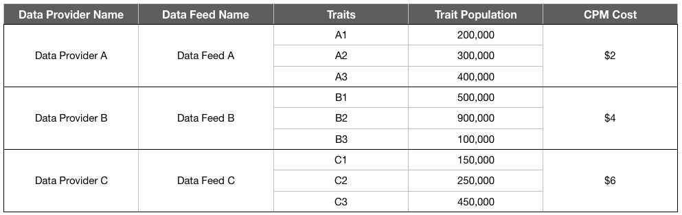

# Billing for Data Feed Buyers {#billing-for-data-feed-buyers}

Audience Marketplace data buyers agree to report all ad impressions served using traits contained in the data feed priced on a cost per thousand ad impressions ([!DNL CPM]) basis. [!DNL CPM] el uso se debe al quinto día de cada mes calendario e incluye datos del mes anterior. Los suscriptores de tarifas planas no necesitan informar sobre el uso.

## How to Report CPM Usage {#report-cpm-usage}

<!-- t_marketplace_report_cpm_usage.xml -->

[!UICONTROL Audience Marketplace] los compradores de datos aceptan informar de todas las impresiones de publicidad servidas mediante características contenidas en la fuente de datos a un costo por mil impresiones de publicidad ([!DNL CPM]). [!DNL CPM] el uso debe realizarse el 5 día de cada mes calendario e incluye datos del mes anterior. Los suscriptores de tarifas planas no necesitan informar sobre el uso.

[!UICONTROL Audience Marketplace] ofrece dos maneras de informar [!DNL CPM] el uso:

* **Informes a nivel de segmento**: es el método de informes [!DNL CPM] de uso recomendado. When you report [!DNL CPM] usage at segment level, the data feed-level reporting section is automatically filled in with the corresponding usage amounts, based on the algorithms described in [Cost Attribution for CPM Data Feeds](#cost-attribution).
* **Informes de nivel de fuente de datos**: este método requiere que informe de forma individual el [!DNL CPM] uso de cada fuente de datos, según los algoritmos descritos en Atribución [de costes para fuentes de datos CPM](#cost-attribution). Sin embargo, este método es más tedioso y propenso a provocar errores que los informes a nivel de segmento.

## Report CPM Usage at Segment Level {#segment-level-report}

The [!UICONTROL Segment Usage] tab allows you to report segment-level usage, while displaying the segments grouped by the destinations they are mapped to.

After reporting [!DNL CPM] usage at segment level, [!UICONTROL Audience Marketplace] automatically assigns the corresponding data feeds the correct usage, based on the [Cost Attribution for CPM Data Feeds](#cost-attribution).

To report [!DNL CPM] usage at segment level:

1. Go to **[!UICONTROL Audience Marketplace > Payables]**.
2. Select the **[!UICONTROL Segment Usage]** tab.
3. Complete el uso de sus segmentos. You can use the [!UICONTROL Search] box to filter the segments if you only need to report usage for some of them.
4. Haga clic en **[!UICONTROL Edit Segments Usage]**.
5. Enter the [!DNL CPM] usage amount in the [!UICONTROL Usage] column.
6. Click **[!UICONTROL Save]** when you're done and review the confirmation dialog.
   
7. Haga clic en **[!UICONTROL Confirm]**.

## Report CPM Usage at Data Feed Level {#feed-level-report}

Data feed-level reporting is a more tedious and prone to error process, since you must individually calculate [!DNL CPM] usage for each data feed. We recommend that you [Report CPM Usage at Segment Level](#segment-level-report) instead.

To report [!DNL CPM] usage at segment level:

1. Go to **[!UICONTROL Audience Marketplace > Payables]**.
2. Select the **[!UICONTROL Feed Usage]** tab.
3. Use the [!UICONTROL Search] box to filter the data feeds and identify the ones that you need to report usage for.
4. Haga clic en **[!UICONTROL Edit Feeds Usage]**.
5. Calculate the [!DNL CPM] usage for each data feed based on the [Cost Attribution for CPM Data Feeds](#cost-attribution), and enter it in the [!UICONTROL Usage] column.
6. Click **[!UICONTROL Save]** when you're done and review the confirmation dialog.

   

7. Haga clic en **[!UICONTROL Confirm]**.

## Informes masivos

To reduce errors and overhead while reporting [!DNL CPM] usage, you can use the bulk reporting option to download a [!DNL CSV] file containing the data feeds and segments, fill in the usage, and upload it back to [!DNL Audience Manager]. Puede utilizar informes masivos para informar tanto sobre la fuente como sobre el uso de segmentos.

To update [!DNL CPM] usage in bulk:

1. Go to **[!UICONTROL Audience Marketplace > Payables]**.
1. Select the **[!UICONTROL Feed Usage]** or **[!UICONTROL Segment Usage]** tab, depending on the type of reporting that you want to update.
1. Click **[!UICONTROL Edit Feeds Usage]** or **[!UICONTROL Edit Segments Usage]**.
1. Click **[!UICONTROL download the current usage]** to make sure you use a valid CSV file.
1. Abra el archivo en su equipo y rellene el informe de uso.
1. Click **[!UICONTROL Choose a CSV file]** to upload the updated usage report.

   

1. [!DNL Audience Manager] valida el archivo en cuanto lo carga y le solicita si detecta algún error en el archivo.

### Errores de validación de informes masivos

| Mensaje de error | Descripción | Se corrigió un problema que hacía que se mostrara |
| ------------- | -------------| -----|
| Entrada no válida | [!DNL Audience Manager] detectó un cambio en el esquema [!DNL CSV] de archivos, como columnas que faltan o cambios en los títulos de columnas. | Evite cambiar la estructura de la tabla. |
| No encontrado | For [!UICONTROL Segment Level Reporting], [!DNL Audience Manager] could not identify the [!UICONTROL Segment ID] and [!UICONTROL Destination ID] combination. For [!UICONTROL Feed Level Reporting], [!DNL Audience Manager] could not identify the [!UICONTROL Data Provider Name], [!UICONTROL Feed Name], and [!UICONTROL Use Case] combination. | For [!UICONTROL Segment Level Reporting], check the validity of the [!UICONTROL Segment ID] and [!UICONTROL Destination ID] combination. For [!UICONTROL Feed Level Reporting], check the validity of the [!UICONTROL Data Provider Name], [!UICONTROL Feed Name], and [!UICONTROL Use Case] combination. |
| Se encontraron registros duplicados | [!DNL Audience Manager] detectados registros duplicados con diferentes valores de impresión. | Revise el informe y asegúrese de que no informa de distintos valores de uso para la misma fuente de datos o segmento. |
| Valores no admitidos | [!DNL Audience Manager] se han detectado valores no numéricos en [!DNL Audience Manager] la columna. | Review the report and make sure you only enter numerical values in the [!DNL Audience Manager] column. |
| Faltan encabezados para campos obligatorios | [!DNL Audience Manager] detectaban encabezados de tabla que faltan para campos obligatorios. For [!UICONTROL Segment Level Reporting], the mandatory fields are: [!UICONTROL Segment ID], [!UICONTROL Destination ID]. For [!UICONTROL Feed Level Reporting], the mandatory fields are: [!UICONTROL Data Provider Name], [!UICONTROL Data Feed Name],  [!UICONTROL Use Case] | Revise el informe y asegúrese de que los encabezados de tabla no se han manipulado con. |

>[!NOTE]
>Removing rows from the [!DNL CSV] usage report does not have any effect on the existing usage report. [!DNL Audience Manager] procesa únicamente los campos incluidos en el informe.

## [!DNL CPM] Optimizaciones para informes

<table id="table_E68FA2130D1C495FAB8982DFB6A31FD9"> 
 <thead> 
  <tr> 
   <th colname="col1" class="entry"> Recomendaciones </th> 
   <th colname="col2" class="entry"> Descripción </th> 
  </tr>
 </thead>
 <tbody> 
  <tr> 
   <td colname="col1"> 
<b>Informar siempre el número total de impresiones</b> 
 </td> 
   <td colname="col2"> 
Para totales de impresión CPM: 

   
 Informar el número total de impresiones, sin utilizar decimales. Audience Manager calcula automáticamente el CPM según el número total que informe.

Si necesita informar de 1234,567 impresiones, informe de la misma manera. No es necesario dividir el número total de impresiones en 1000 para calcular el CPM.

Las características utilizadas para optimizar el contenido de la aplicación o la aplicación (Optimización de contenido) con herramientas como Adobe Target o un destino de Analytics no contribuyen a los totales de uso de los planes CPM. Normalmente, los proveedores de datos se compensan con la optimización de contenido mediante planes de tarifas planos.

See <a href="#cost-attribution">Cost Attribution for CPM Data Feeds</a> for more information. 
 </td>
  </tr>
  <tr> 
   <td colname="col1"> 
<b>Mantener pulsado el intervalo de informes mensual</b> 
 </td> 
   <td colname="col2"> 
El sistema de informes se cierra después del 5 de cada mes. Si no puede informar el uso CPM para entonces, debe agregar esa cantidad al informe del mes siguiente. Por ejemplo: supongamos que utiliza 1000 impresiones en octubre, que no se ha superado el plazo de informes de octubre y que utilice 1000 impresiones en noviembre. En este caso, se informa el total de octubre y noviembre (2000) en diciembre, entre el primer y el quinto.

<b>Sugerencia</b>: Siempre debe intentar informar el uso CPM para el mes anterior entre el primer día y el quinto día del siguiente mes.

Puede informar el uso CPM tan tarde como el quinto del nuevo mes calendario, pero esto no es recomendable. El uso del CPM de informes antes del quinto de cada mes proporciona a Audience Manager la hora de comprobar y procesar los datos.
 </td>
  </tr> 
 </tbody> 
</table>

## Cost Attribution for CPM Data Feeds {#cost-attribution}

In [!UICONTROL Audience Marketplace] you must self-report impression amounts each month, for each of your segments. We recommend reporting [!DNL CPM] usage at segment level, so that cost attribution is done automatically.

<!-- marketplace_cpm_billing.xml -->

### Billing Summary {#billing-summary}

You must submit [!DNL CPM] data feed impression amounts between the 1st and the 5th days of each calendar month. To do this correctly, we recommend that you [Report CPM Usage at Segment Level](#segment-level-report).

>[!TIP]
>When you report [!DNL CPM] usage at segment level, the data feed-level reporting section is automatically filled in with the corresponding usage amounts.

Should you need to [!UICONTROL Report CPM Usage at Data Feed Level], you must individually compile all impressions delivered for each feed in the previous calendar month, and report them according to the billing allocation described in this article.

After you report [!DNL CPM] number for the previous calendar month, [!DNL Adobe] will do the following:

* Create an invoice and bill you based on the [!DNL CPM] rate for each subscribed data feed.
* Pay data providers (sellers) fees owed based on your reported [!DNL CPM] use.

>[!IMPORTANT]
>
>Como comprador, todos los totales de impresión informados deben ser verdaderos y precisos. Si no puede informar totales de impresión el quinto día de cada mes, debe incluir los totales del mes no informado en el mes siguiente.

## Assign Impressions at Feed Level Based on Trait Qualification Rules {#assign-impressions}

The [!UICONTROL Activation] use case lets you use traits in the corresponding data feed to create segments in [Segment Builder](../../../features/segments/segment-builder.md#topic_E166819D26B94A868376BA54E10E4B74) and map those segments to a destination. The Boolean operators [!UICONTROL AND], [!UICONTROL OR], and [!UICONTROL NOT] let you set the conditions for trait and segment qualification.

When you [Report CPM Usage at Data Feed Level](#feed-level-report), you must allocate impressions proportionally for each data feed, according to the [!DNL Boolean] operators used in the trait qualification rules. La siguiente tabla muestra cómo asignar impresiones correctamente por tipo de regla booleana o tipo de característica.

>[!TIP]
>[Utilice el uso CPM de informes en Nivel](#segment-level-report) de segmento para que Audience Manager realice automáticamente los informes de nivel de fuente de datos.

<table id="table_BF00FE6740D2459DAFA62F2478492586"> 
 <thead> 
  <tr> 
   <th colname="col1" class="entry"> Lógica o tipo de cualificación de regla </th> 
   <th colname="col2" class="entry"> Distribución de facturación </th> 
  </tr> 
 </thead>
 <tbody> 
  <tr> 
   <td colname="col1"> 
 AND 
 </td> 
   <td colname="col2"> 
Apply 100% of the delivered impression totals to all the provider traits in a rules-based segment that uses a Boolean  AND condition. 
 </td> 
  </tr> 
  <tr> 
   <td colname="col1"> 
 O 
 </td> 
   <td colname="col2"> 
Aplique la asignación ponderada de los totales de impresión entregados a todas las características del proveedor en un segmento basado en reglas que utiliza una condición Booleana OR. La asignación ponderada se calcula con la fórmula siguiente:

<code>(Característica Población/Segmento de segmento) * Número de impresiones * Costo del CPM</code>
 </td> 
  </tr>
  <tr> 
   <td colname="col1"> 
 NO 
 </td> 
   <td colname="col2"> 
Apply 100% of the delivered impression totals to all the provider traits in a rules-based segment that uses a Boolean  NOT condition. 
 </td> 
  </tr> 
  <tr> 
   <td colname="col1"> 
Segmentos algorítmicos 
 </td> 
   <td colname="col2"> 
Aplique el 100% de los totales de impresión entregados a todas las fuentes de proveedores de un segmento que contenga características algorítmicas. 
 </td> 
  </tr>
 </tbody>
</table>

## Billing Examples {#billing-examples}

The examples below are meant to illustrate how [!DNL CPM] usage allocation is done at data feed level.

>[!MPORTANT]
>We recommend that you [Report CPM Usage at Segment Level](#segment-level-report) instead, to have this process done automatically.

Veamos el siguiente escenario:

### Caso 1: Segmentos con reglas de cualificación Y

Este segmento contiene 3 características de proveedores de datos separados. Since segment qualification is based on an [!UICONTROL AND] condition, visitors have to realize the traits from all three feeds to qualify for the segment.

With an [!UICONTROL AND] condition, you must assign 100% of the impressions received during the month to all three data providers. In the [!UICONTROL Audience Marketplace > Payables] section, you credit each provider with 1,000,000 impressions.

This example applies to segments that use [!DNL Boolean] [!UICONTROL NOT] operators or for segments that contain algorithmic traits.

### Caso 2: Segmentos con reglas de cualificación O

Este segmento contiene 3 características de proveedores de datos separados. Since segment qualification is based on an [!UICONTROL OR] condition, visitors have to realize at least one of the three traits to qualify for the segment.

We cannot tell which trait is responsible for an impression because qualification is based on an [!UICONTROL OR] condition. As a result, in the [!UICONTROL Audience Marketplace > Payables] section you credit each provider with a weighted allocation of the total impressions, based on trait population.

>[!MORE_ LIKE_ THIS]
>
>* [Asignación de impresiones e impresiones para fuentes de datos de tarifa plana](../../../features/audience-marketplace/marketplace-data-buyers/marketplace-buyer-billing.md)

## Billing and Impression Allocation for Flat Fee Data Feeds {#billing-flat-fee}

Una fuente de datos de tarifa fija factura una cantidad fija cada mes, independientemente de cuándo empiece la suscripción o de cuántas impresiones utilice. Las tarifas no se prorratean para el uso o intervalos parciales de mes. Al igual que con la facturación CPM, Adobe generará una factura y le facturará a la tarifa mensual y plana de sus fuentes de datos suscritas.

Por ejemplo, supongamos que ha decidido activar ciertas características en una fuente en mitad del mes. Aún se facturará a la velocidad mensual completa, independientemente de cuándo haya iniciado la suscripción o de características específicas activadas.