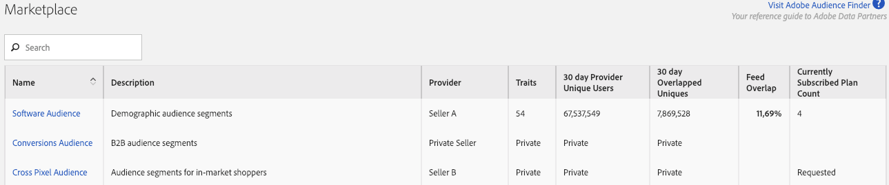

# Mercado de audiencias para compradores de datos {#audience-marketplace-for-data-buyers}

Información general y flujo de trabajo para compradores de datos que deseen comprar datos de terceros desde dentro [!DNL Audience Manager].

>[!NOTE]
>[Los permisos](../../../reporting/reports-dashboard.md) basados en roles controlan el acceso a [!UICONTROL Audience Marketplace] las funciones.
>
>* Los administradores pueden crear fuentes de datos, administrar suscriptores y suscribirse a fuentes de datos.
>* Los usuarios solo pueden buscar y ver fuentes.

## Mercado: Acerca de {#about-marketplace}

<!-- c_marketplace_about.xml -->

La [!UICONTROL Marketplace] es una [!DNL Audience Manager] función para compradores de datos que enumera las fuentes de datos a las que puede suscribirse. Enumera las fuentes de datos privadas, [!DNL CPM]o de tasa fija. Estas fuentes las proporcionan proveedores externos que las utilizan [!DNL Audience Manager] para vender datos. En [!UICONTROL Marketplace], las herramientas de informes permiten rastrear el uso de las fuentes y la superposición entre sus características y las de una fuente de datos suscrita. Por último, con [!UICONTROL Audience Marketplace], [!DNL Adobe] se encarga de las facturas y los pagos de honorarios (aunque es necesario informar sobre el uso cuando se suscribe a una [!DNL CPM] fuente). Estas funciones le permiten encontrar fuentes de datos eficaces sin perder tiempo buscando un proveedor de datos.

>[!TIP]
> 
>Utilice **[Adobe Audience Finder](https://www.adobe-audience-finder.com/)** para encontrar fuentes de datos de alta calidad a las que puede suscribirse. A continuación, vuelva a la interfaz de usuario de Audience Manager o utilice la API [de comprador de](https://bank.demdex.com/portal/swagger/index.html#/Audience_Marketplace_Buyer_API) Audience Marketplace para suscribirse a las fuentes que haya encontrado.

La [!UICONTROL Marketplace] lista contiene información que puede ordenar y buscar para encontrar la fuente de datos que sea adecuada para usted. Los elementos de la lista del [!UICONTROL Marketplace] comprador incluyen:

* **[!UICONTROL Search]** :: Busque fuentes de datos por nombre o descripción de texto.
* **[!UICONTROL Name]** :: Nombre de la fuente de datos.
* **[!UICONTROL Description]** :: Información sobre el contenido de una fuente de datos.
* **[!UICONTROL Provider]** :: Nombre del proveedor de datos.
* **[!UICONTROL Traits]** :: Número de características de una fuente de datos.
* **[!UICONTROL 30 Day Provider Unique Users]** :: Número de usuarios únicos vistos en los últimos 30 días.
* **[!UICONTROL 30 Day Overlapped Uniques]** :: El número de usuarios de su cuenta que se superponen con los usuarios de la cuenta del proveedor.
* **[!UICONTROL Feed Overlap]** :: El valor de valores únicos superpuestos de 30 días, mostrado en porcentajes, calculado como: Comprador de datos 30 días superpuestos únicos / Comprador de datos 30 días únicos) x 100.
* **[!UICONTROL Private Feeds]** :: Consulte Fuentes de datos [privadas](../../../features/audience-marketplace/marketplace-private-feeds.md).
* **[!UICONTROL Currently Subscribed Plan Count]** :: El número de suscripciones que tiene con un proveedor de datos.

## Fuentes de datos privadas {#private-data-feeds}

En la [!UICONTROL Marketplace] lista, a veces el nombre del proveedor y los datos de características se marcan como privados. Esto indica una fuente [de datos](../../../features/audience-marketplace/marketplace-private-feeds.md)privada. Una fuente de datos privada permite a los vendedores limitar el acceso del comprador a sus datos. Los vendedores pueden convertir las fuentes en privadas cuando ofrecen ofertas especiales, descuentos o cuando la privacidad y el control de acceso son importantes para ellos. Como comprador, debes enviar una solicitud de suscripción al vendedor si quieres acceder a una fuente privada. Consulte [Suscripción a una fuente](../../../features/audience-marketplace/marketplace-data-buyers/marketplace-manage-subscriptions.md#subscript-private-data-feed) de datos privada para obtener más información.

>[!MORE_LIKE_THIS]
>
>* [La página de detalles del plan de Audience Marketplace](../../../features/audience-marketplace/marketplace-data-buyers/marketplace-manage-subscriptions.md#marketplace-buyer-details)
>* [Descuentos para compradores de datos](../../../features/audience-marketplace/marketplace-data-buyers/marketplace-manage-subscriptions.md#buyer-discount)

