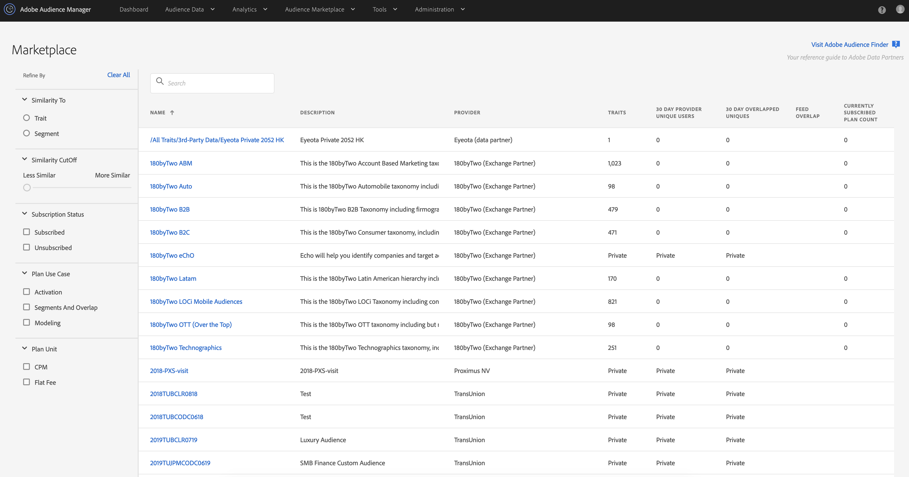

# [!UICONTROL Audience Marketplace] for Data Buyers {#audience-marketplace-for-data-buyers}

Overview and workflow for data buyers who want to purchase third-party data from within [!DNL Audience Manager].

>[!NOTE]
>[Role-based permissions](../../../reporting/reports-dashboard.md) control access to [!UICONTROL Audience Marketplace] features.
>
>* Administrators can create data feeds, manage subscribers, and subscribe to data feeds.
>* Users can search and view feeds only.

## The [!UICONTROL Marketplace]: About {#about-marketplace}

The [!UICONTROL Marketplace] is an [!DNL Audience Manager] feature for data buyers that lists data feeds you can subscribe to. It lists flat rate, [!DNL CPM], and private data feeds. These feeds are provided by third-party vendors that use [!DNL Audience Manager] to sell data.

In the [!UICONTROL Marketplace], reporting tools let you track feed usage and the overlap between your [!UICONTROL traits] and those in a subscribed data feed. Finally, with [!UICONTROL Audience Marketplace], [!DNL Adobe] takes care of invoices and fee payments (though you do have to self-report usage when subscribed to a [!DNL CPM] feed). These features let you find effective data sources without wasting time looking for a data provider.

>[!TIP]
>
>Use the **[Adobe Audience Finder](https://www.adobe-audience-finder.com/)** to find high quality data feeds that you can subscribe to. Then, go back into the [!DNL Audience Manager] user interface or use the [Audience Marketplace Buyer API](https://bank.demdex.com/portal/swagger/index.html#/Audience_Marketplace_Buyer_API) to subscribe to the feeds you found.

The [!UICONTROL Marketplace] list contains information that you can sort and search to find the data feed that&#39;s right for you. Items in the [!UICONTROL Marketplace] buyer&#39;s list include:

* **[!UICONTROL Search]**: Find data feeds by name or text description.
* **[!UICONTROL Similar Traits]**: Shows you the number of similar [!UICONTROL traits] from a data feed. This column is shown after you enter a [!UICONTROL trait] or [!UICONTROL segment] to filter by in the **[!UICONTROL Similarity To]** section.
* **[!UICONTROL Name]**: Name of the data feed.
* **[!UICONTROL Description]**: Information about the contents of a data feed.
* **[!UICONTROL Provider]**: nombre del proveedor de datos.
* **[!UICONTROL Traits]**: el número de [!UICONTROL traits] en una fuente de datos.
* **[!UICONTROL 30 Day Provider Unique Users]**: número de usuarios únicos vistos en los últimos 30 días.
* **[!UICONTROL 30 Day Overlapped Uniques]**: número de usuarios de su cuenta que se superponen con los usuarios de la cuenta del proveedor.
* **[!UICONTROL Feed Overlap]**: valor de valores exclusivos superpuestos de 30 días, mostrado en porcentajes, calculado como: comprador de datos (valores exclusivos superpuestos de 30 días / comprador de datos (valores exclusivos de 30 días) x 100.
* **[!UICONTROL Private Feeds]**: vea [Fuentes de datos privadas](../../../features/audience-marketplace/marketplace-private-feeds.md).
* **[!UICONTROL Currently Subscribed Plan Count]**: el número de suscripciones que tiene con un proveedor de datos.

 

Para encontrar fácilmente las mejores fuentes de datos según sus necesidades, utilice los siguientes filtros disponibles a la izquierda de la página [!UICONTROL Marketplace]:

* **[!UICONTROL Similarity To]**: filtre las fuentes de datos en función de su similitud con [!UICONTROL trait] o [!UICONTROL segment] de su elección. Al escribir [!UICONTROL trait] o el segmento con el que comparar, puede usar el identificador [!UICONTROL trait] o [!UICONTROL segment], o sus nombres respectivos.
* **[!UICONTROL Similarity Cutoff]**: arrastre el control deslizante para filtrar las fuentes de datos en función de lo similares que sean sus [!UICONTROL traits] a los [!UICONTROL trait] o [!UICONTROL segment] seleccionados.
* **[!UICONTROL Subscription Status]**: filtre las fuentes de datos en función de su estado de suscripción.
* **[!UICONTROL Plan Use Case]**: filtre las fuentes de datos según los casos de uso admitidos: **[!UICONTROL Activation]**, **[!UICONTROL Segments and Overlap]** y **[!UICONTROL Modelling]**.
* **[!UICONTROL Plan Unit]**: filtre las fuentes de datos según su tipo de precios.

## Buscando [!UICONTROL Traits] similares {#finding-similar-traits}

[!UICONTROL Audience Marketplace] le da la opción de encontrar [!UICONTROL traits] de varias fuentes de datos, según su similitud con sus [!UICONTROL traits] o segmentos existentes. A continuación se indica cómo hacerlo:

1. Ir a **[!UICONTROL Audience Marketplace]** > **[!UICONTROL Marketplace]**.
2. Utilice el selector **[!UICONTROL Similarity To]** para elegir entre filtrar según un [!UICONTROL trait] o [!UICONTROL segment]. Puede filtrar según el nombre o el ID [!UICONTROL trait]/[!UICONTROL segment]. El cuadro de búsqueda muestra automáticamente las sugerencias relevantes en función de sus entradas.
3. Una vez que haya identificado el rasgo o el segmento por el que desea filtrar, haga clic en él en la lista de sugerencias.
4. Para reducir los resultados, use el control deslizante **[!UICONTROL Similarity Cutoff]** para pasar de [!UICONTROL traits] menos similares a otros más similares.

Una vez completado el filtrado, verá una nueva columna en la página de resultados: **[!UICONTROL Similar Traits]**. Esta columna muestra el número de [!UICONTROL traits] similares al que filtró, de cada fuente de datos que cumple los criterios de filtrado.

Para ver la lista completa de características similares, haga clic en el número de la columna **[!UICONTROL Similar Traits]**.

>[!NOTE]
>
> Audience Marketplace muestra los primeros 500 resultados similares de [!UICONTROL trait] en las fuentes de datos.

Vea el siguiente vídeo para obtener información general sobre cómo encontrar [!UICONTROL traits] similares.

>[!VIDEO](https://video.tv.adobe.com/v/29370/)

## Fuentes de datos privadas {#private-data-feeds}

En la lista [!UICONTROL Marketplace], a veces el nombre del proveedor y los datos de [!UICONTROL trait] se marcan como privados. Esto indica una [fuente de datos privada](../../../features/audience-marketplace/marketplace-private-feeds.md). Una fuente de datos privada permite a los vendedores limitar el acceso de los compradores a sus datos. Los vendedores pueden hacer que las fuentes sean privadas cuando ofrezcan ofertas especiales, descuentos o cuando la privacidad y el control de acceso sean importantes para ellos. Como comprador, debes enviar una solicitud de suscripción al vendedor si deseas acceder a una fuente privada. Consulte [Suscribirse a una fuente de datos privada](../../../features/audience-marketplace/marketplace-data-buyers/marketplace-manage-subscriptions.md#subscript-private-data-feed) para obtener más información.

>[!MORELIKETHIS]
>
>* [La página de detalles del plan de Audience Marketplace](../../../features/audience-marketplace/marketplace-data-buyers/marketplace-manage-subscriptions.md#marketplace-buyer-details)
>* [Descuentos para compradores de datos](../../../features/audience-marketplace/marketplace-data-buyers/marketplace-manage-subscriptions.md#buyer-discount)
