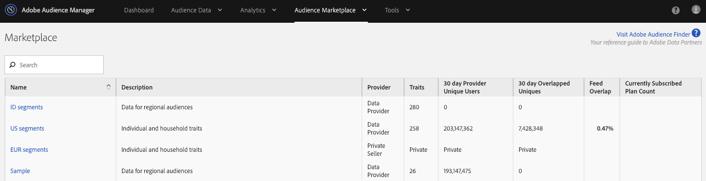

# Administrar Suscripciones de fuentes de datos {#manage-data-feed-subscriptions}

El [!UICONTROL Marketplace] es el lugar donde los compradores de datos van a investigar y suscribirse a fuentes de datos públicas y privadas. Siga estos pasos para suscribirse a una fuente de datos pública.

## Suscripción a una fuente de datos pública {#subscript-public-data-feed}

El [!UICONTROL Marketplace] es el lugar donde los compradores de datos van a investigar y suscribirse a fuentes de datos públicas y privadas. Siga estos pasos para suscribirse a una fuente de datos pública.

<!-- t_subscribe_feed.xml -->

Para suscribirse a una fuente de datos pública:

1. Vaya a **[!UICONTROL Audience Marketplace > Marketplace]**. Utilice la función de búsqueda o navegue por la lista para encontrar una fuente de datos.

   

1. Haga clic en el nombre de la fuente de datos que desee utilizar. Se abre la página [de detalles del](../../../features/audience-marketplace/marketplace-data-buyers/marketplace-manage-subscriptions.md#marketplace-buyer-details) plan para la fuente seleccionada.

   

1. Elija un caso de uso en la tabla suscripciones y:
   * Mueva el **[!UICONTROL Subscription]** deslizador a **[!UICONTROL On]**.
   * Haga clic **[!UICONTROL Review & Subscribe]**. Esto abre la [!UICONTROL Terms and Conditions] ventana.
   

1. En la [!UICONTROL Terms and Conditions] ventana:

   * **Importante:** Deje marcada la **[!UICONTROL ID sync]** casilla de verificación. Esta configuración ayuda a mejorar las tasas de coincidencia con el proveedor de datos.
   * Marque la casilla Términos y condiciones y haga clic en **[!UICONTROL Accept]** para completar el proceso de suscripción.
   

### Pasos siguientes

Después de suscribirse a una fuente de datos:

* Compruebe la suscripción marcando la [!UICONTROL Traits] carpeta. Consulte [Almacenamiento para las fuentes](../../../features/audience-marketplace/marketplace-data-buyers/marketplace-manage-subscriptions.md#find-subscribed-data-fee)de datos suscritas.

* Revise la documentación de facturación y pago. Consulte los vínculos relacionados a continuación.

### Prácticas recomendadas {#best-practices}

A continuación se muestra un conjunto de prácticas recomendadas que le recomendamos seguir al trabajar con [!UICONTROL Audience Marketplace]:

Al explorar nuevos conjuntos de datos de terceros y de terceros [!UICONTROL Audience Marketplace], el primer paso que recomendamos es habilitar las fuentes de datos para [!UICONTROL Segments & Overlap]. Esto permite a los usuarios explorar datos generando segmentos para evaluar el tamaño de la audiencia y ejecutando informes de superposición para obtener perspectivas de audiencia iniciales. La mayoría de los proveedores de datos oferta este caso de uso de forma gratuita, por lo que puede realizar esta análisis sin costo adicional.

Cuando ejecute informes de superposición, siga estas optimizaciones para asegurarse de que obtiene resultados útiles.

1. Asegúrese de que los conjuntos de datos superpuestos sean similares en cuanto al tipo de datos y las metodologías de recopilación, como por ejemplo:
   * Visitante geográfico
   * Cookie vs. ID móviles
   * Ventana retroactiva
   * actividad sin conexión vs. en línea
   * Frecuencia con la que el proveedor de datos actualiza los datos

1. La superposición puede aumentar ligeramente con el tiempo, por lo que asegúrese de que transcurren hasta 30 días antes de ejecutar los informes de superposición para permitir la sincronización de los datos.
1. La superposición puede aumentar si utiliza datos de un proveedor de datos en varias campañas de marketing.
e iniciativas. Esto permite a los usuarios de los dos conjuntos de datos sincronizar más oportunidades.
1. No hay garantía de que haya una superposición entre los conjuntos de datos. Para que una superposición sea válida, un usuario del conjunto de datos del cliente debe estar asociado al conjunto de datos del proveedor de datos durante el período de tiempo de sistema de informes. Si los datos multimedia del cliente no se han servido a los usuarios en el conjunto de datos del proveedor de datos, nunca se superpondrá.
1. No piense que la baja superposición es algo malo. Aproveche una superposición baja para el cliente potencial y capte nuevos usuarios.

## Suscripción a una fuente de datos privada {#subscript-private-data-feed}

Los compradores se suscriben a fuentes de datos privadas y a los planes de **[!UICONTROL Audience Marketplace > Marketplace]**.

<!-- t_private_feed.xml -->

>[!TIP]
>
>En ocasiones, los proveedores de datos pueden oferta un descuento en una fuente de datos privada. Es posible que desee preguntar sobre un posible descuento al enviar la solicitud de suscripción.

Para suscribirse a una fuente de datos privada:

1. Haga clic en el nombre de la fuente de datos en la [!UICONTROL Marketplace].
1. Haga clic **[!UICONTROL Request Access]**. Se abre el cuadro de diálogo de solicitud.
1. En el cuadro de diálogo de solicitud, escriba al proveedor una nota que exprese su interés en su fuente de datos y haga clic en **[!UICONTROL Send]**. El vendedor revisará tu mensaje y aprobará o rechazará tu solicitud. Mientras espera la aprobación, aparece &quot;Solicitado&quot; en la [!UICONTROL Marketplace] lista de esa fuente de datos.

   * **[!UICONTROL Request approved]**:: El estado de la [!UICONTROL Marketplace] lista cambia a &quot;Acceso concedido&quot; y recibirá una notificación automatizada. En este punto puede suscribirse a la fuente. Consulte [Suscripción a una fuente](../../../features/audience-marketplace/marketplace-data-buyers/marketplace-manage-subscriptions.md#subscript-public-data-feed) de datos pública para obtener instrucciones.
   * **[!UICONTROL Request denied]**:: El texto &quot;Solicitado&quot; se elimina de la [!UICONTROL Marketplace] lista de la fuente. Puede intentar suscribirse de nuevo o elegir una fuente diferente.

## Descuentos de fuentes de datos para compradores {#buyer-discount}

En [!UICONTROL Audience Marketplace]particular, los proveedores pueden oferta a los compradores con un descuento sobre el precio publicado de una fuente de datos de [!DNL CPM] o de tasa fija. Sin embargo, los importes de descuento no son visibles para los compradores en la lista de la [!DNL Marketplace] fuente. Sin embargo, también puede solicitar un descuento cuando se suscriba a una fuente de datos privada o cuando solicite más información sobre una fuente en particular.

## Solicitar un descuento {#request-discount}

<!-- marketplace-buyer-discounts.xml -->

<table id="table_3C6E58F593BA48EC89ACBD9A26E4E74F"> 
 <thead> 
  <tr> 
   <th colname="col1" class="entry"> Estado del comprador </th> 
   <th colname="col2" class="entry"> Descripción </th> 
  </tr> 
 </thead>
 <tbody> 
  <tr> 
   <td colname="col1"> 
 <b>Suscriptores actuales</b> 
 </td> 
   <td colname="col2"> 
Si ya está suscrito a una fuente de datos privada y desea solicitar un descuento: 
 
    <ol id="ol_A58D419EBB9349E9B1225202535130F6"> 
     <li id="li_D0DDC8AC6E9C4675AA4630D63FE8F071"> <a href="../../../features/audience-marketplace/marketplace-data-buyers/marketplace-manage-subscriptions.md#unsubscribe"> Cancele la suscripción</a> de la fuente de datos. </li> 
     <li id="li_05A5379F2A944FB28AB39C196DDE3A1D">Póngase en contacto con el proveedor de datos y solicite un precio con descuento. </li> 
     <li id="li_B1B5AA6F6CC64512A02D5E8861A5F266">Si el proveedor le ofrece un descuento, vuelva a suscribirse a la fuente el 1º día del mes siguiente. </li> 
    </ol> </td> 
  </tr> 
  <tr> 
   <td colname="col1"> 
 <b>Nuevos suscriptores de fuentes de datos privadas</b> 
 </td> 
   <td colname="col2"> 
Solicite un descuento en su solicitud de suscripción. Consulte <a href="../../../features/audience-marketplace/marketplace-data-buyers/marketplace-manage-subscriptions.md#subscript-private-data-feed"> Suscripción a una fuente</a>de datos privada. 
 </td>
  </tr> 
  <tr> 
   <td colname="col1"> 
 <b>Suscriptores potenciales</b> 
 </td> 
   <td colname="col2"> 
Un <a href="../../../features/audience-marketplace/marketplace-private-feeds.md"> suscriptor</a> potencial es un comprador de datos que ha solicitado acceso a una fuente de datos privada, ha recibido la aprobación del vendedor pero no se ha suscrito a la fuente. Para solicitar un descuento como suscriptor potencial: 
 
    <ol id="ol_9CECDA92E7894B20AC8A777D78962188"> 
     <li id="li_618B64160CF24549AFCA73E006DCA35A">Vaya a <b> Audience Marketplace &gt; Mercado</b>. </li> 
     <li id="li_FE52A06B30FC4858B48AF81954365FE9">Haga clic en el nombre de la fuente para la que ha sido aprobado. </li> 
     <li id="li_763C050AC9464BE380D00F6085B6E540">Haga clic en <b> Solicitar más detalles</b>. Pide un descuento en tu solicitud de detalles al vendedor. </li> 
    </ol> </td> 
  </tr> 
 </tbody> 
</table>

## Revisar fuentes con descuento {#review-discounted-feeds}

Para revisar las fuentes con descuento:

1. Vaya a **[!UICONTROL Audience Marketplace > Marketplace]**.
1. Haga clic en el nombre de una fuente a la que ya esté suscrito.
1. Observe las columnas [!UICONTROL Price] y [!UICONTROL Your Price] de la [!UICONTROL Plan Details] tabla. Si se descuenta la fuente:

   * El precio original está marcado con una línea roja.
   * La tarifa de la [!UICONTROL Your Price] columna será inferior a la tarifa de la [!UICONTROL Price] columna.

En el ejemplo, el comprador obtiene un 10 % de descuento en el [!UICONTROL Segments and Overlap] plan del **[!UICONTROL Software Audience Feed]**.

## Búsqueda de datos de fuentes suscritas {#find-subscribed-data-fee}

Los datos (características) de las fuentes de datos aparecen en sus propias carpetas de almacenamientos de características. Vaya a **[!UICONTROL Audience Data > Traits]** y expanda la **[!UICONTROL 3rd-Party Data]** carpeta para realizar la vista y trabajar con las características de las fuentes suscritas. Busque la subcarpeta con el nombre de su proveedor de datos. Éstas contienen carpetas con el nombre de cada fuente de datos y características de lista que proporciona la fuente.

<!-- marketplace-feed-storage.xml -->

## Cancelar la suscripción a una fuente de datos {#unsubscribe}

Los compradores de datos cancelan la suscripción de fuentes de datos y planes en **[!UICONTROL Audience Marketplace > Marketplace]**.

<!-- t_unsubscribe_feed.xml -->

Para cancelar la suscripción de una fuente de datos:

1. Haga clic en el nombre de la fuente de datos en la [!UICONTROL Marketplace].
1. En la [!UICONTROL Use Case] sección busque el plan que desea utilizar y mueva el **[!UICONTROL Subscription]** deslizador a **[!UICONTROL Off]**.

## Desactivación de fuente de datos: Por qué sucede y cómo responder {#data-feed-deactivation-reasons}

En [!UICONTROL Audience Marketplace], los proveedores de datos pueden anular el acceso a las fuentes de datos suscritas. No te alarmes si esto te pasa. Te tenemos cubierto. Consulte esta sección para ver los procesos y procedimientos relacionados con las desactivaciones de fuentes de datos.

## Razones comunes para la desactivación de fuentes de datos {#reasons-for-deactivation}

<!-- marketplace-subscriber-deactivated.xml -->

Puede ser desconcertante o incluso molesto si una fuente a la que te suscribes está desactivada. Sin embargo, los proveedores de datos pueden desactivar una fuente de datos por diversos motivos. Algunas razones comunes son:

* **Facturación:** Los proveedores de datos desactivarán una fuente si se retrasa constantemente el pago de las tarifas o si no se pagan las mismas.
* **Actualizaciones de fuentes:** Los proveedores de datos deben desactivar las fuentes cuando actualizan su taxonomía de fuentes o estructuras de costes.
* **Compradores inactivos:** Los proveedores de datos se reservan el derecho de desactivar las fuentes si los suscriptores no muestran gastos durante un período de tiempo prolongado.
* **Vendedores inactivos:** Los proveedores de datos que se vayan [!UICONTROL Audience Marketplace] desactivarán y eliminarán todas sus fuentes de datos.

>[!TIP]
>
>Póngase en contacto directamente con el proveedor de datos si cree que una fuente de datos se desactivó por error. El [!DNL Adobe] consultor puede ayudarle con información de contacto o asistencia adicional.

## Correo electrónico de desactivación {#deactivation-email}

Cuando un proveedor de datos desactiva una de sus fuentes de datos, envía un correo electrónico [!DNL Audience Manager] a los usuarios de la compañía que tienen [!UICONTROL Administrator] permisos. A veces, los filtros de correo electrónico clasifican este mensaje como correo no deseado. Como resultado, puede que no reciba esta importante notificación. Para ayudarle a identificar el mensaje de desactivación, este mensaje de correo electrónico contiene los siguientes elementos:

* **Desde:** El correo electrónico de desactivación procede de `aam-noreply@adobe.com`. Sugerencia: No respondas a este correo electrónico.

* **Línea de asunto:** La Suscripción al *nombre de la fuente de datos aquí* está cancelada.

* **Datos adjuntos:** El correo electrónico incluye un archivo adjunto titulado &quot; `list-of-affected-entities-by-feed-revocation.csv`.&quot; Es una forma enrevesada de decir que el adjunto lista todas las características incluidas en la fuente cancelada. Como comprador de datos, debe revisar este archivo adjunto. Le ayudará a encontrar y eliminar características desactivadas de sus segmentos y modelos [algorítmicos](../../../features/algorithmic-models/understanding-models.md).

## Lista de rasgos desactivada {#deactivation-trait-list}

La lista que acompaña a un correo electrónico de desactivación contiene los campos como se muestra a continuación.

<table id="table_5C3800F9D8AA43EFAB4690959A721F63"> 
 <thead> 
  <tr> 
   <th colname="col1" class="entry"> Campo </th> 
   <th colname="col2" class="entry"> Descripción </th> 
  </tr> 
 </thead>
 <tbody> 
  <tr> 
   <td colname="col1"> 
<b> ID de fuente de datos</b> 
 </td> 
   <td colname="col2"> 
ID de la fuente de datos desactivada. 
 </td> 
  </tr> 
  <tr> 
   <td colname="col1"> 
<b> Nombre de fuente de datos</b> 
 </td> 
   <td colname="col2"> 
Nombre de la fuente de datos desactivada. 
 </td> 
  </tr> 
  <tr> 
   <td colname="col1"> 
<b> SID de características</b> 
 </td> 
   <td colname="col2"> 
ID de características desactivadas. 
 </td> 
  </tr> 
  <tr> 
   <td colname="col1"> 
<b> Nombre de característica</b> 
 </td> 
   <td colname="col2"> 
Nombres de características desactivados. 
 </td> 
  </tr> 
  <tr> 
   <td colname="col1"> 
<b> SID de segmento</b> 
 </td> 
   <td colname="col2"> 
ID del segmento que contiene características desactivadas. 
 </td> 
  </tr> 
  <tr> 
   <td colname="col1"> 
<b> Nombre del segmento</b> 
 </td> 
   <td colname="col2"> 
Nombre del segmento que contiene características desactivadas. 
 </td> 
  </tr> 
  <tr> 
   <td colname="col1"> 
<b> ID del modelo de algo</b> 
 </td> 
   <td colname="col2"> 
ID del modelo algorítmico que contiene características desactivadas. 
 </td> 
  </tr> 
  <tr> 
   <td colname="col1"> 
<b> Nombre del modelo de algo</b> 
 </td> 
   <td colname="col2"> 
Nombres de modelos algorítmicos que contienen características desactivadas. 
 </td> 
  </tr> 
 </tbody> 
</table>

## Eliminar características desactivadas {#remove-deactivated-traits}

Como comprador de datos, usted es responsable de eliminar las características de una fuente cancelada de todos los segmentos activos, en uso o inactivos. Las opciones de eliminación incluyen:

* Eliminación masiva con las API  REST o las herramientas [de administración](../../../reference/bulk-management-tools/bulk-management-intro.md)masiva.

* Busque manualmente los segmentos afectados y elimine las características desactivadas mediante [!UICONTROL Segment Builder]. Consulte [Eliminar características de un segmento](../../../features/segments/segment-builder.md#segment-builder-controls-traits).

>[!NOTE]
>
>La eliminación de características de los modelos o destinos algorítmicos activos afecta a la precisión de la escala y de los objetivos. Intente reemplazar los rasgos revocados con características nuevas y activas si es posible.

[Cancele la suscripción de la fuente](../../../features/audience-marketplace/marketplace-data-buyers/marketplace-manage-subscriptions.md#unsubscribe) de datos desactivada después de eliminar todas las características revocadas de la cuenta. Si se trata de una desactivación temporal, puede volver a suscribirse una vez que el proveedor de datos haya terminado de realizar los cambios necesarios y reactive la fuente. Como con la mayoría de las cosas, una buena comunicación con sus socios (el proveedor de datos y [!DNL Adobe]) puede ayudarle a trabajar a través de este proceso.

## La página de detalles del plan de Audience Marketplace {#marketplace-buyer-details}

Al hacer clic en el nombre de un plan de datos en el [!UICONTROL Marketplace], [!DNL Audience Manager] proporciona información que puede ayudarle a tomar decisiones informadas sobre la suscripción a una fuente de datos.

<!-- marketplace-buyer-details.xml -->

Esta página proporciona la siguiente información:

1. **Información** básica del plan. Esto incluye información de fuentes como:
   * Nombre de la fuente de datos. Por ejemplo, como se muestra arriba, el nombre de esta fuente es &quot;Fuente de datos de muestra&quot;.
   * El nombre del proveedor de datos;
   * ID de fuente de datos;
   * Descripción;
   * Número de características del pienso;

1. Botones de información del plan.
   * Haga clic en **[!UICONTROL Explore All Traits]** para ver detalles sobre todas las características de la fuente de datos seleccionada.
   * Haga clic en **[!UICONTROL Request More Details]** para hacer preguntas al proveedor de datos sobre la fuente de datos seleccionada o para solicitar un descuento. Esta función envía sus comentarios y preguntas directamente al proveedor de datos.

1. Métricas de informes de fuente de datos. El diagrama de Venn (y métricas relacionadas) muestra los datos de superposición de características de los últimos 30 días. Consulte [El Mercado: Acerca](marketplace-data-buyers.md#about-marketplace) de los detalles.
   * **[!UICONTROL 30 Day Overlapped Uniques]**:: El número de usuarios únicos en su cuenta que se superponen con los usuarios en la cuenta del proveedor. Para obtener una definición de usuarios únicos, consulte UUID de AAM en el [índice de ID en Audience Manager](/help/using/reference/ids-in-aam.md).
   * **[!UICONTROL 30 Day Provider Unique Users]**:: Número de usuarios únicos procedentes de la cuenta del proveedor.
   * **[!UICONTROL Your Unique Users]**:: El número de usuarios únicos procedentes de su cuenta.

1. **[!UICONTROL Plan Details]** Tabla. Esta tabla muestra los casos de uso para los que puede suscribirse a la fuente de datos, así como su modelo de precios. Consulte [Explicación de los casos](#use-cases)de uso de fuentes de datos.

1. Botones de acción de plan.
   * Haga clic en **[!UICONTROL Cancel]** para salir de la página sin realizar cambios.
   * Haga clic en **[!UICONTROL Review & Subscribe]** para suscribirse a una fuente de datos. Este botón aparece atenuado hasta que se cambia [!UICONTROL Subscription] a [!UICONTROL On]. Consulte también [Suscripción a una fuente](#subscript-public-data-feed) de datos pública y [Suscripción a una fuente](#subscript-private-data-feed)de datos privada.

## Explicación de los casos de uso de fuentes de datos {#use-cases}

Como comprador [!UICONTROL Audience Marketplace] de datos, puede comprar datos para casos de uso de superposición, modelado y activación. Cada caso de uso está diseñado para un propósito específico y limita lo que se puede hacer con los datos. Estas descripciones de casos de uso pueden ayudarle a tomar la decisión correcta sobre qué tipo de plan de datos comprar.

## Realizar comparaciones con segmentos y superponer planes {#comparisons}

<!-- c_use_cases_for_buyers.xml -->

### Segmentos y superposición

Este caso de uso le permite comparar sus características con las características del proveedor en un informe de superposición de [rasgo a rasgo.](../../../reporting/dynamic-reports/trait-trait-overlap-report.md#trait-to-trait-overlap-report) Además, puede crear o agregar características de proveedor a un segmento y realizar comparaciones adicionales con los informes de [segmento a rasgo](../../../reporting/dynamic-reports/segment-trait-overlap-report.md) y de [segmento a segmento](../../../reporting/dynamic-reports/segment-segment-overlap-report.md) . Las comparaciones superpuestas pueden ayudarle a:

* **Ampliar el alcance de la audiencia:** La superposición baja sugiere que sus características contienen usuarios que no ha visto antes. Es posible que desee que estas características intenten llegar a nuevos usuarios.
* **Mejore las audiencias existentes:** La superposición alta sugiere que sus características son similares a las que posee el proveedor de datos. Es posible que desee que estas características ayuden a realizar mejoras específicas y graduales en una audiencia ya desarrollada.

### Modelos algorítmicos

Este caso de uso le permite evaluar las características del proveedor comparándolas con sus características con el modelado [algorítmico](../../../features/algorithmic-models/understanding-models.md#understanding-models). Por ejemplo, nuestro sistema de modelado algorítmico utiliza una de sus características como base para la comparación con una característica del proveedor. Cuando se ejecuta el modelo, puede mostrar si las audiencias de características del proveedor comparten atributos de conversión similares a sus características.

### Activation

Este caso de uso le permite enviar datos a un [destino](../../../features/destinations/destinations.md). En [!DNL Audience Manager], un destino es cualquier sistema de terceros (servidor de publicidad, [!DNL DSP], [!DNL DMP], intercambio, etc.) que desea compartir datos con. Sin embargo, con un caso de [!UICONTROL Activation] uso, no se pueden ejecutar informes de superposición ni probar los datos en un modelo algorítmico.

>[!MORELIKETHIS]
>
>* [Asignación de impresión y facturación para fuentes de datos CPM](../../../features/audience-marketplace/marketplace-data-buyers/marketplace-buyer-billing.md#cost-attribution)
>* [Asignación de facturación e impresión para fuentes de datos de tarifa fija](../../../features/audience-marketplace/marketplace-data-buyers/marketplace-buyer-billing.md)
>* [Cómo informar del uso de CPM](../../../features/audience-marketplace/marketplace-data-buyers/marketplace-buyer-billing.md#report-cpm-usage)
>* [Suscripción a una fuente de datos pública](../../../features/audience-marketplace/marketplace-data-buyers/marketplace-manage-subscriptions.md#subscript-public-data-feed)
>* [Descuentos para compradores de datos](../../../features/audience-marketplace/marketplace-data-buyers/marketplace-manage-subscriptions.md#buyer-discount)
>* [Mercado: Acerca de](../../../features/audience-marketplace/marketplace-data-buyers/marketplace-data-buyers.md#about-marketplace)

