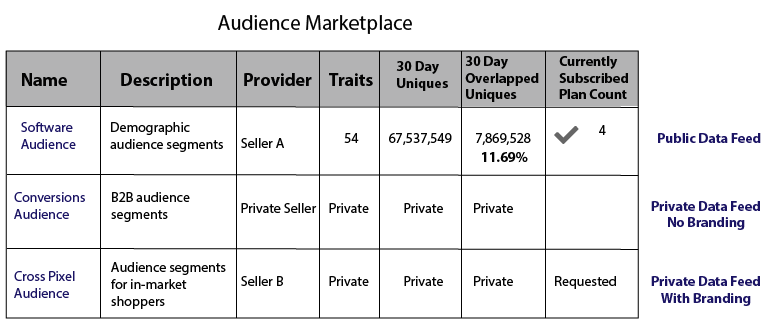
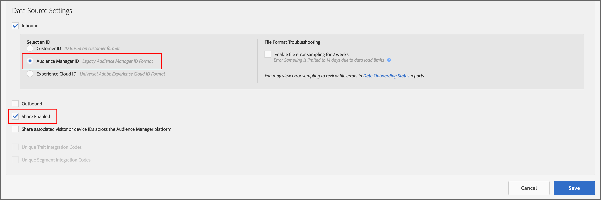

# Fuentes de datos privadas {#private-data-feeds}

Una fuente de datos privada es una opción que permite a los proveedores limitar el acceso de los compradores a sus datos. Los proveedores y compradores de datos deben revisar esta información antes de crear y suscribirse a fuentes de datos privadas.

<!-- c_marketplace_privatefeed.xml -->

## Private Data Feeds for Providers {#private-data-feeds-providers}

Como proveedor, sus fuentes de datos pueden ser públicas o privadas. Una fuente de datos privada permite limitar el acceso de los compradores a los datos, incluido el nombre del proveedor de datos. Es posible que desee crear una fuente de datos privada para ofrecer ofertas especiales, descuentos o cuando la privacidad y el control de acceso son importantes. Con una fuente de datos privada, puede revisar y aprobar solicitudes de compradores. Después de aprobar una solicitud, la fuente tiene el mismo aspecto que una fuente de datos pública al comprador. You can view and manage all your feeds in **[!UICONTROL Audience Marketplace > My Shared Data]**. Como se muestra a continuación, este tipo de fuente se marca como "Privado" en la columna de estado.

### Administración de solicitudes de fuente

Clicking the name of a private data feed from [!UICONTROL My Shared Data] takes you to a page that contains several tabs. Haga clic en una ficha para administrar las solicitudes privadas de fuentes de datos.

La tabla siguiente define la función o las funciones proporcionadas por cada ficha de acción.

<table id="table_AFB429CA52A34658859448D9A5215F9F"> 
 <thead> 
  <tr> 
   <th colname="col1" class="entry"> Tabulación </th> 
   <th colname="col2" class="entry"> Descripción </th> 
  </tr> 
 </thead>
 <tbody> 
  <tr> 
   <td colname="col1"> 
 <b> Suscriptores actuales</b> 
 </td> 
   <td colname="col2"> 
Enumera los compradores aprobados que se han suscrito a una fuente de datos privada. 
 </td> 
  </tr> 
  <tr> 
   <td colname="col1"> 
 <b> Suscriptores potenciales</b> 
 </td> 
   <td colname="col2"> 
Enumera los compradores aprobados que no se han suscrito a una fuente de datos privada. 
 
Una aprobación permite a los compradores ver una fuente de datos como si fueran públicas. Esto les brinda la posibilidad de revisar y evaluar las fuentes antes de suscribirse. También puede ofrecer descuentos en fuentes de datos a compradores enumerados como suscriptores potenciales. Once the buyer subscribes, their profile moves to <b> Current Subscribers</b>. 
 </td>
  </tr> 
  <tr> 
   <td colname="col1"> 
 <b> Solicitudes de acceso</b> 
 </td>
   <td colname="col2"> 
Enumera las solicitudes de suscripción nuevas para una fuente de datos privada. Haga clic en esta ficha para revisar, aprobar o rechazar solicitudes de compradores. 

    <ul id="ul_BE0A835A90B14C05B3F63226B79D052D"> 
     <li id="li_2C5686CEB6F4430BA18AED5AD75C330A">Approved buyers move to <b> Potential Subscribers</b>. </li>
     <li id="li_929591FCF81E43A3881813BDBD3AC278">Rejected buyers move to <b> Denied Access</b>. </li>
    </ul> </td>
  </tr>
  <tr> 
   <td colname="col1"> 
 <b> Solicitudes de detalles</b> 
 </td>
   <td colname="col2"> 
Enumera los compradores aprobados que aún no se han suscrito a una fuente de datos y han solicitado más información sobre las fuentes. 
 
Una aprobación permite a los compradores ver una fuente de datos como si fueran públicas. Esto les brinda la posibilidad de revisar y evaluar las fuentes antes de suscribirse. También puede ofrecer descuentos en fuentes de datos a compradores que soliciten acceso. Si responde a una solicitud de detalles, se elimina el perfil de comprador de esta ficha. If they haven't subscribed, the buyer profile is still in <b> Potential Subscribers</b>. 
 </td>
  </tr>
  <tr> 
   <td colname="col1"> 
 <b> Denegado acceso</b> 
 </td> 
   <td colname="col2"> 
Enumera las solicitudes de suscripción rechazadas para una fuente de datos privada. 
 
To re-approve denied buyers, change the  Rejection Status to <b> Allow</b>. This moves the buyer to <b> Potential Subscribers</b>. 
 </td> 
  </tr> 
 </tbody> 
</table>

### Pasos siguientes

La siguiente documentación puede ayudarle a empezar a utilizar fuentes de datos privadas.

* [Crear una fuente de datos pública o privada](../../features/audience-marketplace/marketplace-data-providers/marketplace-create-manage-feeds.md#create-public-private-data-feed)
* [Revisar, aprobar o rechazar solicitudes de fuente privada](../../features/audience-marketplace/marketplace-data-providers/marketplace-create-manage-feeds.md#manage-private-requests)
* [Fuentes de datos privadas para compradores](../../features/audience-marketplace/marketplace-private-feeds.md#private-data-feeds-for-buyers)

## Private Data Feeds for Buyers {#private-data-feeds-for-buyers}

As a buyer, private data feeds appear in the [Marketplace](../../features/audience-marketplace/marketplace-data-buyers/marketplace-data-buyers.md#about-marketplace) like any other offer. Sin embargo, en este caso, la lista de fuentes no muestra información resumida sobre características, usuarios únicos y superposiciones de usuarios. Also, the data seller has an option to show or hide their name in the [!UICONTROL Provider] column of the [!UICONTROL Marketplace] list. Cuando el vendedor aprueba la solicitud de suscripción, todos los datos de una fuente privada quedan disponibles para usted (funciona como una fuente pública). The [!UICONTROL Marketplace] example below lists the 3 different feed types available to you as a buyer.

Los tipos de fuentes incluyen:

En la tabla se describe cómo se muestran u ocultan los distintos tipos de fuente.

<table id="table_41D4A798ACF548A3A03ACB427CA4652D"> 
 <thead> 
  <tr> 
   <th colname="col1" class="entry"> Tipo de fuente </th> 
   <th colname="col2" class="entry"> Descripción </th> 
  </tr> 
 </thead>
 <tbody> 
  <tr> 
   <td colname="col1"> 
<b> Público</b> 
 </td> 
   <td colname="col2"> 
El nombre, la característica y los datos únicos del proveedor aparecen en la lista. 
 </td> 
  </tr> 
  <tr> 
   <td colname="col1"> 
<b> Privado sin marca</b> 
 </td> 
   <td colname="col2"> 
El nombre del proveedor está establecido en "Vendedor privado" y no puede ver los recuentos de características, los datos únicos y los datos superpuestos de características. 
 </td> 
  </tr> 
  <tr> 
   <td colname="col1"> 
<b> Privado con marca</b> 
 </td> 
   <td colname="col2"> 
El nombre del proveedor aparece en la lista pero no puede ver los recuentos de características, los datos únicos y los datos superpuestos de características. 
 </td> 
  </tr> 
 </tbody> 
</table>

### Pasos siguientes

Consulte [Suscríbase a una fuente de datos privada](../../features/audience-marketplace/marketplace-data-buyers/marketplace-manage-subscriptions.md#subscript-private-data-feed) para solicitar acceso.

## How to set up the Sharing Relationship between Data Provider and Data Buyer {#set-up-sharing-relationship}

### Paso 1 - Habilitación: Proveedor de datos y Comprador de datos

El primer paso del proceso requiere la intervención de Adobe Consulting o del Servicio de atención al cliente. El proveedor de datos y el comprador de datos deben ponerse en contacto con el consultor de Adobe o el Servicio de atención al cliente para solicitar la habilitación.

### Paso 2 - Proveedor de datos - Crear nueva fuente de datos

En su cuenta de Audience Manager, cree una nueva fuente de datos de cookies con:

* **ID de Audience Manager** como clave de entrada;
* The **Share Enabled** option checked.

After you click **Save**, a new subfolder is automatically created in **Traits Storage &gt; 3rd Party Data**.

### Paso 3 - Proveedor de datos - Identificar características para compartir

En este paso, identificará las características que desee compartir con su socio. Puede crear nuevas características o editar características existentes. En cualquier caso, necesitará las características:

* Para asociarlo con la fuente de datos creada como parte del paso 2.
* Se almacenará en la subcarpeta recién creada, bajo datos de terceros.

Read more about [creating traits](/help/using/features/traits/create-onboarded-rule-based-traits.md) and [editing traits](/help/using/features/traits/manage-trait-rules.md#edit-trait).

### Paso 4 - Proveedor de datos - Crear fuente de datos

A continuación, cree una fuente de datos para compartir sus características con el comprador de datos. Refer to [Create a Public or Private Data Feed](/help/using/features/audience-marketplace/marketplace-data-providers/marketplace-create-manage-feeds.md) for instructions on how to create a data feed.

>[!IMPORTANT]
>
>En Configuración, seleccione la opción Privado. Si establece este campo en Público, cualquier cliente de Audience Marketplace puede suscribirse a su fuente.

### Paso 5 - Comprador de datos - Solicitar acceso

Go to **Audience Marketplace &gt; Marketplace**. Busque la fuente de datos creada por el proveedor de datos en el paso anterior. Click **Request Access**. Ahora, el contacto designado desde el proveedor de datos recibirá una notificación por correo electrónico. See also, [Subscribe to a Private Data Feed](/help/using/features/audience-marketplace/marketplace-data-buyers/marketplace-manage-subscriptions.md#subscript-private-data-feed).

### Paso 6 - Proveedor de datos - Otorgar acceso

Go to **Audience Marketplace &gt; My Shared Data** and search for the feed you created in step 4. Click into the new access request and click **Allow Access** to approve the request. See also, [Review, Approve, or Reject Private Feed Requests](/help/using/features/audience-marketplace/marketplace-data-providers/marketplace-create-manage-feeds.md#manage-private-requests).

### Paso 7 - Comprador de datos - Activar suscripción

After the data provider grants access to the data feed, you can see the feed in your account in **Audience Marketplace &gt; Marketplace**. Review the details, turn the Subscription button ON, and click **Review &amp; Subscribe**. See [Storage for Subscribed Data Feeds](/help/using/features/audience-marketplace/marketplace-data-buyers/marketplace-manage-subscriptions.md#find-subscribed-data-fee) for information on where to find the 3rd party traits.

Tenga en cuenta que estas características sólo se pueden editar en la cuenta del proveedor de datos.

