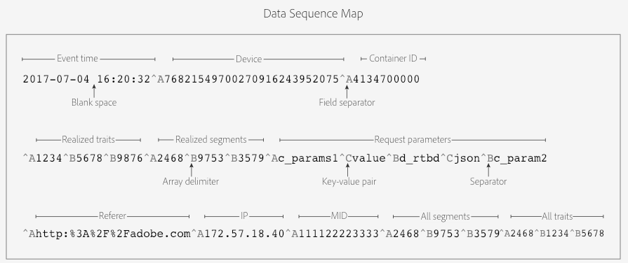

# [!UICONTROL Customer Data Feeds] {#customer-data-feeds}

Información básica sobre [!UICONTROL Customer Data Feed] los archivos ([!UICONTROL CDF]) e instrucciones sobre cómo empezar. Inicio aquí si está interesado en recibir [!UICONTROL CDF] archivos o simplemente desea más información.

## Archivo Contenido y finalidad {#file-contents-purpose}

Un [!UICONTROL CDF] archivo contiene los mismos datos que una [!DNL Audience Manager] llamada de evento (`/event`) envía a nuestros servidores. Esto incluye los datos gustar los ID de usuario, [!UICONTROL trait IDs], [!UICONTROL segment IDs]y todos los demás parámetros capturados por una llamada de evento. Los procesos de sistemas internos [!DNL Audience Manager] datos de evento en un [!UICONTROL CDF] archivo con contenido organizados en campos que aparecen en un orden establecido. [!DNL Audience Manager] Intenta generar [!UICONTROL CDF] archivos cada hora y los almacena en un bloque seguro y específico del cliente en un [!DNL Amazon S3] servidor. Proporcionamos estos archivos para que pueda trabajar con [!DNL Audience Manager] datos fuera de los límites impuestos por nuestra interfaz de usuario.

>[!IMPORTANT]
>
>Tenga en cuenta las siguientes restricciones cuando se trabaja con archivos CDF:
>
>* Antes de configurar el envío de archivo CDF, asegúrese de tener los permisos adecuados de terceros proveedores de datos para la exportación de terceros características. Audience Manager actualmente no admite funcionalidad en la interfaz de usuario para solicitud archivo CDF envío exportar permiso de proveedores de datos de terceros, así que comuníquese con ellos de forma independiente.
>* No debe utilizar [!UICONTROL CDF] los archivos como proxy para monitor Página tráfico, conciliar discrepancias en el informe, o para facturación, etc.

## Introducción {#getting-started}

No hay ningún proceso de autoservicio para inicio [!UICONTROL CDF] archivo envío. Para comenzar, póngase en contacto con su asesor o con el [!DNL Audience Manager] Servicio de atención al cliente. Durante implementación, su [!DNL Audience Manager] representante:

* Configure el bucket de [!DNL Amazon S3] almacenamiento.
* Proporcione credenciales de autenticación de solo [!DNL S3] lectura a su archivo almacenamiento bucket. No podrá ver ni acceder a directorios y archivos que pertenezcan a otros clientes.

Archivo notificaciones y [!UICONTROL CDF] archivos aparecerán en su [!DNL S3] bucket cuando estén listos para descargar. Usted es responsable de supervisar y descargar archivos de su directorio asignado [!DNL S3] . Consulte [Notificaciones sobre procesamiento de archivos de fuentes de datos de clientes](#cdf-file-processing-notifications).

## Pasos siguientes {#next-steps}

Las secciones siguientes y las preguntas frecuentes[ sobre la fuente de datos del ](../faq/faq-cdf.md)cliente pueden ayudarle a familiarizarse con este servicio.

## [!UICONTROL Customer Data Feed] Contenido definido {#cdf-defined}

Enumera y define los elementos de datos y las matrices de un [!UICONTROL CDF] archivo, por orden de apariencia. Las definiciones incluyen tipos de datos, pero esta información no forma parte de un [!UICONTROL CDF] archivo.

>[!IMPORTANT]
>
>Los píxeles de evento se excluyen de forma predeterminada en las configuraciones de CDF. Asegúrese de especificar en su solicitud a Client Care si desea incluir evento píxeles en sus archivos CDF. Cada píxel evento se completará como una fila única en sus archivos CDF.

## Definiciones {#definitions}

Un [!UICONTROL CDF] archivo incluye algunos o todos los campos definidos a continuación. Para obtener información sobre la organización interna de archivos, consulte [Estructura](#cdf-file-structure) del Archivo de la fuente de datos del cliente.

<table id="table_46BC897A30C2469AB5911F5B85A3FAA7"> 
 <thead> 
  <tr> 
   <th colname="col1" class="entry"> Campo </th> 
   <th colname="col2" class="entry"> Tipo de datos </th> 
   <th colname="col3" class="entry"> Descripción </th> 
  </tr> 
 </thead>
 <tbody> 
  <tr> 
   <td colname="col1"> <p><code> Event Time</code> </p> </td> 
   <td colname="col2"> <p>Timestamp </p> </td> 
   <td colname="col3"> <p>La hora en que un archivo CDF fue procesado por los servidores<span class="wintitle"> de recopilación de </span> datos (DCS). La marca de hora utiliza la <i>formato aaaa-mm-dd hh:mm:ss</i> y se establece en la zona horaria UTC. </p> <p> <p>Nota: El Tiempo del <i>evento no</i> es: <p> 
       <ul id="ul_41ABC813FAAC4659AC8DA13F4A6DD7EB"> 
        <li id="li_0192D253EA4C49C4BF2E8BA62CEE028E">La hora de la Página evento o la evento se llaman a sí mismas, aunque puede estar cerca de esas horas. </li> 
        <li id="li_271DF14395BC495FBF17186588A554A8">Relacionado con la hora DCS en el nombre del archivo. Consulte también <a href="#different-processing-times"> Fuente de datos del cliente Archivo Horas de nombres y Archivo Horas de contenido...</a>. </li> 
       </ul> </p> </p> </p> </td> 
  </tr> 
  <tr> 
   <td colname="col1"> <p><code> Device</code> </p> </td> 
   <td colname="col2"> <p>Cadena </p> </td> 
   <td colname="col3"> <p>Este es el ID<span class="wintitle"> de usuario único (UUID), que es un </span> ID de dispositivos de 38 dígitos para su visitante del sitio. Consulte también Index <a href="../reference/ids-in-aam.md"> de ID en Audience Manager</a>. </p> </td> 
  </tr> 
  <tr> 
   <td colname="col1"> <p><code> Container ID</code> </p> </td> 
   <td colname="col2"> <p>Numérica </p> </td> 
   <td colname="col3"> <p>El ID de la contenedor que activa la sincronización de ID. Este campo solo se rellena si establece el ID de contenedor en el campo d_nsid <i></i> del sitio implementación. De lo contrario, el valor predeterminado de 0 no se incluirá en los archivos CDF. </p> </td> 
  </tr> 
  <tr> 
   <td colname="col1"> <p><code> Realized Traits</code> </p> </td> 
   <td colname="col2"> <p>Matriz numérica </p> </td> 
   <td colname="col3"> <p>Matriz de ID de rasgos que contiene todas las características que un visitante ha obtenido (para el que está cualificado) en la llamada de evento. </p> <p>Tenga en cuenta que la matriz puede contener características para las que el visitante había calificado antes y para las que vuelve a calificar a través de esta llamada de evento. </p> </td> 
  </tr> 
  <tr> 
   <td colname="col1"> <p><code> Realized Segments</code> </p> </td> 
   <td colname="col2"> <p>Matriz numérica </p> </td> 
   <td colname="col3"> <p>Matriz de ID de segmento que contiene todos los segmentos que un visitante realizó (para los cualificó) en la llamada de evento. </p> </td> 
  </tr> 
  <tr> 
   <td colname="col1"> <p><code> Request Parameters</code> </p> </td> 
   <td colname="col2"> <p>Cadena </p> </td> 
   <td colname="col3"> <p>Una cadena que captura todos los parámetros (variables, ID, pares clave-valor, ID dispositivos publicidad, etc.) transferidos en la llamada evento. </p> <p>Ejemplo abreviado: </p> <p> <code> d_rtbd:json,c_contextData.a.CarrierName:mobile,c_contextData.a.adid:92D56353-49C5-431E-B474-FC528D585810,c_contextData.a,RunMode:Application,c_contextData.a.DaysSinceLastUpgrade:61,d_cid_ic:xid%01EACB6E40-AC65-4012-9FE9-ABD59965E9C4%011,c_contextData.a.PrevSessionLength:583</code> </p> </td> 
  </tr> 
  <tr> 
   <td colname="col1"> <p><code> Referer Data Type</code> </p> </td> 
   <td colname="col2"> <p>Cadena </p> </td> 
   <td colname="col3"> <p>La URL no codificada de la Página de referencia (en caso de haberla). </p> </td> 
  </tr> 
  <tr> 
   <td colname="col1"> <p><code> IP Data Type</code> </p> </td> 
   <td colname="col2"> <p>Cadena </p> </td> 
   <td colname="col3"> <p>Dirección IP del visitante capturado en la llamada de evento. </p> </td> 
  </tr> 
  <tr> 
   <td colname="col1"> <p><code> MCDevice </code> </p> </td> 
   <td colname="col2"> <p>Cadena </p> </td> 
   <td colname="col3"> <p>ID <span class="keyword"> de Experience Cloud</span> (MID) asignado al visitante del sitio. Consulte también Cookies <a href="https://experienceleague.adobe.com/docs/id-service/using/intro/cookies.html?lang=es" format="https" scope="external"> y el servicio</a> de Adobe Experience Platform ID. </p> </td> 
  </tr> 
  <tr> 
   <td colname="col1"> <p><code> All Segments</code> </p> </td> 
   <td colname="col2"> <p>Matriz numérica </p> </td> 
   <td colname="col3"> <p>Matriz de ID de segmento que contiene segmentos realizados anteriormente y segmentos nuevos para los que el visitante está cualificado. </p> </td> 
  </tr> 
  <tr> 
   <td colname="col1"> <p><code> All Traits</code> </p> </td> 
   <td colname="col2"> <p>Matriz numérica </p> </td> 
   <td colname="col3"> <p>Matriz de ID de características de primera y terceros que contiene características realizadas anteriormente y nuevas características para las que el visitante ha calificado desde la última fuente de datos generada. </p> </td> 
  </tr> 
 </tbody> 
</table>

## [!UICONTROL Customer Data Feed] Estructura Archivo {#cdf-file-structure}

Enumera y define la estructura de datos de un [!UICONTROL CDF] archivo. Esto incluye Secuencia de datos, delimitadores y separadores de campo, un mapa de archivos de datos y un archivo de muestra.

## Secuencia e identificadores de campo de datos {#identifiers-and-sequence}

[!UICONTROL CDF] Los archivos no contienen columnas ni encabezados de campo etiquetados. En su lugar, un archivo define campos [!UICONTROL CDF] y matrices con caracteres de no impresión [!DNL ASCII] . Además, el [!UICONTROL CDF] archivo enumera cada campo y matriz en un orden específico. Comprender los identificadores de campo y el orden le ayudará a analizar el archivo correctamente.

<table id="table_D2C8786DF7CE47E5ADB8930EC825F8F6"> 
 <thead> 
  <tr> 
   <th colname="col1" class="entry"> Elemento Archivo CDF </th> 
   <th colname="col2" class="entry"> Descripción </th> 
  </tr> 
 </thead>
 <tbody> 
  <tr> 
   <td colname="col1"> <p>Separadores y delimitadores de campos </p> </td> 
   <td colname="col2"> <p>Estos caracteres de no impresión definen los elementos y la estructura de su archivo CDF: </p> <p> 
     <ul id="ul_056A9B90AC88405CBB5F81A56CD6E4C9"> 
      <li id="li_B9DA15DCB6A445D781B8753C1C4262B0">Ctrl + a (ASCII <code> 001</code> o <code> ^A</code>) separa los datos de campos individuales con un indicador de espacio de no impresión. </li> 
      <li id="li_E68D0CC065B34AC9AF91F166CAA2A67C">Ctrl + b (ASCII <code> 002</code> o <code> ^B</code>) separa los datos de una matriz y solicitud parámetros. </li> 
      <li id="li_6C32D927FEF04CDE9887374E8C2688E7">Ctrl + c (ASCII <code> 003</code> o <code> ^C</code>) define pares clave-valor. </li> 
     </ul> </p> </td> 
  </tr> 
  <tr> 
   <td colname="col1"> <p>Secuencia de campos </p> </td> 
   <td colname="col2"> <p> <p>Importante: <span class="keyword"> Audience Manager</span> se reserva el derecho de añadir nuevos campos al final del archivo CDF en futuras versiones. Esto significa que el diseño técnico del sistema de análisis de archivos no debe suponer un número fijo de columnas (aunque puede suponer un orden fijo para las columnas existentes).</p> </p> <p>Los datos en su archivo CDF aparecen en el orden que se muestra a continuación. /N puede aparecer en lugar de cualquiera de estos campos, lo que indica un valor nulo.</p> <p> 
     <ol id="ol_1FDF4A7F089448ED8A724378C23009C8"> 
      <li id="li_CB97D90B54EB4F95861583D4A5F660C7">Hora del evento </li> 
      <li id="li_C44E8CCB1A964B7A941FD772FB8A7608">Device </li> 
      <li id="li_F8AE0D4CA19D411686A240FE06F56147">ID de contenedor </li> 
      <li id="li_660D17989BE54610A01229C47894E8A9">Características realizadas </li> 
      <li id="li_1591180564374204852785C6FFCA4F74">Segmentos realizados </li> 
      <li id="li_FE38DA4969EE4E19B39124E77E2EA5F9">Parámetros de solicitud </li> 
      <li id="li_9AC25DA883214FBC902D7CE9DACFAE28">Sitio de referencia </li> 
      <li id="li_BA05F1C33B5B4625B450425FF1911B30">Dirección IP </li> 
      <li id="li_08E632FB135F42B5830D5CBFE6EE6BE8">Experience Cloud ID de dispositivo (o MID). Consulte también <a href="https://experienceleague.adobe.com/docs/id-service/using/intro/cookies.html?lang=es" format="https" scope="external"> Cookies y el servicio de identidad de Adobe Experience Platform</a> </li> 
      <li id="li_7A05AF4790A1425A90D019681DF4A595">Todos los segmentos </li> 
      <li id="li_1B5A6F076A354BA0A931CB260E6D2675">Todas las características </li> 
     </ol> </p> <p>Para ver descripciones de los campos, consulte <a href="#cdf-defined"> Definición del contenido</a> de la fuente de datos del cliente. </p> </td> 
  </tr> 
 </tbody> 
</table>

## [!UICONTROL CDF] Mapa Archivo {#cdf-file-map}

[!UICONTROL CDF] Los datos del archivo aparecen en el orden que se muestra a continuación.



## Identificación de matrices

Las matrices de un [!UICONTROL CDF] archivo inicio y terminan con el separador de `Ctrl + a` campos. Esto hace que el primer elemento de una matriz aparezca gustar campo de datos independiente. Por ejemplo, la matriz realizada [!UICONTROL traits] comienza con `^A1234`. El ID y el delimitador `^B5678` de la matriz siguen a esta entrada. Como resultado, podría sentirse tentado a pensar que el primer elemento en la matriz realizada [!UICONTROL traits] es ID 5678 (porque comienza con `^B`). Este no es el caso, por lo que debe estar familiarizado con el Secuencia y la estructura de un archivo de datos. Aunque el primer elemento de la matriz realizada [!UICONTROL trait] (o cualquiera de las otras matrices de un [!UICONTROL CDF] archivo) comienza con `^A`, el orden de aparición o posición en el archivo define la inicio de una matriz. Y, el primer elemento de una matriz siempre está separado de la entrada anterior por `^A`.

## Ejemplo [!UICONTROL CDF] de Archivo {#sample-file}

Un archivo de muestra [!UICONTROL CDF] puede tener un aspecto similar al siguiente. Hemos insertado saltos de línea en este ejemplo para ayudar a que se ajuste al Página.


## [!UICONTROL Customer Data Feed] Archivo convenciones de nomenclatura {#cdf-naming-conventions}

Las secciones siguientes lista y definen los elementos en [!UICONTROL CDF] su nombre de archivo.

## [!UICONTROL CDF] Nombre de Archivo: sintaxis y ejemplo {#cdf-file-name}

Un nombre de archivo típico [!UICONTROL CDF] contiene los elementos enumerados a continuación. Nota: *La* letra en cursiva indica un marcador de posición variable:

### Sintaxis

```
s3://aam-cdf/YOUR-S3-BUCKET-NAME/day=yyyy-mm-dd/hour=hh/AAM-CDF_PARTNER-ID_FILE-SEQUENCE_0.gz
```

### Ejemplo

```
s3://aam-cdf/dataCompany/day=2017-09-14/hour=17/AAM_CDF_1234_0_0_0.gz
```

En su [!DNL S3] bloque almacenamiento, los archivos se ordenan de forma ascendente por ID de socio ([!UICONTROL PID]), día y hora.

## [!UICONTROL CDF] Archivo Elementos de nombre definidos {#cdf-file-name-elements}

En la tabla siguiente se enumeran y definen los elementos de un [!UICONTROL CDF] nombre de archivo.

<table id="table_4AC4F90C1C7D43E2A93CB3B6908D7E94"> 
 <thead> 
  <tr> 
   <th colname="col1" class="entry"> Archivo elemento Name </th> 
   <th colname="col2" class="entry"> Descripción </th> 
  </tr> 
 </thead>
 <tbody> 
  <tr> 
   <td colname="col1"> <p> <code> s3://aam-cdf/</code> </p> </td> 
   <td colname="col2"> <p>Este es el bucket de almacenamiento raíz predeterminado para su archivo CDF en un servidor Amazon S3. </p> </td> 
  </tr> 
  <tr> 
   <td colname="col1"> <p> <code> <i>your S3 bucket name</i> </code> </p> </td> 
   <td colname="col2"> <p>Nombre del bucket S3 de solo lectura que contiene sus archivos CDF. </p> </td> 
  </tr> 
  <tr> 
   <td colname="col1"> <p> <code>day=<i>yyyy-mm-dd</i></code> </p> </td> 
   <td colname="col2"> <p>La fecha en que se procesó el archivo. </p> </td> 
  </tr> 
  <tr> 
   <td colname="col1"> <p> <code>hour=<i>hh</i></code> </p> </td> 
   <td colname="col2"> <p>Un valor de hora expresado en notación de 24 horas y establecido en la zona horaria UTC. Consulte también <a href="#different-processing-times"> Fuente de datos del cliente Archivo Horas de nombres y Archivo Horas de contenido...</a>. </p> </td> 
  </tr> 
  <tr> 
   <td colname="col1"> <p> <code> <i>partner ID</i> </code> </p> </td> 
   <td colname="col2"> <p>Su ID socio. </p> </td> 
  </tr> 
  <tr> 
   <td colname="col1"> <p> <code> <i>File Sequence</i>_0</code> </p> </td> 
   <td colname="col2"> <p>Valores que identifican el Secuencia de archivo. El Secuencia aumenta de la siguiente manera: 0_0_0 , 0_1_0, 0_2_0....1_0_0</p> </td> 
  </tr> 
  <tr> 
   <td colname="col1"> <p> <code> .gz</code> </p> </td> 
   <td colname="col2"> <p>Una extensión de archivo gzip. Los archivos CDF están comprimidos gzip. </p> </td> 
  </tr> 
 </tbody> 
</table>

## [!UICONTROL Customer Data Feed] Archivo notificaciones de procesamiento {#cdf-file-processing-notifications}

[!DNL Audience Manager] escribe un `.info` archivo en el [!DNL S3] directorio para avisarle cuando su [!UICONTROL Customer Data File] ([!UICONTROL CDF]) esté listo para descargar. El `.info` archivo también incluye [!DNL JSON] metadatos con formato sobre el contenido de los [!UICONTROL CDF] archivos. Consulte esta sección para obtener información sobre la sintaxis y los campos utilizados por este archivo notificación.

## Información de muestra Archivo {#sample-info-file}

Cada `.info` archivo contiene una `Files` sección and `Totals` . Esta `Files` sección contiene una matriz que contiene métricas específicas para cada archivo por hora. Esta `Totals` sección contiene métricas agregadas en todos los [!UICONTROL CDF] archivos para un día en particular. El contenido del `.info` archivo podría ser similar al del siguiente ejemplo.

```js
{
    "Files": [
        {
            "FileByteSize": 2709730,
            "FileChecksumMD5": "a9ea418e79511642cff11c2a898037dc-1",
            "FileName": "AAM_CDF_1109_000000_0.gz",
            "FileSequenceNumber": 1
        },
        {
            "FileByteSize": 2783351,
            "FileChecksumMD5": "7b469485d60274b6991acd0817855840-3",
            "FileName": "AAM_CDF_1109_000001_0.gz",
            "FileSequenceNumber": 2
        }
    ],
    "Totals": {
        "Day": "2017-09-26",
        "Hour": "18",
        "TotalByteSize": 150092997,
        "TotalNumberFiles": 2
    }
}
```

## Información Archivo campos definidos {#info-file-fields-defined}

Las tablas siguientes lista y definen los elementos de un [!UICONTROL CDF] `.info` archivo.

### Archivos objeto

<table id="table_582101B414864DA991CE813A7937ECC6"> 
 <thead> 
  <tr> 
   <th colname="col1" class="entry"> Campo </th> 
   <th colname="col2" class="entry"> Descripción </th> 
  </tr> 
 </thead>
 <tbody> 
  <tr> 
   <td colname="col1"> <p> <code> Files</code> </p> </td> 
   <td colname="col2"> <p>Inicia la matriz que contiene metadatos sobre los archivos CDF. </p> </td> 
  </tr> 
  <tr> 
   <td colname="col1"> <p> <code> FileByteSize</code> </p> </td> 
   <td colname="col2"> <p>Archivo tamaño en bytes. </p> </td> 
  </tr> 
  <tr> 
   <td colname="col1"> <p> <code> FileChecksumMD5</code> </p> </td> 
   <td colname="col2"> <p>La Amazon S3 ETag. El número que sigue al guión muestra el número de partes utilizadas para versión el archivo durante el cargar de varias partes. El <code> ETag</code> no es idéntico a la suma de comprobación MD5 del archivo. </p> </td> 
  </tr> 
  <tr> 
   <td colname="col1"> <p> <code> FileName</code> </p> </td> 
   <td colname="col2"> <p>El nombre del archivo. Consulte <a href="#cdf-naming-conventions"> Fuente de datos de cliente Archivo convenciones</a> de nomenclatura. </p> </td> 
  </tr> 
  <tr> 
   <td colname="col1"> <p> <code> FileSequenceNumber</code> </p> </td> 
   <td colname="col2"> <p>Un número de índice para cada archivo. </p> </td> 
  </tr> 
 </tbody> 
</table>

### Objeto Totales

<table id="table_44F0B2D229E84A5DB3041760B1A50858"> 
 <thead> 
  <tr> 
   <th colname="col1" class="entry"> Campo </th> 
   <th colname="col2" class="entry"> Descripción </th> 
  </tr> 
 </thead>
 <tbody> 
  <tr> 
   <td colname="col1"> <p> <code> Totals</code> </p> </td> 
   <td colname="col2"> <p>Inicia el objeto que contiene los datos agregados sobre todos los archivos CDF. </p> </td> 
  </tr> 
  <tr> 
   <td colname="col1"> <p> <code> Day</code> </p> </td> 
   <td colname="col2"> <p>El día para el cual los datos están disponibles. Utiliza <i>formato-mm-dd</i> aaaa. </p> </td> 
  </tr> 
  <tr> 
   <td colname="col1"> <p> <code> Hour</code> </p> </td> 
   <td colname="col2"> <p>Hora para la cual hay datos disponibles. Utiliza formato de 24 horas definidas en la zona horaria UTC. </p> </td> 
  </tr> 
  <tr> 
   <td colname="col1"> <p> <code> TotalByteSize</code> </p> </td> 
   <td colname="col2"> <p>Tamaño total de todos sus archivos CDF para esa fecha en bytes. </p> </td> 
  </tr> 
  <tr> 
   <td colname="col1"> <p> <code> TotalNumberFiles</code> </p> </td> 
   <td colname="col2"> <p>Número total de archivos cargados en el directorio S3. </p> </td> 
  </tr> 
 </tbody> 
</table>

## [!UICONTROL Customer Data Feed] Nombre Archivo Las horas y las horas del contenido Archivo son diferentes {#different-processing-times}

El [!UICONTROL CDF] archivo contiene marcas de tiempo en el nombre y el contenido del archivo. Estas marcas de tiempo registran diferentes procesos evento para el mismo [!UICONTROL CDF] archivo. No es raro ver diferentes marcas de tiempo en el nombre y el contenido del mismo archivo. Comprender cada marca de tiempo puede ayudarlo a evitar errores comunes al trabajar con estos datos o intentar ordenarlos por tiempo.

## Localización [!UICONTROL CDF] de marcas de hora de Archivo {#locating-timestamps}

[!UICONTROL CDF] Los archivos registran el tiempo de manera diferente en 2 ubicaciones separadas.


## Comprender la diferencia entre marcas de hora {#understanding-timestamps}

En la tabla siguiente se proporcionan detalles adicionales sobre las marcas de tiempo de los [!UICONTROL CDF] archivos, así como información sobre cómo utilizarlos correctamente.

| Ubicación de la marca de tiempo | Descripción |
|--- |--- |
| Nombre del archivo | La marca de tiempo en el nombre de archivo marca el momento en [!DNL CDF] el que [!DNL Audience Manager] se comenzó a preparar el archivo para la envío. Esta marca de tiempo se establece en la [!DNL UTC] zona horaria. Utiliza el parámetro, con el formato de `hour=` hora como una hora de 2 dígitos en notación de 24 horas. Este tiempo puede ser diferente del tiempo de evento registrado en el contenido del archivo. Al trabajar con [!DNL CDF] archivos, a veces notará que su [!DNL S3] cubo está vacío durante una hora en particular. Un bucket vacío significa que puede significar cualquiera de los siguientes medios:<ul><li>No hay datos para esa hora en particular. </li><li> Nuestros servidores están sometidos a cargas pesadas y no pueden procesar archivos durante una hora en particular. Cuando el servidor se pone al día, coloca los archivos que deberían haber ido en un bucket de tiempo anterior en un bucket con un valor de tiempo posterior. Por ejemplo, verá esto cuando un archivo que debería haber estado en el cubo de la hora 17 aparezca en el cubo de la hora 18 (con `hour=18` en el nombre del archivo). En este caso, el servidor probablemente comenzó a procesar su archivo en la hora 17 pero no pudo completarlo dentro de ese intervalo de tiempo. En su lugar, el archivo se inserta en el siguiente bloque de tiempo por hora.</li></ul><br>**Importante**: No utilice la marca de tiempo del nombre de archivo para grupo eventos por tiempo. Si necesita grupo por tiempo, utilice la marca de `EventTime` tiempo en el contenido del archivo. |
| Contenido Archivo | La marca de tiempo en [!DNL CDF] el contenido del archivo marca el tiempo en que [!DNL Data Collection Servers] se inició el procesamiento del archivo. Esta marca de tiempo se establece en la [!DNL UTC] zona horaria. Utiliza el campo, con el formato de `EventTime` tiempo como *`yyyy-mm-dd hh:mm:ss`*. Esta hora es cercana a la hora real de la evento en el Página, pero puede ser diferente del indicador de hora en el nombre del archivo. <br> **Sugerencia**: a diferencia de la marca de `hour=` tiempo en el nombre del archivo, puede usar `EventTime` para grupo datos por tiempo. |

>[!MORELIKETHIS]
>
>* [Preguntas frecuentes sobre la Fuente de datos de clientes](../faq/faq-cdf.md)
