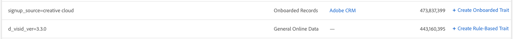

# Crear rasgos a partir de señales

Crear nuevas características de todas las señales, incluidas las que ya se utilizan en características, y capturar las audiencias futuras que califiquen después de la creación de características. Vea el vídeo para obtener una demostración rápida o lea la información detallada:

>[!VIDEO](https://video.tv.adobe.com/v/25169/?quality=12)

## Características de Crear del tablero de señales {#create-traits-from-signal-dashboard}

El [!UICONTROL Signal Dashboard] permite crear nuevas características desde [!UICONTROL Top Unused Signals] , [!UICONTROL New Unused Signals] y las búsquedas guardadas.

Cuando se crea una nueva característica, el tipo de característica se configura previamente en función del tipo de señal:

* **[!UICONTROL Rule-based]** características para señales en tiempo real, archivos de registro procesables y [!DNL Adobe Analytics] señales;

* **[!UICONTROL Onboarded]** características de las señales incorporadas.

Para crear nuevas características desde **[!UICONTROL Signal Dashboard]** , identifique la señal que desee utilizar en el rasgo y, a continuación, haga clic en la correspondiente **[!UICONTROL Create Rule-Based Trait]** o **[!UICONTROL Create Onboarded Trait]** vincular.

Se le redirigirá al **[generador](../../features/traits/about-trait-builder.md)** de rasgos para crear las nuevas características.

## Características de Crear de la señal Search {#create-traits-from-signal-search}

Crear características basadas en señales usadas o no utilizadas que no se muestran en el [!UICONTROL Signal Dashboard] .

Search para señales específicas y crear rasgos basados en regla o incorporados en base a los resultados. A continuación se muestra cómo hacer esto:

1. Vaya a **[!UICONTROL Audience Data > Signals > Search]** un búsqueda y ejecútelo en función de los pares de clave-valor que esté buscando o haga clic en **[!UICONTROL Search]** sin introducir ningún par clave-valor para mostrar todos los resultados.
2. Identifique las señales que desee utilizar en el rasgo, en el lista de resultados.
   * Para crear un rasgo a partir de una señal, haga clic en el correspondiente **[!UICONTROL Create Rule-Based Trait]** o **[!UICONTROL Create Onboarded Trait]** en el vincular.
   * Para crear un rasgo a partir de varias señales, haga clic en la casilla de verificación correspondiente de cada señal y, a continuación, haga clic en **[!UICONTROL Create Trait from Multiple Signals]** .

   >[!NOTE]
   >Solo se pueden crear rasgos a partir de las señales del mismo tipo. No se puede crear un rasgo basado en una combinación de una señal en tiempo real y una llamada integrada.
   >
   > 
   >También puede crear características a partir de las señales usadas. Las señales que ya se utilizan en características tienen el número de rasgos mostrados en la **[!UICONTROL Included in Traits]** columna. Haga clic en la flecha para ver las características que incluyen la señal.
   >
   >

3. Utilice el **[generador](../../features/traits/about-trait-builder.md)** de características para crear las nuevas características.
