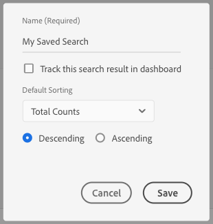
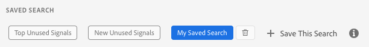

# Guardar criterios de búsqueda {#save-search-criteria}

Optimice los esfuerzos de búsqueda de señales guardando hasta 10 conjuntos de criterios de búsqueda para usarlos cuando los necesite y realice un seguimiento de los mismos en [!UICONTROL Signals Dashboard]. Audience Manager vuelve a cargar las búsquedas guardadas cada vez que se carga [!UICONTROL Signals Dashboard].

1. Vaya a **[!UICONTROL Audience Data > Signals > Search]** y ejecute un **[!UICONTROL Signals Search]** con los pares clave-valor o los filtros que desee guardar para futuras búsquedas.
1. Haga clic en **[!UICONTROL Save this Search]** una vez que obtenga los resultados de la búsqueda.

   
1. Escriba un nombre sugestivo para la búsqueda, de modo que pueda identificarlo más adelante.
1. (Opcional) Active la opción **[!UICONTROL Track this search result in the dashboard]** si desea que el panel de señales incluya las señales en el conjunto de búsqueda actual.
1. Seleccione los criterios de **[!UICONTROL Default Sorting]**:
   * **[!UICONTROL Total Counts]**
   * **[!UICONTROL Key Name]**
1. Elija el modo **[!UICONTROL Default Sorting]**:
   * **[!UICONTROL Descending]**
   * **[!UICONTROL Ascending]**
1. Haga clic en **[!UICONTROL Save]**. Puede ver la búsqueda guardada en la sección [!UICONTROL Saved Search] y utilizarla siempre que la necesite.

Vea el siguiente vídeo para aprender a guardar búsquedas de señal.

>[!VIDEO](https://video.tv.adobe.com/v/25147/)
