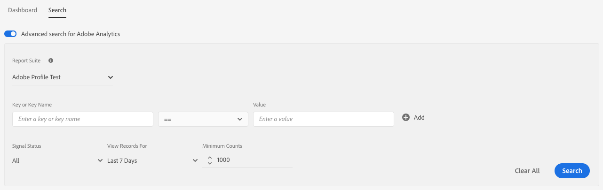

# Búsqueda avanzada de Adobe Analytics {#advanced-search-for-adobe-analytics}

Los clientes de Audience Manager que también usen [!DNL Adobe Analytics] pueden aprovechar la integración estrecha entre las dos soluciones habilitando la opción [!UICONTROL Advanced Search for Adobe Analytics].

Esta integración le permite ver los nombres descriptivos de los pares de clave-valor derivados de [!DNL Adobe Analytics] grupos de informes. A continuación se indica cómo hacerlo:

1. Vaya a [!UICONTROL Audience Data > Signals > Search], ejecute un [!UICONTROL Signals Search] y habilite la opción **[!UICONTROL Advanced search for Adobe Analytics]**.
1. Utilice el menú desplegable **[!UICONTROL Report Suite]** para buscar y seleccionar el grupo de informes [!DNL Adobe Analytics] que se va a utilizar.
1. Escriba el resto de los criterios de búsqueda y haga clic en **[!UICONTROL Search]**. Para buscar todas las señales en el grupo de informes especificado, deje los campos clave-valor en blanco.
   >[!NOTE]
   >
   >El campo **[!UICONTROL Key or Key Name]** muestra sugerencias autocompletadas basadas en sus datos de entrada, así como nombres descriptivos para las claves que ingresó.

   
1. Los resultados de la búsqueda ahora le mostrarán los nombres descriptivos de los pares clave-valor introducidos en la columna **[!UICONTROL Key or Key Name]** o de todas las señales del grupo de informes, si ha dejado los campos clave-valor en blanco.

El siguiente vídeo muestra cómo usar [!UICONTROL Data Explorer] para detectar y usar los datos de Adobe Analytics, incluida la búsqueda de señales usadas y no usadas, la creación de características de Analytics y la comprensión de los datos.

>[!VIDEO](https://video.tv.adobe.com/v/25150)
