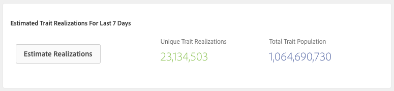

# Realizaciones de rasgos de relleno {#backfill-trait-realizations}

Rellenar las realizaciones de rasgos para capturar audiencias históricas y evitar la pérdida de datos relevantes antes de la fecha de creación de un rasgo.

>[!IMPORTANT]
>
>[!UICONTROL Data Explorer Trait Backfill] es una funcionalidad premium que mejora el experiencia Audience Manager desbloqueando casos de uso adicionales. El relleno requiere potencia de procesamiento adicional y está disponible para todos los clientes Audience Manager a un costo incremental. Póngase en contacto con su representante de ventas de Adobe Systems para obtener más detalles.

Cuando crea rasgos a partir de señales no utilizadas, puede optar por relleno las realizaciones de rasgos durante un período de tiempo específico. [!DNL Audience Manager] Capta el datos históricos sobre las audiencias que cumplen los requisitos para el nuevo rasgo y las almacena en el perfil correspondiente. Puede verlo **[!UICONTROL Backfill Options]** en la [!UICONTROL Trait Expression] sección del generador **[de](../../features/traits/about-trait-builder.md)** rasgos.

>[!NOTE]
>
>Puede relleno realizaciones de características para rasgos basados en el regla y en incorporados.

A continuación, le indicamos cómo relleno las realizaciones de rasgos:

1. Vaya a [!UICONTROL Audience Data > Signals > Search] y ejecute un Search de señales o utilice el Panel de [señales](../../features/data-explorer/data-explorer-signals-dashboard.md) para identificar las señales que se usarán en el nuevo rasgo.
1. Crear un nuevo rasgo en función de las señales deseadas.
1. Utilice la **[!UICONTROL Backfill Options]** **[!UICONTROL Trait Expression]** sección para seleccionar el intervalo de tiempo durante el cual desea relleno las realizaciones de características. Los intervalos relleno predefinidos incluyen 1, 7, 14 y 30 días. También puede elegir un intervalo de fecha personalizado de hasta 30 días.

   

1. (Opcional) Haga clic **[!UICONTROL Estimate Realizations]** en la **[!UICONTROL Estimated Trait Realizations]** sección para ver las estimaciones [!UICONTROL Unique Trait Realizations] y [!UICONTROL Total Trait Population] los valores de la característica de relleno en los últimos 7 días.

   

   >[!IMPORTANT]
   >
   >El relleno y la estimación de características no están disponibles para características con expresiones que usan los siguientes operadores:
   >    * `!=`
   >    * `matchesregex`
   >    * `matcheswords`
1. Crear el rasgo.

Una vez que termine de crear el rasgo, verá sus realizaciones de relleno incluidas en las estadísticas de realización.

Mire el video a continuación para ver un recorrido en video sobre cómo relleno características.

>[!VIDEO](https://video.tv.adobe.com/v/25169/)

## Latencia de relleno de rasgos {#trait-backfilling-latency}

Las características recién creadas inicio capturar audiencias de dos a tres horas después de su creación. Sin embargo, debido al gran volumen de datos que [!DNL Audience Manager] realiza a diario, la población de relleno no se refleja inmediatamente en los [!UICONTROL Unique Trait Realizations] gráficos y [!UICONTROL Total Trait Population] .

Audience Manager actualiza el con la población rellenada en un plazo de 48 horas desde la [!UICONTROL Trait Graph] creación del rasgo.

## Límite de relleno de rasgos {#trait-backfilling-limit}

[!UICONTROL Data Explorer] Permite relleno hasta 50 características por mes, restableciendo el contador de relleno el día 1 de cada mes.

>[!NOTE]
>
>La cuota de relleno de rasgos no se traslada de meses anteriores. Por ejemplo, si relleno 30 características este mes, el rasgo relleno cuota para el mes siguiente se restablece a 50, no a 70.

## Impacto en la presentación de informes {#reporting-impact}

Las realizaciones de rasgos rellenadas se reflejan en las métricas and[!UICONTROL Unique Trait Realizations], ya que [!UICONTROL Total Trait Population] convierten las señales históricas en realizaciones de [!DNL Audience Manager] rasgos.

Sin embargo, los [!UICONTROL Trait Graph], [!UICONTROL General Reports], y [!UICONTROL Trend Reports] no se actualizan retroactivamente con métricas históricas rellenadas antes de la fecha de creación del rasgo.
