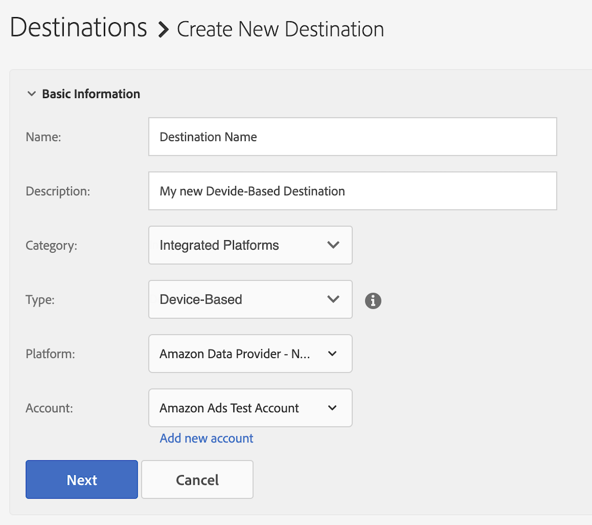

# Configurar [!DNL Amazon Advertising] como un destino basado en dispositivos de autoservicio {#configure-amazon}

Este artículo explica cómo configurar una integración con [Amazon Advertising](https://advertising.amazon.com/API/docs/en-us).

## Requisitos previos {#prerequisites}

Antes de configurar el destino [!DNL Amazon Advertising], asegúrese de cumplir los siguientes requisitos previos.

* Su cuenta de [!DNL Amazon] debe cumplir los requisitos para la publicidad.
* Al crear el primer destino [!DNL Amazon Advertising] en su instancia de Audience Manager, póngase en contacto con Adobe Consulting o con el Servicio de atención al cliente para habilitar la sincronización de ID [!DNL Amazon] (ID de Data Source = 139200) para su cuenta. Esto es necesario para la sincronización correcta entre el Audience Manager y [!DNL Amazon].
* Una vez creadas las nuevas audiencias del proveedor de datos, debe [actualizar sus metadatos](https://advertising.amazon.com/API/docs/en-us/data-provider/openapi#tag/Metadata/paths/~1v2~1dp~1audiencemetadata~1%7BaudienceId%7D/put) y agregar **[!DNL audience fees]**. Para esta operación, puede usar la [API de Amazon Ads](https://advertising.amazon.com/API/docs/en-us/guides/onboarding/apply-for-access) o la [IU de Amazon Advertising](https://advertising.amazon.com/).

## Agregar nuevo destino [!DNL Amazon Advertising] {#add-new-amazon-destination}

Esta sección describe los pasos que debe seguir al configurar un nuevo destino basado en dispositivos para [!DNL Amazon Advertising]. En este escenario se da por hecho que no tiene un destino [!DNL Amazon Advertising] configurado a través de su asesor de Adobe o del Servicio de atención al cliente.

### Paso 1. Autenticar con [!DNL Amazon Advertising] {#step1-authenticate-with-amazon}

Para poder agregar el destino basado en el dispositivo, debe vincular el Audience Manager y la cuenta de [!DNL Amazon Advertising]. A continuación se indica cómo hacerlo:

1. Inicie sesión en su cuenta de Audience Manager y vaya a **[!UICONTROL Administration > Integrated Accounts]**. Si tiene una integración configurada anteriormente con una plataforma de destino, debería verla en esta página. En caso contrario, la página está vacía.
1. Seleccione **[!UICONTROL Add Account]**.
1. Seleccione [!UICONTROL Amazon Data Provider].

   

1. Seleccione una de las opciones de **[!UICONTROL Amazon Data Provider]** según la región en la que se haya creado la cuenta de [!DNL Amazon Ads] (Norteamérica, Europa o Extremo Oriente) y haga clic en **[!DNL Confirm]** para que se le redirija a la página de autenticación.

   

1. Una vez que se haya autenticado, se le redirigirá a Audience Manager, donde debería ver sus cuentas de anunciante asociadas. Seleccione la cuenta de anunciante que desee usar y haga clic en **[!UICONTROL Confirm]**. Al hacerlo, autorizó el acceso de Audience Manager para enviar actualizaciones para sus audiencias.

### Paso 2: Crear un nuevo destino basado en dispositivos {#step2-create-new-destination}

Después de haber vinculado al Audience Manager y a su cuenta de [!DNL Amazon Advertising], puede crear el nuevo destino. A continuación se indica cómo hacerlo:

>[!NOTE]
>
>No puede cambiar el nombre de un destino existente basado en dispositivos. Asegúrese de proporcionar un nombre que le ayude a identificar el destino correctamente.

1. Inicie sesión en su cuenta de Audience Manager, vaya a **[!UICONTROL Audience Data > Destinations]** y seleccione **[!UICONTROL Create Destination]**.
1. En la sección **[!UICONTROL Basic Information]**, escriba un **[!UICONTROL Name]** y **[!UICONTROL Description]** para el nuevo destino y use la siguiente configuración:

   

1. Seleccione **[!UICONTROL Next]**.
1. Elija las [etiquetas de exportación de datos](/help/using/features/data-export-controls.md#controls-labels) que desee establecer para este destino.
1. Seleccione **[!UICONTROL Save]**.
1. En la sección **[!UICONTROL Segment Mappings]**, seleccione los segmentos de audiencia que desee enviar a este destino.
1. Guarde el destino.

## Consideraciones de tasas de coincidencia {#match-rates-considerations}

La integración entre el Audience Manager y [!DNL Amazon Advertising] admite rellenos de audiencia históricos. Todas las calificaciones del segmento se envían a [!DNL Amazon] cuando crea el destino.

## Resolución de problemas {#troubleshooting}

Al configurar o enviar datos al destino [!DNL Amazon Advertising], es posible que se encuentre con los errores que se describen a continuación. En esta sección se explica qué puede causar los errores y cómo corregirlos.

| Mensaje de error | Ocurrencia/Motivo | Resolución |
|---|---|---|
| `Internal server error` | Este mensaje de error se muestra en la interfaz de usuario del Audience Manager al intentar agregar una nueva cuenta de [!DNL Amazon] mediante una versión obsoleta de la API de Amazon. | Contacte con el Servicio de atención al cliente de Adobe. |
| `Amazon Error: Account XXXXXXXXX was not found` | Este mensaje de error se muestra en la interfaz de usuario del Audience Manager cuando las credenciales configuradas para el destino no están autorizadas para acceder a la cuenta de Amazon Ads correspondiente. | <ul><li>Asegúrese de que las credenciales de la cuenta que está usando cumplan [los requisitos previos](#prerequisites).</li><li>Vaya a la interfaz de usuario de Amazon Ads con las mismas credenciales y compruebe si las audiencias correctas se muestran en la cuenta correspondiente. </li></ul> |
