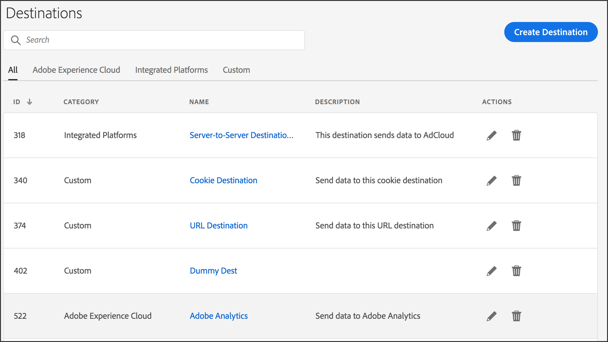

# Página de inicio de destinos {#destinations-home}

La página de aterrizaje [!UICONTROL Destination] enumera todos los destinos de servidor a servidor, las cookies y [!DNL URL]. Proporciona funciones que le permiten crear, editar, buscar e informar sobre destinos. La página de aterrizaje se encuentra en **[!UICONTROL Audience Data > Destinations]**.

## Página de aterrizaje predeterminada {#default-landing-page}

<!-- destinations-home.xml -->

La página de aterrizaje predeterminada enumera los destinos en función del tipo. Puede filtrar los destinos mediante las cuatro pestañas disponibles:

* **Todos**: muestra todos los tipos de destinos.
* **Adobe Experience Cloud**: muestra destinos que envían datos a otras soluciones de Adobe Experience Cloud. Actualmente, la única opción admitida es Adobe Analytics. Consulte [Configurar un destino de Analytics](/help/using/features/destinations/create-analytics-destination.md).
* **Plataformas integradas**: muestra destinos basados en personas y en dispositivos (también denominados destinos de servidor a servidor).
* **Personalizado**: muestra destinos de URL y cookies.

## Página de aterrizaje de Audiencias direccionables {#audiences-landing-page}

Para ver los datos de audiencia y las tasas de coincidencia para el destino servidor a servidor, seleccione **[!UICONTROL Integrated Platforms > Device-Based]**.

Para obtener más información acerca de la información mostrada, vea [Interfaz de audiencias direccionables](/help/using/features/addressable-audiences.md#addressable-audience-interface).

