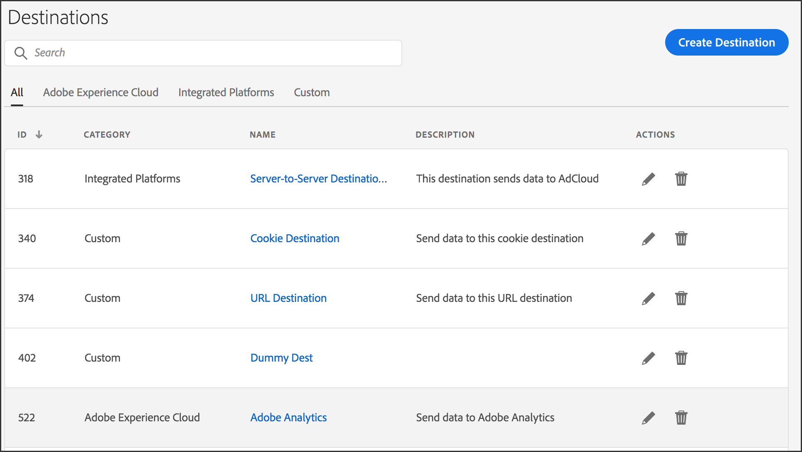

# Manage Destinations {#manage-destinations}

The [!UICONTROL Destination] landing page lists all of your [!DNL URL], cookie, and server-to-server destinations. Proporciona funciones que permiten crear, editar, buscar e informar sobre destinos. The landing page is located in **[!UICONTROL Audience Data > Destinations]**.

## Default Landing Page {#default-landing-page}

<!-- destinations-home.xml -->

La página de aterrizaje predeterminada enumera los destinos según el tipo. Puede filtrar los destinos utilizando las cuatro fichas disponibles:

* **Todos**: muestra todos los tipos de destinos.
* **Adobe Experience Cloud**: muestra destinos que envían datos a otras soluciones de Adobe Experience Cloud. Actualmente, la única opción compatible es Adobe Analytics. See [Configure an Analytics Destination](/help/using/features/destinations/create-analytics-destination.md).
* **Plataformas integradas**: muestra destinos basados en las personas y en los dispositivos (también denominados destinos servidor a servidor). Tenga en cuenta que los destinos basados en personas actualmente son una función beta que solo está disponible para clientes seleccionados.
* **Personalizado**: muestra destinos de URL y cookie.

## Addressable Audiences Landing Page {#audiences-landing-page}

To see audience data and match rates for your server-to-server destination, select **[!UICONTROL Integrated Platforms > Device-Based]**.

For more information about the displayed information, see [Addressable Audiences Interface](/help/using/features/addressable-audiences.md#addressable-audience-interface).

## Destination Builder {#destination-builder}

[!UICONTROL Destination Builder] permite crear destinos basados en cookies o [!DNL URL] en destinos. You cannot create server-to-server ([!DNL S2S]) destinations with [!UICONTROL Destination Builder], but you can manage their segment mappings. Contact your consultant to set up a [!DNL S2S] destination. [!UICONTROL Destination Builder] está ubicado **[!UICONTROL Audience Data > Destinations]** en.

### Destination Builder Settings {#destination-builder-settings}

<!-- destination-builder.xml -->

[!UICONTROL Destination Builder] consiste en las siguientes secciones y configuraciones:

| [!UICONTROL Destination Builder] Sección | Finalidad |
|--- |--- |
| Información básica | Used to name the destination, describe it, and select destination type ([!DNL URL] or [!DNL cookie]), and platform (all, [!DNL Android], browser, or [!DNL iOS]). |
| Configuración | Includes controls for:  <ul><li>Passing in key-value data to [!DNL URL] destinations. Puede enviar datos como pares de clave-valor individuales o serializados. For details see, [Destination Serialization](../../features/destinations/key-value-pairs.md#destination-serialized) and [Standard and Serial Key-Value Pairs](../../features/destinations/key-value-pairs.md). </li><li>Elementos de un destino de cookie como nombre de cookie, dominio, tamaño, intervalo de caducidad, formato de datos, etc.</li></ul> |
| Asignaciones de segmentos | Le permite señalar el informe con un:  <ul><li>Busque, agregue y administre segmentos asociados con todos los tipos de destino. </li><li>Set delivery priorities on individual segments (for [!DNL cookie]-based segments only).</li></ul> |

### Data Delivery Methods {#data-delivery-methods}

Send information to a destination by passing it in through a [!DNL URL] string, by writing to a browser [!DNL cookie], or through offline server-to-server data transfers.

* [!DNL URL] y los destinos basados en cookies transmiten datos sincrónicamente, ya que el usuario realiza acciones en una página.
* La transmisión de datos de servidor a servidor es asincrónica y puede ocurrir mucho después de que el usuario haya abandonado la página. El tipo de entrega que seleccione depende de los requisitos comerciales y de cómo un socio de datos concreto desee recibir datos o puede recibir datos.

See [How to Choose a Destination Type](../../features/destinations/destinations.md) for more information.

>[!MORE_ LIKE_ THIS]
>
>* [Crear un destino de cookie](../../features/destinations/manage-destinations.md#create-cookie-destination)
>* [Crear un destino de URL](../../features/destinations/manage-destinations.md#configure-url-destination)

## Configure a Cookie Destination {#create-cookie-destination}

Un destino de cookie devuelve y escribe datos en una cookie en el navegador del usuario. La cookie contiene datos que pueden ser leídos por otras plataformas que tengan acceso a la página. Follow these instructions to create a cookie destination with [!UICONTROL Destination Builder].

<!-- create-cookie-destination.xml -->

To create a new cookie destination, go to **[!UICONTROL Audience Data > Destinations > Create New Destination]** and complete the sections as described below.

### Información básica {#basic-information}

Esta sección contiene campos y opciones que inician el proceso de creación de destinos de cookies. Para completar esta sección:

1. Click **[!UICONTROL Basic Information]** to expose the controls.
2. Asigne un nombre al destino. Evite abreviaciones y caracteres especiales.
3. *(Opcional)* Describa el destino. Una descripción concisa es una manera eficaz de definir o proporcionar más información sobre un destino.
4. In the **[!UICONTROL Category]** list, choose **[!UICONTROL Custom]**.
5. In the **[!UICONTROL Environment]** list, select **[!UICONTROL Browser]**. No se pueden configurar destinos de cookies para entornos móviles nativos, como las aplicaciones de Android o iOS.
6. In the **[!UICONTROL Type]** list, click **[!UICONTROL Cookie]**.
7. *(Opcional)* Seleccione un **[!UICONTROL Auto-fill Destination Mapping]**. Las opciones incluyen:
   * **[!UICONTROL Segment ID]**: Agrega automáticamente y envía el ID de segmento al destino.
   * **[!UICONTROL Integration Code Value]**: Agrega y envía automáticamente el código de integración de segmentos a la asignación de destino. El código de integración es un identificador único creado y utilizado por el cliente. Tiene un límite de 255 caracteres, máximo.
8. Click **[!UICONTROL Next]** to go to the [!UICONTROL Configuration] settings or click **[!UICONTROL Data Export Labels]** to apply export controls to the destination.

### Data Export Labels {#data-export-labels-cookies}

This section contains options that apply [data export controls](../../features/data-export-controls.md) to a cookie destination. Omita este paso si no utiliza los controles de exportación de datos. Para completar esta sección:

1. Click **[!UICONTROL Data Export Labels]** to expose the controls.
2. Select a label that corresponds to data export control applied to the destination (see [Add Export Labels to a Destination](../../features/destinations/manage-destinations.md#add-data-export-labels) for details).
3. Haga clic en **[!UICONTROL Save]**.

### Configuración {#configuration}

Esta sección contiene campos y opciones que permiten configurar la cookie para el destino.

>[!NOTE]
>
>[!DNL Audience Manager] codifica los datos escritos en la cookie de destino. For example, spaces are encoded as `%20` and semicolons are encoded as `%3B`.

Para completar esta sección:

1. Click **[!UICONTROL Configuration]** to expose the controls
1. Asigne un nombre a la cookie. Evite abreviaciones y caracteres especiales.
1. Elija una opción de formato de datos. Estas opciones permiten elegir los delimitadores y separadores para los pares de clave-valor que envían datos de segmentos a un destino. Las opciones de formato son:
   * **Clave única:** Permite definir la clave en un par clave-valor. You'll set the value after you select a segment in the [!UICONTROL Segment Mappings] section below.
   * **Clave múltiple:** Permite definir la clave y el valor de un par clave-valor. Creará el par clave-valor después de seleccionar un segmento en la sección Asignaciones de segmentos a continuación.
See [Standard and Serial Key-Value Pairs](../../features/destinations/key-value-pairs.md) for more information about these data elements.
1. Haga clic en **[!UICONTROL Save]**.

Todos los demás ajustes son opcionales. For more information about the **[!UICONTROL Cookie Domain]** and **[!UICONTROL Publish data to]** settings, see [Optional Settings for Cookie Destinations](../../features/destinations/manage-destinations.md#optional-settings-cookies).

### Segment Mappings {#segments-mapping}

Esta sección permite buscar y agregar segmentos al destino. Para completar esta sección:

1. Click **[!UICONTROL Segment Mappings]** to expose the controls.
1. In the **[!UICONTROL Search and Add Segments]** box, start typing the name of a segment or click **[!UICONTROL Browse All Segments]** to browse a list of available segments.
1. Click **[!UICONTROL Add Selected Segments]** when you find the segment you want to use. Adding a segment opens the [!UICONTROL Edit Mapping] window.
1. In the [!UICONTROL Edit Mapping] dialog:
   * **[!UICONTROL Mapping]** permite establecer un valor para la clave especificada en la sección Configuración anterior.
   * **[!UICONTROL Publish from]** permite definir la fecha de inicio y finalización del destino. Si la fecha de finalización está en blanco, el destino nunca caduca.
1. Haga clic en **[!UICONTROL Save]**.
1. Haga clic en **[!UICONTROL Done]**.

## Configure a URL Destination {#configure-url-destination}

[!DNL URL] Un destino realiza llamadas de píxeles desde una página a su destino. Follow these instructions to create a [!DNL URL] destination with [!UICONTROL Destination Builder].

<!-- create-url-destination.xml -->

To create a new [!DNL URL] destination, go to **[!UICONTROL Audience Data > Destinations > Create New Destination]** and complete the sections as described below.

### Información básica {#basic-info}

Esta sección contiene campos y opciones que inician el proceso de creación de destinos de URL. Para completar esta sección:

1. Click **[!UICONTROL Basic Information]** to expose the controls.
1. Asigne un nombre al destino. Evite abreviaciones y caracteres especiales.
1. *(Opcional)* Describa el destino. Una descripción concisa es una manera eficaz de definir o proporcionar más información sobre un destino.
1. In the **[!UICONTROL Category]** list, choose **[!UICONTROL Custom]**.
1. In the **[!UICONTROL Environment]** list, select the environment in which to trigger the URL destination.
1. In the **[!UICONTROL Type]** list, click **[!UICONTROL URL]**.
1. *(Opcional)* Seleccione un **[!UICONTROL Auto-fill Destination Mapping]**. Las opciones incluyen:
   * **[!UICONTROL Segment ID]**: Agrega automáticamente y envía el ID de segmento al destino.
   * **[!UICONTROL Integration Code Value]**: Agrega y envía automáticamente el código de integración de segmentos a la asignación de destino. El código de integración es un identificador único creado y utilizado por el cliente. Tiene un límite de 255 caracteres, máximo.
1. Click **[!UICONTROL Next]** to go to the [!UICONTROL Configuration] settings or click **[!UICONTROL Data Export Labels]** to apply export controls to the destination.

### Data Export Labels {#data-export-labels-dest}

This section contains options that apply [data export controls](../../features/data-export-controls.md) to a [!DNL URL] destination. Omita este paso si no utiliza los controles de exportación de datos. Para completar esta sección:

1. Click **[!UICONTROL Data Export Labels]** to expose the controls.
2. Select a label that corresponds to the data export control applied to the destination (see [Add Export Labels to a Destination](../../features/destinations/manage-destinations.md#add-data-export-labels) for details).
3. Haga clic en **[!UICONTROL Save]**.

### Configuración {#configure-base-data}

This section contains options that let you set a base [!DNL URL] and data delimiters passed in by the [!DNL URL] string. Esta sección es opcional. Para completar esta sección:

1. Click **[!UICONTROL Configuration]** to expose the controls.
1. *(Opcional)* Seleccione la casilla de **[!UICONTROL Serialize]** verificación.
Esto permite enviar segmentos a un destino secuencialmente en lugar de realizar llamadas independientes para cada segmento. La serialización ayuda a hacer eficientes las transferencias de datos. Al seleccionar esta casilla de verificación, se exponen los campos URL y delimitador. For more information, see [Standard and Serial Key-Value Pairs](../../features/destinations/key-value-pairs.md).
1. If you select **[!UICONTROL Serialize]**, then you must also configure the URL and delimiter fields described below.

| Campo | Descripción |
|--- |--- |
| Dirección URL base | The base part of a standard `HTTP` [!DNL URL] that does not change. Also, you need to place the `%ALIAS%`  [placeholder macro](../../features/destinations/destination-macros.md#destination-macros-defined) in the base URL. Ejemplo: `https://www.myCompany.com/%alias%...` |
| URL segura | The base part of a secure `HTTPS` [!DNL URL] that does not change. Also, you need to place the `%ALIAS%`   [placeholder macro](../../features/destinations/destination-macros.md#destination-macros-defined) in the base URL. Ejemplo: `https://www.myCompany.com/%alias%...` |
| Delimitador | The symbol that separates the segment variables in the [!DNL URL] string. Normalmente es una coma o punto y coma. Obtenga esta información de su socio de destino. |

### Segment Mappings {#segment-mappings}

Esta sección permite buscar y agregar segmentos al destino. Para completar esta sección:

1. Click **[!UICONTROL Segment Mappings]** to expose the controls.
1. In the **[!UICONTROL Search and Add Segments]** box, start typing the name of a segment or click **[!UICONTROL Browse All Segments]** browse a list of available segments.
1. Click **[!UICONTROL Add Selected Segments]** when you find the segment you want to use. Adding a segment opens the [!UICONTROL Edit Mapping] window.
1. En [!UICONTROL Edit Mapping]:
   * **[!UICONTROL Mappings]**: Proporcione los pares de clave-valor que utiliza el segmento.
   * **[!UICONTROL Start Date]** y **[!UICONTROL End Date]**: Elija una fecha de inicio y de finalización para el destino. Si la fecha de finalización está en blanco, el destino nunca caduca.
1. Haga clic en **[!UICONTROL Done]**.

### Optional Settings for Cookie Destinations {#optional-settings-cookies}

In [!UICONTROL Destination Builder], the [!UICONTROL Configuration section] contains the [!UICONTROL Cookie Domain] and [!UICONTROL Publish Data To] fields. Permiten crear reglas para determinar si un destino configura una cookie o devuelve una cookie. [!UICONTROL Cookie Domain] y [!UICONTROL Publish Data To] funcionan de forma independiente y son opcionales. Puede crear un destino de cookie sin utilizar ninguno de ellos.

## Cookie Domain: Syntax and Examples {#cookie-domain-syntax}

<!-- cookie-destination-options.xml -->

<table id="table_4F4F7562AFEE49F8917AAE5712B5CCE4"> 
 <thead> 
  <tr> 
   <th colname="col1" class="entry"> Dominio de la cookie </th> 
   <th colname="col2" class="entry"> Descripción </th> 
  </tr>
 </thead>
 <tbody> 
  <tr> 
   <td colname="col1"> 
<b>Sintaxis</b> 
 </td> 
   <td colname="col2"> 
The  Cookie Domain field accepts a simple text string that lets you set cookies on a specified domain or all domains. Al utilizar esta función: 
 
 
     <ul id="ul_473CB59F2C0C4B358201BE5C8B27D73D"> 
      <li id="li_4E7F4691C1B54415963F7D5AA1558C9A">Establezca sólo un dominio para cada destino de cookie. Do not type multiple domains in the  Cookie Domain field. Create another  Destination instead. </li> 
      <li id="li_AEBF5C5F3C264C5EA4A2A6063C3F377D">No utilice caracteres comodín. </li> 
     </ul> 
 
 Leave the  Cookie Domain field blank to set a cookie on all domains. Ésta es la configuración predeterminada. 
 
Para configurar cookies en un dominio y subdominio específicos: 
 
 
     <ul id="ul_F25BC0D8C40641A2A5CA338E5C258435"> 
      <li id="li_E236D8DEE4F24F9BBA36074F7049C12C">Type the name of the domain in the  Cookie Domain field. </li> 
      <li id="li_0471C198EE344DE5963A3C2F70B9E78B">Inicie el nombre de dominio con un período. For example, <code> .somedomain.com</code>. </li> 
      <li id="li_73D06F2BEF45487280C2245E1F6B8ED0">The <code> https://www</code> prefix is not required. </li> 
     </ul> 
 </td> 
  </tr> 
  <tr> 
   <td colname="col1"> 
<b>Ejemplo</b> 
 </td> 
   <td colname="col2"> 
Como ejemplo simple, supongamos que tenemos un sitio ficticio llamado sports. com. Sports.com tiene dominios para golf, béisbol y fútbol. To set a cookie in all the sports domains, you would type that in the  Cookie Domain box as shown below: 
 
  
 
This tells  Audience Manager to set a cookie in any domain that contains the pattern <code><i>something</i></code>.sports.com. Consulte a continuación un conjunto de ejemplos más complejo. 
 </td> 
  </tr> 
 </tbody> 
</table>

### Ejemplos de dominios de cookies complejas

These examples show you if [!DNL Audience Manager] will set a cookie based on how the [!UICONTROL Cookie Domain] option is configured.

<table id="table_3A7B9479CDA6493FA8104D8D9841E914"> 
 <thead> 
  <tr> 
   <th colname="col1" class="entry"> Sitio Web </th> 
   <th colname="col2" class="entry">Dominio de la cookie: .sports.com 
Conjunto de cookies 
 </th> 
   <th colname="col3" class="entry">Dominio de la cookie: .golf.sports.com 
Conjunto de cookies 
 </th> 
   <th colname="col4" class="entry">Dominio de la cookie: En blanco 
Conjunto de cookies 
 </th> 
  </tr> 
 </thead>
 <tbody> 
  <tr> 
   <td colname="col1"> 
 <b>sports.com</b> 
 </td> 
   <td colname="col2"> Sí </td> 
   <td colname="col3"> No </td> 
   <td colname="col4"> Sí </td> 
  </tr> 
  <tr> 
   <td colname="col1"> 
 <b>golf.sports.com</b> 
 </td> 
   <td colname="col2"> Sí </td> 
   <td colname="col3"> Sí </td> 
   <td colname="col4"> Sí </td> 
  </tr> 
  <tr> 
   <td colname="col1"> 
 <b>baseball.sports.com</b> 
 </td> 
   <td colname="col2"> Sí </td> 
   <td colname="col3"> No </td> 
   <td colname="col4"> Sí </td> 
  </tr> 
  <tr> 
   <td colname="col1"> 
 <b>sports.golf.com</b> 
 </td> 
   <td colname="col2"> No </td> 
   <td colname="col3"> No </td> 
   <td colname="col4"> Sí </td> 
  </tr> 
 </tbody> 
</table>

## Publish Data To {#publish-data-to}

[!UICONTROL Publish Data To] La configuración devuelve una cookie si el dominio cumple los criterios establecidos por las opciones seleccionadas. Las opciones incluyen:

* **[!UICONTROL All of our domains]**: (Predeterminado) Devuelve un [!DNL cookie] para cualquier dominio.
* **[!UICONTROL Only the selected domains]**: Devuelve una cookie solo para los dominios seleccionados en la lista de dominios.
* **[!UICONTROL All of our domains except the selected domains]**: Impide que los dominios seleccionados reciban una [!DNL cookie]. All other domains can receive a [!DNL cookie].

>[!MORE_ LIKE_ THIS]
>
>* [Crear un destino de cookie](../../features/destinations/manage-destinations.md#create-cookie-destination)

## Add or Edit Segments for Server-to-Server Destinations {#add-edit-segments}

You can only add or edit segments for a server-to-server ([!DNL S2S]) destination. You cannot create [!DNL S2S] destinations with [!UICONTROL Destination Builder]. Contact your consultant to set up [!DNL S2S] destinations. Follow these instructions to add or edit segments for an [!DNL S2S] destination.

<!-- destination-s2s-edit.xml -->

To add or edit segment mappings for an [!DNL S2S] destination:

1. Go to **[!UICONTROL Audience Data > Destinations]**. Select **Integrated Platforms &gt; Device-Based** and find the [!DNL S2S] destination you want to work with.
1. In the [!UICONTROL Action] column, click the pencil icon to edit the destination.
   * In the **[!UICONTROL Search and Add Segments]** box, start typing the name of a segment or click **[!UICONTROL Browse All Segments]** browse a list of available segments.
   * Click **[!UICONTROL Add Selected Segments]** when you find the segment you want to use. Adding a segment opens the [!UICONTROL Edit Mapping] window.
   * En [!UICONTROL Edit Mapping]:
      * **[!UICONTROL Mappings]**: Defina un valor para el par [clave-valor](../../features/destinations/key-value-pairs.md) utilizado por este destino.
      * **[!UICONTROL Start Date]** y **[!UICONTROL End Date]**: Elija una fecha de inicio y de finalización para el destino. Si la fecha de finalización está en blanco, el destino nunca caduca.
1. Click **[!UICONTROL Save]** and then click **[!UICONTROL Done]**.

## Add Data Export Labels to a Destination {#add-data-export-labels}

[!DNL Data Export Labels] trabaje con [!DNL Export Controls] el que establezca en un origen de datos. [!DNL Data Export Labels] impedir que agregue características restringidas a un segmento y envíe datos de segmentos a un destino. You can set multiple export labels to a new or existing [!DNL cookie] or [!DNL URL] destination.

>[!NOTE]
>
>To add an export label, you need administrator permissions *or* sufficient privileges to create or edit a destination.

<!-- t_export_labels.xml -->

Para agregar etiquetas de exportación a un destino:

1. Haga clic en **[!UICONTROL Audience Data]**:
   * For new destinations: Click **[!UICONTROL Create New Destination]**. Complete the [!UICONTROL Basic Information] section before you select a data export label. See [Create a Cookie Destination](../../features/destinations/manage-destinations.md#create-cookie-destination) or [Create a URL Destination](../../features/destinations/manage-destinations.md#configure-url-destination) for information.
   * For existing destinations: Use the [!DNL Search] box to find your destination or scroll through the list and click on the destination name to open it.
1. Seleccione una [!DNL Data Export Label]. Deje las casillas de verificación en blanco si no desea establecer restricciones de exportación. Las etiquetas de exportación incluyen las siguientes opciones:
   * **[!UICONTROL This destination may enable a combination with personally identifiable information (PII)]**
   * **[!UICONTROL This destination may be used for on-site ad targeting]**
   * **[!UICONTROL This destination may be used for off-site ad targeting]**
   * **[!UICONTROL This destination may be used for on-site ad personalization]**
   >[!IMPORTANT]
   >
   >Export restrictions will not work unless you set a [matching export control](../../features/data-export-controls.md) on a data source.
1. Haga clic en **[!UICONTROL Save]**.

>[!MORE_ LIKE_ THIS]
>
>* [Crear una fuente de datos](../../features/manage-datasources.md#create-data-source)

