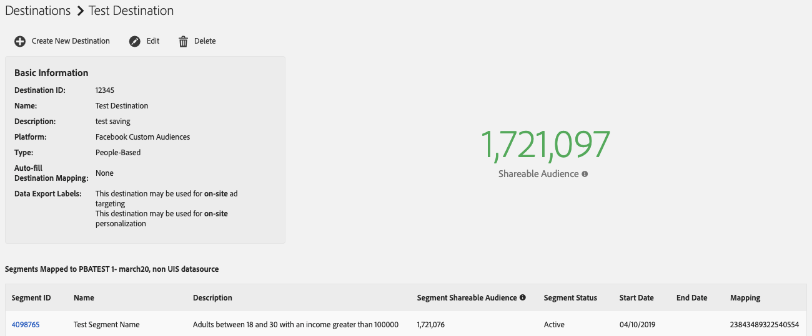
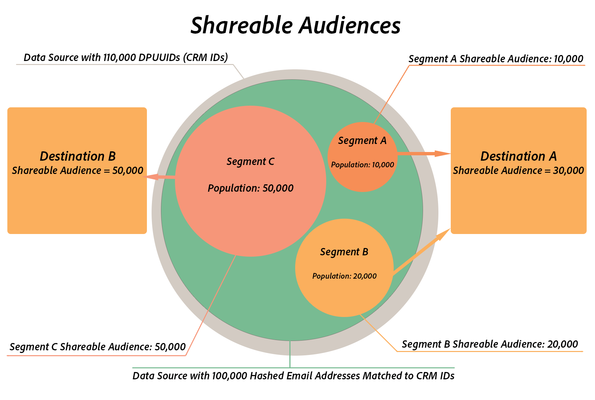

# Audiencias compartibles {#shareable-audiences}

>[!IMPORTANT]
>Este artículo contiene documentación del producto que le guiará a través de la configuración y el uso de esta función. Nada de lo que contiene aquí es asesoramiento legal. Por favor, consulte a su propio asesor legal para obtener orientación legal.

[!DNL People-Based Destinations] trajo la noción de [!DNL Shareable Audiences] a Audience Manager. Esta métrica le ayuda a comprender cuántas direcciones de correo electrónico con hash puede compartir Audience Manager con la plataforma de destino.

[!DNL Shareable Audiences] es una métrica que le ayuda a interpretar los datos de audiencia en el contexto de [!DNL People-Based Destinations]. Puede ver esta métrica en la página [!UICONTROL Destinations] y en la página [!UICONTROL Segment].

## Audiencias compartibles de segmentos {#segment-shareable-audiences}

La métrica [!DNL Segment Shareable Audience] de la página del segmento indica el número de direcciones de correo electrónico con hash del origen de datos con [DPUUID](../../reference/ids-in-aam.md) coincidentes, que también cumplen los requisitos para el segmento definido en el período retrospectivo determinado, dada la regla de combinación de perfiles aplicada en él y que Audience Manager puede compartir con la plataforma de destino.

Esta métrica tiene un periodo retrospectivo de 1 día. Esto le ayuda a comprender el alcance de audiencia del segmento en un destino específico.

## Audiencia compartible de destino {#destination-shareable-audience}

La métrica [!DNL Destination Shareable Audience] en una página de destino basada en personas indica el número total de direcciones de correo electrónico con hash del origen de datos con [DPUUID](../../reference/ids-in-aam.md) coincidentes que Audience Manager puede compartir con la plataforma de destino, a partir de todos los segmentos asignados a ese destino.

Esta métrica tiene un período retrospectivo de duración. Esto le ayuda a comprender la escala de la audiencia a la que puede acceder desde la fuente de datos de direcciones de correo electrónico con hash.

## Ejemplo

Un cliente de Audience Manager tiene una fuente de datos con 110 000 [DPUUID](../../reference/ids-in-aam.md) (ID de CRM). Ingresan 100 000 direcciones de correo electrónico con hash en Audience Manager, las utilizan con varios destinos basados en personas y sincronizan los ID con las 100 000 direcciones de correo electrónico con hash con los ID de CRM. El cliente puede usar la regla de combinación [!DNL All Cross-Device Profiles] para crear tres segmentos de audiencia:

* Segmento A con un recuento de población de 10 000, asignado al destino A;
* Segmento B con un recuento de población de 20 000, asignado al destino A;
* Segmento C con un recuento de población de 50 000, asignado al destino B.

En este escenario:

* Segmento A: audiencia compartible = 10 000;
* Audiencia compartible del segmento B = 20 000;
* Audiencia compartible del segmento C = 50 000;
* Destino A: Audiencia Que Se Puede Compartir = Segmento A: Audiencia Que Se Puede Compartir + Segmento B: Audiencia Que Se Puede Compartir = 30 000;
* Destino B Audiencia Compartida = Segmento C Audiencia Compartida = 50 000.

>[!NOTE]
>
>En el ejemplo anterior, no significa que las 80 000 direcciones de correo electrónico con hash de los tres segmentos coincidan con cuentas existentes en las plataformas de destino. Solo significa que Audience Manager envía los identificadores hash de los tres segmentos a sus respectivos destinos. Al enviar segmentos de audiencia a destinos basados en personas, la coincidencia de audiencias se produce en el lado del socio. El destino A puede tener hasta 30 000 cuentas de usuario coincidentes, mientras que el destino B puede tener hasta 50 000 cuentas de usuario coincidentes, pero no hay garantía de tasas de coincidencia. Adobe no tiene acceso a métricas específicas de socios. Consulte [Tasas de coincidencia](../../faq/faq-people-based-destinations.md#match-rates) para ver las preguntas más frecuentes acerca de la visibilidad de los destinos basados en personas en las tasas de coincidencia.
