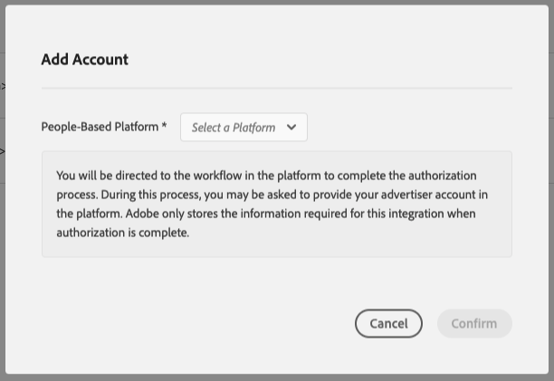

# Flujo de trabajo A: Personalization basado en toda la actividad en línea combinada con los datos sin conexión {#workflow-a}

>[!IMPORTANT]
>Este artículo contiene documentación del producto que le guiará a través de la configuración y el uso de esta función. Nada de lo que contiene aquí es asesoramiento legal. Por favor, consulte a su propio asesor legal para obtener orientación legal.

Esta página incluye instrucciones paso a paso sobre cómo combinar datos de [!DNL CRM] sin conexión con datos de comportamiento que ya tiene en Audience Manager para crear nuevos segmentos de audiencia y, a continuación, enviar estos segmentos de audiencia a [!DNL People-Based Destinations].

## Paso 1: Configuración de Data Source {#configure-data-source-settings}

Dependiendo de si sus [DPUUID](../../reference/ids-in-aam.md) son direcciones de correo electrónico con hash y minúsculas, es posible que tenga que configurar el origen de datos que almacenará las direcciones de correo electrónico con hash.

 

**Escenario 1: sus [DPUUID](../../reference/ids-in-aam.md) ya son direcciones de correo electrónico con hash y en minúsculas.**

En este caso, debe etiquetar la fuente de datos correspondiente como tal:

1. Ir a [!UICONTROL Audience Data] -> [!UICONTROL Data Sources].
1. Busque el origen de datos que contiene sus [DPUUID](../../reference/ids-in-aam.md) y haga clic en él.
1. En el menú desplegable **[!UICONTROL ID Type]**, seleccione **[!UICONTROL Cross Device]**.
1. Asegúrese de que la opción [!UICONTROL Cannot be tied to personally identifiable information] esté desmarcada.
1. En la sección **[!UICONTROL Data Source Settings]**, seleccione las opciones **[!UICONTROL Inbound]** y **[!UICONTROL Outbound]**, y habilite la opción **[!UICONTROL Share associated cross-device IDs in people-based destinations]**.
1. Utilice el menú desplegable para seleccionar la etiqueta **[!UICONTROL Emails(SHA256, lowercased)]** para este origen de datos.

   >[!IMPORTANT]
   >
   >Esta opción solo etiqueta la fuente de datos como que contiene datos con hash con ese algoritmo específico. Audience Manager no almacena en hash los datos en este paso. Asegúrese de que las direcciones de correo electrónico que planea almacenar en este origen de datos ya tengan un cifrado hash con el algoritmo [!DNL SHA256]. De lo contrario, no podrá usarlo para [!DNL People-Based Destinations].

   

1. Guarde la configuración de la fuente de datos.

 

**Escenario 2: sus [DPUUID](../../reference/ids-in-aam.md) no son direcciones de correo electrónico con hash y en minúsculas.**

En este caso, debe crear una nueva fuente de datos entre dispositivos que almacene sus direcciones de correo electrónico con hash. A continuación se indica cómo hacerlo:

1. Inicie sesión en su cuenta de Audience Manager, vaya a **[!UICONTROL Audience Data]** > **[!UICONTROL Data Sources]** y haga clic en **[!UICONTROL Add New]**.
1. Escriba [!UICONTROL Name] y [!UICONTROL Description] para el nuevo origen de datos.
1. En el menú desplegable **[!UICONTROL ID Type]**, seleccione **[!UICONTROL Cross Device]**.
1. En la sección **[!UICONTROL Data Source Settings]**, seleccione las opciones **[!UICONTROL Inbound]** y **[!UICONTROL Outbound]**, y habilite la opción **[!UICONTROL Share associated cross-device IDs in people-based destinations]**.
1. Utilice el menú desplegable para seleccionar la etiqueta **[!UICONTROL Emails(SHA256, lowercased)]** para este origen de datos.

   >[!IMPORTANT]
   >
   >Esta opción solo etiqueta la fuente de datos como que contiene datos con hash con ese algoritmo específico. Audience Manager no almacena en hash los datos en este paso. Asegúrese de que las direcciones de correo electrónico que planea almacenar en este origen de datos ya tengan un cifrado hash con el algoritmo [!DNL SHA256]. De lo contrario, no podrá usarlo para [!DNL People-Based Destinations].

   
1. Guarde la configuración de la fuente de datos.

Vea el siguiente vídeo para ver un tutorial sobre cómo crear un origen de datos para [!UICONTROL People-Based Destinations].

>[!VIDEO](https://video.tv.adobe.com/v/29006/)

>[!NOTE]
>
> Consulte [Incorporación de datos](people-based-destinations-prerequisites.md#data-onboarding) para ver las preguntas más frecuentes sobre cómo debe llevar los datos sin conexión a Audience Manager para destinos basados en personas.

## Paso 2: Hacer coincidir DPUUID con direcciones de correo electrónico con hash mediante la sincronización de ID basada en archivos {#match-ids-emails}

>[!IMPORTANT]
>
> Este paso solo se aplica al [escenario 2](people-based-destinations-workflow-combined.md#configure-data-source-settings) descrito anteriormente. Si los [DPUUID](../../reference/ids-in-aam.md) existentes ya tienen direcciones de correo electrónico con hash, vaya al [Paso 3: crear una regla de combinación de perfiles para la segmentación](people-based-destinations-workflow-combined.md#create-merge-rule).

Supongamos que desea hacer coincidir sus [DPUUID](../../reference/ids-in-aam.md) existentes con las direcciones de correo electrónico con hash de la tabla siguiente (columna derecha) y almacenar las direcciones de correo electrónico con hash en la nueva fuente de datos que creó en [Paso 1: Configuración de Data Source](people-based-destinations-workflow-combined.md#configure-data-source-settings).

| DPUUID (ID DE CRM) | La dirección de correo electrónico | Dirección de correo electrónico con hash |
| -------------------------------------- | --------------------- | ---------------------------------------------------------------- |
| 68079982765673198504052656074456196039 | `johndoe@example.com` | 55e79200c1635b37ad31a378c39feb12f120f116625093a19bc32fff15041149 |
| 67412682083411995725538770443620307584 | `janedoe@email.com` | 16d72e3edbeb089b299e0d12fc09522fdc5ece2d11dcb1304ecdd6fab4f7193a |
| 89159024796760343733111707646026765593 | `name@mydomain.com` | feec5debcea411f54462a345a0d90c9975415d2d4862745ff8af00c49b6b4ae6 |

 

Puede vincular hasta 10 direcciones de correo electrónico con hash a un único [DPUUID](../../reference/ids-in-aam.md). Para ello, separe las direcciones de correo electrónico con hash con un `<TAB>`, dentro del archivo de sincronización.

En nuestro ejemplo, ahora tendría dos fuentes de datos.

| ID de fuente de datos | Contenido de fuente de datos |
| -------------- | -------------------------- |
| 999999 | DPUUID existentes (CRM ID) |
| 987654 | Direcciones de correo electrónico con hash |

 

Su [archivo de sincronización de ID](../../integration/sending-audience-data/batch-data-transfer-explained/id-sync-file-based.md) tendría el siguiente contenido:

```
68079982765673198504052656074456196039<TAB>55e79200c1635b37ad31a378c39feb12f120f116625093a19bc32fff15041149
67412682083411995725538770443620307584<TAB>16d72e3edbeb089b299e0d12fc09522fdc5ece2d11dcb1304ecdd6fab4f7193a
89159024796760343733111707646026765593<TAB>feec5debcea411f54462a345a0d90c9975415d2d4862745ff8af00c49b6b4ae6
```

 

El [archivo de sincronización de ID](../../integration/sending-audience-data/batch-data-transfer-explained/id-sync-file-based.md) debe seguir esta estructura de nomenclatura:

`c2c_id_<DPUUID_DATA_SOURCE_ID>_<HASHED_EMAIL_DATA_SOURCE_ID>_TIMESTAMP.sync`

 

En el ejemplo anterior, el nombre de archivo tendría este aspecto:
`c2c_id_999999_987654_1560431657.sync`

[Descargue el archivo de ejemplo aquí](assets/c2c_id_999999_987654_1560431657.sync).

Una vez que haya creado el archivo de sincronización de ID, debe cargarlo en un bloque de [!DNL Amazon S3]. Para obtener información sobre cómo cargar archivos de sincronización de ID, consulte [Enviar datos por lotes a Audience Manager](../../integration/sending-audience-data/batch-data-transfer-explained/batch-data-transfer-overview.md).

## Paso 3: Creación de una regla de combinación de perfiles para la segmentación {#create-merge-rule}

El siguiente paso es crear una nueva regla de combinación que le ayudará a crear los segmentos de audiencia que desea enviar a sus destinos basados en personas.

>[!IMPORTANT]
>
> Si ya tiene una regla definida con las opciones [!UICONTROL Current Authenticated Profiles] o [!UICONTROL Last Authenticated Profiles], puede saltar a [Paso 4 - Crear segmentos de audiencia](people-based-destinations-workflow-combined.md#create-audience-segments).

1. Inicie sesión en su cuenta de Audience Manager y vaya a **[!UICONTROL Audience Data]** > **[!UICONTROL Profile Merge Rules]**.
1. Haga clic en **[!UICONTROL Add New Rule]**.
1. Escriba una regla de combinación de perfiles **[!UICONTROL Name]** y **[!UICONTROL Description]**.
1. En la sección **[!UICONTROL Profile Merge Rule Setup]**, seleccione las opciones **[!UICONTROL Current Authenticated Profiles]** o **[!UICONTROL Last Authenticated Profiles]**.
1. En la lista **[!UICONTROL Cross-Device Profile Options]**, seleccione los orígenes de datos en los que desea ejecutar la segmentación. Estas deben ser las fuentes de datos que contengan los [DPUUID](../../reference/ids-in-aam.md) existentes.

## Paso 4: Creación de segmentos de audiencia {#create-audience-segments}

Para crear nuevos segmentos de audiencia, use [Generador de segmentos](../segments/segment-builder.md). Si tiene segmentos de audiencia existentes que desea enviar a [!DNL People-Based Destinations], vaya a [Paso 5 - Configurar la autenticación de plataforma basada en personas](people-based-destinations-workflow-combined.md#configure-authentication).

## Paso 5: Configuración de la autenticación de plataforma basada en personas {#configure-authentication}

1. Inicie sesión en su cuenta de Audience Manager y vaya a **[!UICONTROL Administration]** > **[!UICONTROL Integrated Accounts]**. Si tiene una integración configurada anteriormente con una plataforma social, debería verla en esta página. En caso contrario, la página está vacía.
   
1. Haga clic en **[!UICONTROL Add Account]**.
1. Utilice el menú desplegable **[!UICONTROL People-Based Platform]** para seleccionar la plataforma con la que desea configurar la integración.
   
1. Haga clic en **[!UICONTROL Confirm]** para que se le redirija a la página de autenticación de la plataforma seleccionada.
1. Una vez que se haya autenticado en su cuenta de la plataforma social, se le redirigirá a Audience Manager, donde debería ver sus cuentas de anunciante asociadas. Seleccione la cuenta de anunciante que desee usar y haga clic en **[!UICONTROL Confirm]**.
1. Audience Manager muestra una notificación en la parte superior de la página para informarle de si la cuenta se ha agregado correctamente. La notificación también le permite añadir una dirección de correo electrónico de contacto para recibir notificaciones cuando la autenticación de la plataforma social esté a punto de caducar.

>[!IMPORTANT]
>
>Un Audience Manager gestiona la integración con las plataformas sociales a través de tokens de autenticación que caducan después de un cierto período de tiempo. Consulte Renovación del token de autenticación para obtener más información sobre cómo renovar los tokens caducados.

## Paso 6: Creación de un destino basado en personas {#create-destination}

1. Inicie sesión en su cuenta de Audience Manager, vaya a **[!UICONTROL Audience Data]** > **[!UICONTROL Destinations]** y haga clic en **[!UICONTROL Create Destination]**.
1. En la sección **[!UICONTROL Basic Information]**, escriba **[!UICONTROL Name]** y **[!UICONTROL Description]** para el nuevo origen de datos y use la siguiente configuración:
   * **[!UICONTROL Category]**: Plataformas integradas;
   * **[!UICONTROL Type]**: basado en personas;
   * **[!UICONTROL Platform]**: seleccione la plataforma basada en personas a la que desee enviar segmentos de audiencia;
   * **[!UICONTROL Account]**: seleccione la cuenta de anunciante deseada asociada con la plataforma seleccionada.
     
1. Haga clic en **[!UICONTROL Next]**.
1. Elija el(la) **[!UICONTROL Data Export Labels]** que desea(n) establecer para este destino.
1. En la sección **[!UICONTROL Configuration]**, seleccione el origen de datos que contiene los orígenes de datos con hash.
1. En la sección **[!UICONTROL Segment Mappings]**, seleccione los segmentos que desee enviar a este destino. Estos serían los segmentos que creó en [Paso 4 - Crear segmentos de audiencia](people-based-destinations-workflow-combined.md#create-audience-segments).
1. Guarde el destino.
