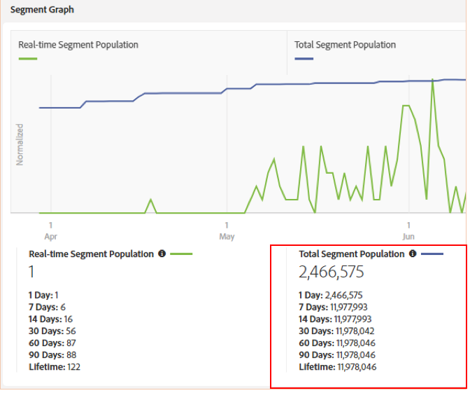

# Consideraciones importantes para las reglas de combinación de perfiles con gráficos de dispositivos {#important-considerations-for-profile-merge-rules-with-device-graphs}

Evite usar [!UICONTROL Profile Merge Rules] con un [!UICONTROL Device Graph] para segmentos que tienen poca o ninguna población de segmentos en tiempo real.

>[!IMPORTANT]
>
>Si la configuración [!UICONTROL Profile Merge Rule] es incorrecta, la población de segmentos exportada a destinos de lote puede ser significativamente menor de lo esperado.

Los segmentos que utilizan una regla [de combinación de perfiles con Device Graph](../../features/profile-merge-rules/merge-rule-targeting-options.md#device-graph-options) solo se evalúan en comparación con los dispositivos que se ven en tiempo real en los servidores [perimetrales de](../../reference/system-components/components-edge.md) Audience Manager una vez creado el segmento.

Recuerde que un [!UICONTROL Profile Merge Rule] con un [!UICONTROL Device Graph] tiene una de las siguientes opciones de dispositivo seleccionadas, como se muestra a continuación.

Los dispositivos que cumplen los requisitos para un segmento en tiempo real se miden según la población [en tiempo real del](../../features/segments/segment-builder-data.md#segment-populations)segmento.

Una población de segmentos en tiempo real baja significa que muy pocos de los dispositivos que califican para el segmento se ven en tiempo real. Para obtener el mejor rendimiento, los segmentos con una población en tiempo real escasa o nula deben utilizar un [!UICONTROL Profile Merge Rule] conjunto para evaluar el *[!UICONTROL Current Device]*, como en la imagen de abajo.

La configuración [!UICONTROL Profile Merge Rule] para evaluar el segmento *[!UICONTROL Current Device]* garantiza que todos los dispositivos (no solo los que se ven en tiempo real) se evalúen para el segmento. Todos los dispositivos que califican para el segmento se definen según la población total del segmento, como se muestra a continuación.

