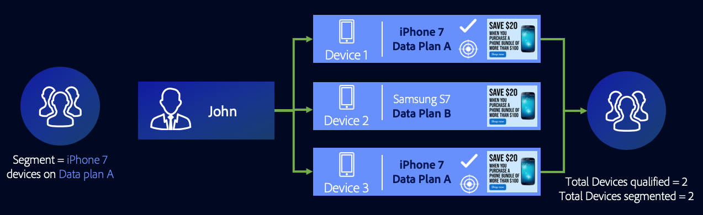

# Casos generales de uso de las reglas de combinación de Perfiles {#general-use-cases-for-profile-merge-rules}

[!UICONTROL Profile Merge Rules] las opciones permiten ampliar o ajustar el enfoque de audiencia en audiencias específicas según las necesidades o objetivos del negocio. En estos casos de uso general se explica cómo utilizar las opciones disponibles y crear reglas de combinación para la segmentación individual, doméstica y entre dispositivos. [!UICONTROL Profile Merge Rules] trabajar con destinos de lote y en tiempo real.

>[!TIP]
>
>Para definiciones y descripciones de estas [!UICONTROL Merge Rule] configuración, consulte [Definición de las opciones de las reglas de combinación de perfiles](merge-rule-definitions.md).

## Segmentación de dispositivos {#device-personalization}

Este escenario se aplica a los especialistas en marketing que deseen evaluar un perfil de dispositivo único para un segmento de audiencia definido en Audience Manager, con el fin de ofrecer una experiencia coherente al dispositivo mediante plataformas de segmentación que admitan ID de dispositivo (DSP, plataformas de personalización en el sitio y otras plataformas de segmentación basadas en dispositivos), sin tener en cuenta la autenticación de usuarios.

Para crear una regla que tenga como objetivo solo perfiles de dispositivo, seleccione **[!UICONTROL No Cross-Device Profile]** + **[!UICONTROL Device Profile]**.

Digamos que John posee tres teléfonos inteligentes. Dos de ellos son iPhone 7s en el Plan de datos A y uno de ellos es un Samsung en el Plan de datos B. Al no tener en cuenta su estado autenticado en ninguno de los tres dispositivos, el operador de telefonía móvil de John desea ofrecerle una actualización del plan de datos, pero solo para los dispositivos iPhone 7 que se ejecutan en el Plan de datos A.

Usando la variable **[!UICONTROL No Cross-Device Profile]** + **[!UICONTROL Device Profile]** regla, [!DNL Device 1] y [!DNL Device 3] ambos califican para el segmento, mientras que el Dispositivo 2 se ignora.

## Segmentación de dispositivos compartidos {#target-shared-devices}

Digamos que John y su esposa, Jane, usan el mismo portátil para visitar una tienda en línea y pedir varios artículos.

John utiliza su propia cuenta para reservar entradas para viajes y ofertas especiales, mientras que Jane utiliza su propia cuenta para comprar música y películas.

El equipo de marketing de la tienda puede usar la variable **[!UICONTROL Current Authenticated Profiles]** + **[!UICONTROL No Device Profile]** para dirigirse a John y Jane con ofertas específicas, basadas exclusivamente en su actividad autenticada.

Al utilizar esta regla, el Audience Manager ignora completamente el perfil del dispositivo, califica el ID de CRM de John para el segmento y no califica el ID de CRM de Jane.

## Segmentación en línea/sin conexión {#device-household-targeting}

Este caso de uso cubre la administración de identidades domésticas. Una empresa puede combinar un perfil de dispositivo único con el último perfil autenticado en ese dispositivo, utilizando la variable **[!UICONTROL Last Authenticated Profiles]** + **[!UICONTROL Device Profile]** regla.

Consideremos un segmento hecho de hogares con ingresos buenos a más de $100.000 al año, que contiene al menos un dispositivo que es un [!DNL iPhone 7] en [!DNL Data Plan B]. Tenemos dos perfiles domésticos (perfiles entre dispositivos), cada uno conectado a dos perfiles de dispositivo diferentes. Los rasgos necesarios para calificar para el segmento se distribuyen entre los perfiles de dispositivo y entre dispositivos.

El Audience Manager combina cada dispositivo + par de perfiles entre dispositivos para ver si el conjunto combinado de características cumple los requisitos para el segmento. Dado que el Audience Manager evalúa todos los perfiles incluidos en la combinación, se pueden segmentar tanto un perfil de dispositivo como un perfil doméstico.

El vínculo entre el dispositivo y el perfil del hogar permite que el Audience Manager cumpla los requisitos [!DNL Household 2] para el segmento, pero no para [!DNL Household 1]. De [!DNL Household 2], solo [!DNL Device 3] califica para el segmento. Esta [!UICONTROL Profile Merge Rule] ha permitido al especialista en marketing entregar un mensaje de marketing coherente a un dispositivo individual ([!DNL Device 3]) y el hogar ([!DNL Household 2]).

## Segmentación para destinos basados en personas {#all-cross-device}

>[!IMPORTANT]
>
>Este artículo contiene documentación del producto pensada para guiarle en la configuración y uso de esta función. Nada de lo contenido en este documento es asesoramiento jurídico. Consulte a su propio asesor jurídico para obtener asesoramiento jurídico.

Este escenario de objetivo solo está disponible para los clientes que han adquirido la variable [!DNL People-Based Destinations] complemento. Esta regla permite que los especialistas en marketing lleguen a los clientes en función de sus propios datos autenticados.

Supongamos que un comerciante en línea desea llegar a los clientes existentes a través de plataformas sociales y mostrarles ofertas personalizadas basadas en sus pedidos anteriores. con [!UICONTROL People-Based Destinations], pueden ingerir direcciones de correo electrónico con hash desde sus propias direcciones [!DNL CRM] en Audience Manager, cree segmentos a partir de los datos sin conexión y envíelos a las plataformas sociales en las que desee publicitar, utilizando ese identificador con hash, lo que optimizará su gasto en publicidad.

Para obtener más información sobre esta opción, consulte [Destinos basados en personas](../destinations/people-based-destinations-overview.md).

## Opciones de gráfico de dispositivos {#device-graph-options}

Selección de un [!UICONTROL device graph] para una [!UICONTROL Profile Merge] depende de condiciones exclusivas de sus propiedades digitales y objetivos empresariales. Estas directrices generales pueden ayudarle a comprender cuándo utilizar un tipo de gráfico frente a otro. Tenga en cuenta que debe tener una relación contractual con un gráfico de dispositivos externos para utilizar estas opciones. Consulte la siguiente tabla para obtener instrucciones generales sobre cuándo elegir una opción de gráfico de dispositivos. Para casos de uso específicos, consulte [Casos de uso de Device Graph de enlace de perfil](profile-link-use-case.md) y [Ejemplos de uso de los Gráficos de dispositivos externos](external-graph-use-cases.md).

<table id="table_66D9152D4FF040A186003272D456625D"> 
 <thead> 
  <tr> 
   <th colname="col1" class="entry"> Tipo de gráfico de dispositivo </th> 
   <th colname="col2" class="entry"> Descripción </th> 
  </tr>
 </thead>
 <tbody> 
  <tr> 
   <td colname="col1"> 
 Gráfico de dispositivos de vínculo de perfil 
 </td> 
   <td colname="col2"> 
 Combinación de perfiles reglas creadas con  Vínculo de perfil son ideales para: 
 
 
     <ul id="ul_FF44FA894BB2448887C8EDA9C8407EF9"> 
      <li id="li_E22505210C664FE6A9AA7C61244B36DA">Propiedades digitales con un alto nivel de autenticación de clientes. </li> 
      <li id="li_BE7112EE611E4DEB95B5C0A2852BFA97">Campañas centradas de bajo alcance. La variable  Vínculo de perfil el gráfico de dispositivos se basa únicamente en datos determinísticos. Este grupo de perfiles de dispositivo siempre será más pequeño en relación con el grupo de usuarios y dispositivos no autenticados. </li> 
      <li id="li_5FD9E936A72A4EFE80E694FA2E08E385">Casos de uso en los que los clientes necesitan estar en un estado autenticado para poder optar a la segmentación. </li> 
     </ul> 
 </td> 
  </tr> 
  <tr> 
   <td colname="col1"> 
Opciones de gráfico de dispositivos externos 
 </td> 
   <td colname="col2"> 
 Combinación de perfiles reglas creadas con cualquier gráfico de dispositivos externos integrado con  Audience Manager son ideales para: 
 
 
     <ul id="ul_D76D773988604A619FA4A3BF37F910F0"> 
      <li id="li_969A0755A9E34CBEB2F7331C137B9A26">Propiedades digitales con un bajo nivel de autenticación de clientes. </li> 
      <li id="li_AC78C8B4AD5340FFAC44FE851096C6A6">Campañas de marca amplias y de gran alcance. </li> 
      <li id="li_14AEC54CE34440889A3A36324EC6F497">Casos de uso en los que los clientes no necesitan estar en un estado autenticado para poder optar a la segmentación. </li> 
     </ul> 
 </td> 
  </tr> 
 </tbody> 
</table>

Vea el siguiente vídeo para obtener una descripción general de los posibles casos de uso de [!UICONTROL Profile Merge Rules].

>[!VIDEO](https://video.tv.adobe.com/v/28975/)

>[!MORELIKETHIS]
>
>* [Casos de uso de Device Graph de enlace de Perfil](profile-link-use-case.md)
>* [Ejemplos de uso de los Gráficos de dispositivos externos](external-graph-use-cases.md)
>* [Preguntas frecuentes sobre las reglas de combinación de perfiles](../../faq/faq-profile-merge.md)

