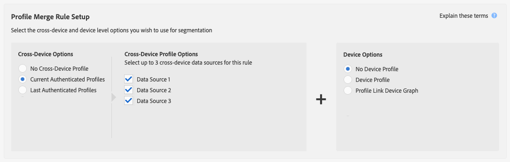

# Casos generales de uso de las reglas de combinación de perfiles {#general-use-cases-for-profile-merge-rules}

Las opciones de [!UICONTROL Profile Merge Rules] le permiten expandir o ajustar el enfoque de la audiencia en audiencias específicas según las necesidades o los objetivos de la empresa. Estos casos de uso generales exploran cómo utilizar las opciones disponibles y crear reglas de combinación para la segmentación individual, doméstica y entre dispositivos. [!UICONTROL Profile Merge Rules] trabajan con destinos por lotes y en tiempo real.

>[!TIP]
>
>Para obtener definiciones y descripciones de esta configuración de [!UICONTROL Merge Rule], consulte [Opciones definidas de reglas de combinación de perfiles](merge-rule-definitions.md).

## Segmentación de dispositivos {#device-personalization}

Este escenario se aplica a los especialistas en marketing que deseen evaluar un perfil de dispositivo único para un segmento de audiencia definido en Audience Manager DSP a fin de ofrecer una experiencia coherente en el dispositivo mediante plataformas de segmentación compatibles con ID de dispositivo (plataformas de personalización en el sitio, plataformas de segmentación basadas en el dispositivo y otras plataformas de segmentación basadas en el dispositivo), sin tener en cuenta la autenticación del usuario.

Para crear una regla que se dirija solamente a perfiles de dispositivo, seleccione **[!UICONTROL No Cross-Device Profile]** + **[!UICONTROL Device Profile]**.

Digamos que John tiene tres smartphones. Dos de ellos son iPhone 7 en el Plan de datos A, y uno de ellos es un Samsung en el Plan de datos B. Sin tener en cuenta su estado de autenticación en ninguno de los tres dispositivos, el operador de telefonía móvil de John quiere ofrecerle una actualización del plan de datos, pero solo para los dispositivos iPhone 7 que se ejecutan en el plan de datos A.

Al usar la regla **[!UICONTROL No Cross-Device Profile]** + **[!UICONTROL Device Profile]**, [!DNL Device 1] y [!DNL Device 3] cumplen los requisitos para el segmento, mientras que el dispositivo 2 se omite.

## Segmentación de dispositivos compartidos {#target-shared-devices}

Digamos que John y su esposa, Jane, usan la misma laptop para visitar una tienda en línea y pedir varios artículos.

John usa su propia cuenta para reservar boletos de viaje y ofertas especiales, mientras que Jane usa su propia cuenta para comprar música y películas.

El equipo de marketing de la tienda puede usar la regla **[!UICONTROL Current Authenticated Profiles]** + **[!UICONTROL No Device Profile]** para segmentar a John y Jane con ofertas específicas, basándose únicamente en su actividad autenticada.

Al utilizar esta regla, Audience Manager ignora completamente el perfil del dispositivo, califica el ID de CRM de John para el segmento y no califica el ID de CRM de Jane.

## Segmentación en línea/sin conexión {#device-household-targeting}

Este caso de uso abarca la administración de la identidad doméstica. Una compañía puede combinar un perfil de dispositivo único con el último perfil que se autenticó en ese dispositivo mediante la regla **[!UICONTROL Last Authenticated Profiles]** + **[!UICONTROL Device Profile]**.

Consideremos un segmento de hogares con ingresos superiores a $100.000/año, que contenga al menos un dispositivo de [!DNL iPhone 7] en [!DNL Data Plan B]. Tenemos dos perfiles domésticos (perfiles multidispositivo), cada uno conectado a dos perfiles de dispositivo diferentes. Los rasgos necesarios para calificar para el segmento se distribuyen entre los perfiles del dispositivo y entre dispositivos.

El Audience Manager combina todos los pares de perfiles entre dispositivos + dispositivos para ver si el conjunto combinado de características cumple los requisitos para el segmento. Dado que el Audience Manager evalúa todos los perfiles incluidos en la combinación, se pueden segmentar tanto un perfil de dispositivo como un perfil doméstico.

El vínculo entre el dispositivo y el perfil doméstico permite que el Audience Manager califique a [!DNL Household 2] para el segmento, pero no a [!DNL Household 1]. De [!DNL Household 2], solo [!DNL Device 3] cumple los requisitos para el segmento. Este(a) [!UICONTROL Profile Merge Rule] ha permitido al especialista en mercadotecnia enviar un mensaje de mercadotecnia coherente a un dispositivo individual ([!DNL Device 3]) y a toda la familia ([!DNL Household 2]).

## Segmentación para destinos basados en personas {#all-cross-device}

>[!IMPORTANT]
>
>Este artículo contiene documentación del producto que le guiará a través de la configuración y el uso de esta función. Nada de lo que contiene aquí es asesoramiento legal. Por favor, consulte a su propio asesor legal para obtener orientación legal.

Este escenario de segmentación solo está disponible para los clientes que han adquirido el complemento [!DNL People-Based Destinations]. Esta regla permite a los especialistas en marketing llegar a los clientes en función de sus propios datos autenticados.

Supongamos que un minorista en línea desea llegar a los clientes existentes a través de plataformas sociales y mostrarles ofertas personalizadas basadas en sus pedidos anteriores. Con [!UICONTROL People-Based Destinations], pueden ingerir direcciones de correo electrónico con hash desde su propio [!DNL CRM] en Audience Manager, generar segmentos a partir de los datos sin conexión y enviar estos segmentos a las plataformas sociales en las que desean anunciar, utilizando ese identificador con hash, para optimizar el gasto en publicidad.

Para obtener más información sobre esta opción, consulte [Destinos basados en personas](../destinations/people-based-destinations-overview.md).

## Opciones de gráfico de dispositivos {#device-graph-options}

Elegir una opción [!UICONTROL device graph] para una regla [!UICONTROL Profile Merge] depende de condiciones únicas de las propiedades digitales y de los objetivos empresariales. Estas directrices generales pueden ayudarle a comprender cuándo utilizar un tipo de gráfico frente a otro. Tenga en cuenta que debe tener una relación contractual con un gráfico de dispositivos externos para utilizar estas opciones. Consulte la tabla siguiente para obtener instrucciones generales sobre cuándo elegir una opción de gráfico de dispositivos. Para casos de uso específicos, consulte [Casos de uso de Device Graph de vínculo de perfil](profile-link-use-case.md) y [Casos de uso de Device Graph externos](external-graph-use-cases.md).

<table id="table_66D9152D4FF040A186003272D456625D"> 
 <thead> 
  <tr> 
   <th colname="col1" class="entry"> Tipo de gráfico del dispositivo </th> 
   <th colname="col2" class="entry"> Descripción </th> 
  </tr>
 </thead>
 <tbody> 
  <tr> 
   <td colname="col1"> 
 gráfico del dispositivo de enlace de perfil 
 </td> 
   <td colname="col2"> 
 Combinación de perfiles Las reglas creadas con la opción  Vínculo de perfil son ideales para: 
 
 
     <ul id="ul_FF44FA894BB2448887C8EDA9C8407EF9"> 
      <li id="li_E22505210C664FE6A9AA7C61244B36DA">Propiedades digitales que tienen un alto nivel de autenticación de clientes. </li> 
      <li id="li_BE7112EE611E4DEB95B5C0A2852BFA97">Campañas específicas de bajo alcance. El gráfico del dispositivo  vínculo de perfil  se basa únicamente en datos determinísticos. Este grupo de perfiles de dispositivos siempre será más pequeño en relación con el grupo de usuarios y dispositivos no autenticados. </li> 
      <li id="li_5FD9E936A72A4EFE80E694FA2E08E385">Casos de uso en los que los clientes deben estar en un estado autenticado para poder optar a la segmentación. </li> 
     </ul> 
 </td> 
  </tr> 
  <tr> 
   <td colname="col1"> 
Opciones de gráfico de dispositivos externos 
 </td> 
   <td colname="col2"> 
 Combinación de perfiles Las reglas creadas con cualquier gráfico de dispositivos externos integrado con el Audience Manager  son ideales para: 
 
 
     <ul id="ul_D76D773988604A619FA4A3BF37F910F0"> 
      <li id="li_969A0755A9E34CBEB2F7331C137B9A26">Propiedades digitales que tienen un nivel bajo de autenticación del cliente. </li> 
      <li id="li_AC78C8B4AD5340FFAC44FE851096C6A6">Campañas de marca amplias y de alto alcance. </li> 
      <li id="li_14AEC54CE34440889A3A36324EC6F497">Casos de uso en los que los clientes no necesitan estar en un estado autenticado para cumplir los requisitos de segmentación. </li> 
     </ul> 
 </td> 
  </tr> 
 </tbody> 
</table>

Vea el siguiente vídeo para obtener una descripción general de los posibles casos de uso de [!UICONTROL Profile Merge Rules].

>[!VIDEO](https://video.tv.adobe.com/v/28975/)

>[!MORELIKETHIS]
>
>* [Casos de uso de Device Graph de enlace de Perfil](profile-link-use-case.md)
>* [Ejemplos de uso de los Gráficos de dispositivos externos](external-graph-use-cases.md)
>* [Preguntas frecuentes sobre reglas de combinación de perfiles](../../faq/faq-profile-merge.md)
