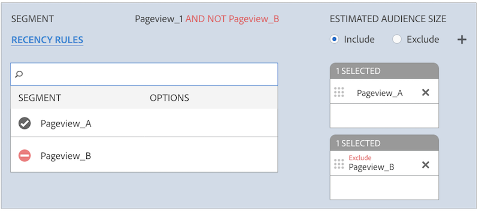

# Reglas de combinación de perfiles y procesos de dessegmentación de dispositivos {#profile-merge-rules-and-device-un-segmentation-processes}

La dessegmentación describe los procesos que descalifican y eliminan perfiles de dispositivos de los segmentos. Su capacidad para eliminar un perfil de dispositivo de un segmento depende de la opción de dispositivo utilizada para crear un [!UICONTROL Profile Merge Rule].

## Opciones de dispositivo disponibles {#device-options}

Como recordatorio, los [!UICONTROL Device Options] están disponibles en la [!UICONTROL Profile Merge Rules Setup] sección al crear o editar un [!UICONTROL Profile Merge Rule].

## Opción de perfil de dispositivo actual y dessegmentación del dispositivo {#current-device-profile-options}

**[!UICONTROL Current Device Profile]** es la opción de perfil de dispositivo predeterminada para un [!UICONTROL Profile Merge Rule]. [!DNL Audience Manager] Puede eliminar un perfil de dispositivo de un segmento cuando [!UICONTROL Profile Merge Rule] utilice la **[!UICONTROL Current Device Profile]** opción. En estas condiciones, la dessegmentación se produce cuando:

* El perfil del dispositivo ha estado inactivo durante 120 días. Un proceso semanal de limpieza de datos elimina los perfiles de dispositivo inactivos de los segmentos.
* El dispositivo ya no cumple los requisitos para un segmento porque las actualizaciones o los cambios en el perfil del dispositivo lo descalifican. Esto sucede cuando cambian los criterios de calificación de segmentos, o cuando se aplica un [!DNL AND NOT] operador a una regla de segmento, o se especifican condiciones de [actualización y frecuencia](../../features/segments/recency-and-frequency.md) que utilizan la configuración menor o igual que. Los casos de uso se describen en la documentación de Supresión [entre dispositivos](../../features/profile-merge-rules/instant-cross-device-suppression.md) instantánea.

<!-- 

  Audience Manager can remove a device profile from a segment when your  Profile Merge Rule uses the <b> Current Device Profile</b> option. Under these conditions, unsegmentation happens when: 
 

 
 <ul id="ul_596501272A224228BD330DD56E01D973"> 
  <li id="li_E4FA1A5C722748CD82AE3A49FCBE86F6">The device profile has been inactive for 120-days. A weekly data cleanup process removes inactive device profiles from your segments. </li> 
  <li id="li_DB0CCD28425048D5B35309B8C2C384F9">The device no longer qualifies for a segment because updates or changes to the device profile disqualify it. This happens when segment qualification criteria change, or you apply an AND NOT operator to a segment rule, or specify <a href="../../features/segments/recency-and-frequency.md"> recency and frequency</a> conditions that use the less than/equal to settings. </li> 
 </ul> 
 

  

 -->

## Sin opción de dispositivo y sin segmentación de dispositivos {#no-device-option}

[!DNL Audience Manager] Puede quitar un ID entre dispositivos de un segmento cuando [!UICONTROL Profile Merge Rule] utilice la opción **[!UICONTROL No Device Profile]** + **[!UICONTROL Current Authenticated]** . En estas condiciones, la dessegmentación se produce cuando el ID entre dispositivos ya no cumple los requisitos para un segmento porque las actualizaciones o los cambios en el perfil entre dispositivos lo descalifican. Esto sucede cuando cambian los criterios de calificación de segmentos, o cuando se aplica un [!UICONTROL AND NOT] operador a una regla de segmento, o se especifican condiciones de [actualización y frecuencia](../../features/segments/recency-and-frequency.md) que utilizan la configuración menor o igual que. Los casos de uso se describen en la documentación de Supresión [entre dispositivos](../../features/profile-merge-rules/instant-cross-device-suppression.md) instantánea.

## Opciones de Device Graph y dessegmentación de dispositivos {#device-graph-options-unsegmentation}

[!DNL Audience Manager] Puede eliminar varios perfiles de dispositivo de un segmento cuando [!UICONTROL Profile Merge Rule] utilice una opción de gráfico de dispositivo. La dessegmentación se produce cuando el perfil combinado del dispositivo del gráfico del dispositivo ya no cumple los requisitos para el segmento porque las actualizaciones o los cambios realizados en este perfil combinado lo descalifican del segmento. Esto sucede cuando cambian los criterios de calificación de segmentos, o cuando se aplica un [!UICONTROL AND NOT] operador a una regla de segmento, o se especifican condiciones de [actualización y frecuencia](../../features/segments/recency-and-frequency.md) que utilizan la configuración menor o igual que. Los casos de uso se describen en la documentación de Supresión [entre dispositivos](../../features/profile-merge-rules/instant-cross-device-suppression.md) instantánea.

>[!NOTE]
>
>**El límite de cuatro dispositivos para la evaluación de segmentos y la descalificación** [!DNL Audience Manager] combina hasta cuatro dispositivos al evaluar segmentos con un [!UICONTROL Profile Merge Rule] que utiliza un gráfico de dispositivos. [!DNL Audience Manager] evalúa el dispositivo *actual y tres dispositivos adicionales vistos por última vez en tiempo* real. Si se emite la señal de dessegmentación, el dispositivo actual y tres dispositivos adicionales vistos en tiempo real se eliminarán del segmento en el destino. Por ejemplo, en un clúster de seis dispositivos, se combinan, evalúan y califican hasta cuatro dispositivos para un segmento. Del mismo modo, se combinan, evalúan y no segmentan hasta cuatro dispositivos.

<!-- 

Currently,  Audience Manager <i>cannot </i> remove a device profile from a segment when your  Profile Merge Rule uses a device graph option. This applies to rules created with these  Device Options settings: 
 

 
 <ul id="ul_0923834C984F464E9AB12FF5A8773214"> 
  <li id="li_731F67B7A07342988B13D7F91ECA5A9E">Profile Link Device Graph. </li> 
  <li id="li_D1EFC6F124124E64A0732DD060F788BE">The  Adobe device graph. </li> 
  <li id="li_CFD4189D4488432D92732532D23B30C7">Other third-party device graph options available that are available to you. </li> 
 </ul> 
 

 Unlike the previous case above, using the AND NOT operator or less than/equal to settings won't remove all of the devices from a segment profile. However, you can unsegment device profiles if you create simple segment rules and apply unsegment logic in the destination that receives your data. The following sections walks you through different unsegmentation use cases. 

 -->

<!-- 

This workaround shows you how to unsegment with Boolean  AND NOT logic when your  Profile Merge Rule uses a device graph option. This procedure uses separate, simple segments mapped to the same destination. In this case, you apply AND NOT logic on the destination rather than creating rules in Segment Builder. To set up unsegment rules for this use case: 
 

 
 <ol id="ol_677F0F9E6CB640079D9021DE66819916"> 
  <li id="li_95F898FDFB2D4F5395201FEA2E60A3AF">Create separate, single-trait segments as shown in the following example. 
 
 </li> 
  <li id="li_3A9F6D8B3CBB4F65B9A06EEC3B265158">Map the segments to the same destination. In this case, we're sending these to  Media Optimizer. </li> 
  <li id="li_092BB5887D0D4EE4B09F4B1C6703D454">Set AND NOT logic on the destination ( Media Optimizer) rather than in  Audience Manager. 
 
 </li> 
 </ol> 
 

 If you're not using  Media Optimizer, apply AND NOT logic on whatever destination receives these segments. 

 -->

<!-- 

This workaround shows you how to unsegment with the < = (less than/equal to) recency and frequency settings when your  Profile Merge Rule uses a device graph option. To set up unsegment rules for this use case: 
 

 
 <ol id="ol_DCBEE004B9FE40A881E4EC17FAEA50C2"> 
  <li id="li_DB8C1B6D5C5546E68769902A4F367966">Create a segment that contains a single trait and apply a > = (greater than/equal to) recency and frequency rule to the trait. 
 
 </li> 
  <li id="li_0DC50960D83B4B27A40F0BC76B944E0B">Map the segment to a destination. In this case, we're sending the segment to  Media Optimizer. </li> 
  <li id="li_FC23194A9FE54296914393F8067A6672">Set NOT logic on the destination ( Media Optimizer) rather than in  Audience Manager. Use NOT logic to exclude all devices that qualify for this segment from your campaign. 
 
 </li> 
 </ol> 
 

 If you're not using  Media Optimizer, apply NOT logic on whatever destination receives these segments. 

 -->

>[!MORE_LIKE_THIS]
>
>* [Preguntas más frecuentes sobre las reglas de combinación de perfiles y Device Graph](../../faq/faq-profile-merge.md)
>* [Eliminación instantánea entre dispositivos](../../features/profile-merge-rules/instant-cross-device-suppression.md)
>* [Consideraciones importantes para las reglas de combinación de perfiles con gráficos de dispositivos](../../features/profile-merge-rules/considerations-pmr-device-graph.md)

