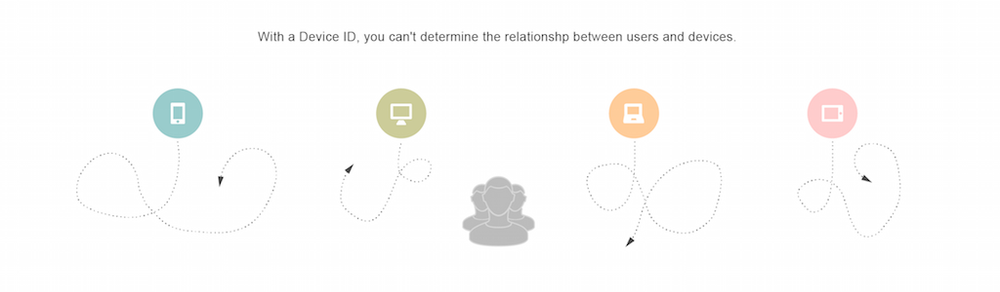

# [!UICONTROL Profile Merge Rules] Información general {#profile-merge-rules-overview}

Con [!UICONTROL Profile Merge Rules] puede controlar qué conjuntos de datos se utilizan para la segmentación y puede dirigirse a usuarios de forma precisa en varios dispositivos.

>[!VIDEO](https://video.tv.adobe.com/v/28974)

## Recopilación de datos y establecimiento de objetivos con perfiles anónimos y autenticados {#data-collection-targeting}

Normalmente, la segmentación y la segmentación de audiencia se basan en datos recopilados de todos los usuarios de un dispositivo. La recopilación de datos y la determinación de objetivos en función de los datos de dispositivos tienen algunas desventajas. Por ejemplo, no puede distinguir entre varios usuarios que comparten un dispositivo o que se dirigen a usuarios de forma precisa en varios dispositivos. La recopilación de datos centrada en el dispositivo ya no es suficiente para campañas de marketing digital o targeting entre dispositivos.

[!UICONTROL Profile Merge Rules] cambia fundamentalmente la forma en que  [!DNL Audience Manager] recopila datos y segmenta usuarios para el targeting. Permite trabajar con dos tipos distintos de perfiles, un perfil de dispositivo y un [perfil autenticado](../../reference/visitor-authentication-states.md).

| Tipo de perfil | Descripción |
|---|---|
| [!UICONTROL Device Profile] | Un [!UICONTROL device profile] está vinculado a un ID para un dispositivo determinado, como un [!UICONTROL cookie] ID o un ID de dispositivo móvil.   Incluye:<ul><li>[!UICONTROL Rule-based traits] se realiza cuando un usuario no está autenticado.</li><li>[!UICONTROL Onboarded traits] está vinculado a un ID de dispositivo como  [!UICONTROL cookie-based], datos de terceros.</li></ul> |
| [!UICONTROL Authenticated Profile] | El [!UICONTROL authenticated profile] está vinculado a un ID de usuario transferido cuando una persona inicia sesión en el sitio.  Incluye:<ul><li>[!UICONTROL Rule-based traits] se recopila entre dispositivos cuando se autentica a un usuario.</li><li>[!UICONTROL Onboarded traits] en un archivo sin conexión vinculado al mismo ID de usuario.</li></ul> |

Estos distintos perfiles controlan los datos que puede utilizar para la segmentación. Por ejemplo, con un [perfil autenticado](../../reference/visitor-authentication-states.md), puede generar una [!UICONTROL segments] precisa basada en los datos de varios dispositivos para un único usuario. Esto significa que puede ofrecer una experiencia de marca uniforme a los clientes en varios dispositivos. [!DNL Audience Manager] lo consigue almacenando la asignación de los diferentes dispositivos que utiliza una persona para sus actividades en línea a su perfil autenticado. Estas asignaciones se denominan [!UICONTROL Profile Link Device Graph].

## Ventajas {#advantages}

Con [!UICONTROL Profile Merge Rules] puede:

* Usuarios de Target según [perfil autenticado](../../reference/visitor-authentication-states.md), perfiles anónimos o combinaciones de ambos.
* Diríjase a un cliente específico de sus dispositivos.
* Cree un gráfico de dispositivos basado en datos determinísticos.
* Ajuste los datos en su [!UICONTROL segments] en función de diferentes perfiles.
* Obtenga información adicional sobre su audiencia.
