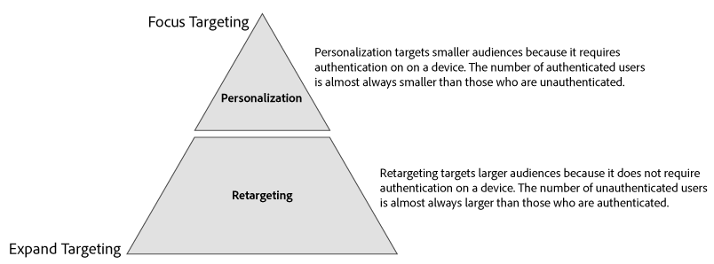

# Casos de uso de Device Graph de enlace de Perfil {#profile-link-device-graph-use-cases}

Recommendations y casos de uso para la reorientación de segmentos y la calificación de segmentos personalizada con [!UICONTROL Profile Link Device Graph].

## Recomendaciones {#recommendations}

Considere el gráfico de dispositivos [!UICONTROL Profile Link] para campañas que:

* Tener un alto nivel de autenticación en sus propiedades digitales. Utilice una [opción de gráfico de dispositivos externos](merge-rule-definitions.md#device-options) si tiene una pequeña cantidad de usuarios autenticados.
* Requiere una segmentación precisa de audiencias conocidas. El [!UICONTROL Profile Link Device Graph] se crea utilizando datos autenticados de origen.
* Segmente audiencias conocidas en sus estados autenticados y no autenticados en tiempo real.

## Segmentación entre dispositivos {#cross-device-personalization}

Digamos que John posee tres dispositivos que usa regularmente para buscar ofertas de paquetes de vacaciones: Su portátil ([!DNL Device 1]), su smartphone ([!DNL Device 2]) y su tableta ([!DNL Device 3]). Sin embargo, John utiliza sus dispositivos para buscar diferentes artículos de las ofertas de paquetes:

* Usa su laptop para buscar vuelos;
* Usa su smartphone para buscar hoteles;
* Utiliza su tableta para buscar visitas guiadas.

Incluso si John no está autenticado en los tres dispositivos mencionados anteriormente, mediante la regla **[!UICONTROL Last Authenticated Profiles]** + **[!UICONTROL Profile Link Device Graph]**, un proveedor de paquetes de vacaciones puede asociar estos dispositivos al perfil autenticado de John, suponiendo que fue la última persona en autenticarse en los tres dispositivos.

Dado que el Audience Manager clasifica todos los perfiles de dispositivo que participaron en la combinación de perfiles para un segmento, los tres perfiles de dispositivo están segmentados. El [!UICONTROL Profile Link Device Graph] permite que el Audience Manager observe el comportamiento en los tres dispositivos y califique cada dispositivo para un segmento para el que ningún perfil de dispositivo único esté cualificado por sí solo.

Este [!UICONTROL Profile Merge Rule] permite a los especialistas en marketing ofrecer una experiencia coherente a todos los dispositivos propiedad de una persona, en función de la actividad del usuario en lugar de la actividad individual del dispositivo.

>[!MORELIKETHIS]
>
>* [Ejemplos de uso de los Gráficos de dispositivos externos](external-graph-use-cases.md)
>* [Casos generales de uso de las reglas de combinación de Perfiles](merge-rule-targeting-options.md)
>* [Preguntas frecuentes sobre las reglas de combinación de perfiles](../../faq/faq-profile-merge.md)

