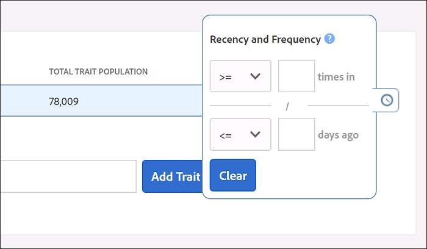

# Actualización y frecuencia {#recency-and-frequency}

En [!UICONTROL Segment Builder], la actualización y la frecuencia le permiten segmentar a los visitantes en función de las acciones que se producen o que se repiten a lo largo de un intervalo diario establecido.

El Audience Manager define [!DNL recency] y [!DNL frequency] de la siguiente manera:

* **[!UICONTROL Recency]:** Hace cuánto tiempo un usuario vio o calificó para uno (o más) [!UICONTROL traits].
* **[!UICONTROL Frequency]:** Frecuencia a la que un usuario vio o calificó para uno (o más) [!UICONTROL traits].

La configuración de [!UICONTROL Recency] y [!UICONTROL Frequency] le ayuda a segmentar a los visitantes en función de su nivel de interés real (o percibido) en un sitio, una sección o un creativo particular. Por ejemplo, los usuarios que cumplen los requisitos de un segmento con requisitos de alta actualización/frecuencia pueden estar más interesados en un sitio o producto que los usuarios que visitan con menos frecuencia o con menos frecuencia.

## Ubicación de la configuración de [!UICONTROL Recency and Frequency] {#location}

En [!UICONTROL Segment Builder], la configuración de [!UICONTROL Recency] y [!UICONTROL Frequency] se encuentra en la sección [!UICONTROL Basic View] del panel [!UICONTROL Traits]. Haga clic en el icono del reloj para mostrar estos controles.

## Limitaciones y reglas {#limitations-rules}

Revise y comprenda estos límites y reglas cuando desee aplicar actualización y frecuencia a características de los segmentos.

### [!UICONTROL Recency] {#recency}

<table id="table_026064124C694D75B7A960457D50170B"> 
 <thead> 
  <tr> 
   <th colname="col1" class="entry"> Límite o regla </th> 
   <th colname="col2" class="entry"> Descripción </th> 
  </tr> 
 </thead>
 <tbody> 
  <tr> 
   <td colname="col1"> 
 <b>Valor mínimo</b> 
 </td> 
   <td colname="col2"> 
La actualización debe ser superior a 0. 
 </td> 
  </tr>
  <tr> 
   <td colname="col1"> 
 <b>Tipos de rasgos</b> 
 </td> 
   <td colname="col2"> 
Puede aplicar controles de actualización solo a características de carpeta y basadas en reglas. 
 </td> 
  </tr> 
  <tr> 
   <td colname="col1"> 
 <b>Características de terceros</b> 
 </td> 
   <td colname="col2"> 
No puede establecer reglas de actualización en rasgos de terceros individuales o grupos de rasgos que contengan rasgos de terceros. La actualización y la frecuencia solo se aplican a sus propios rasgos. 
 </td> 
  </tr> 
 </tbody> 
</table>

### [!UICONTROL Frequency] {#frequency}

<table id="table_EBD621D26C8B4D03933E8C0753C892A7"> 
 <thead> 
  <tr> 
   <th colname="col1" class="entry"> Límite o regla </th> 
   <th colname="col2" class="entry"> Descripción </th> 
  </tr> 
 </thead>
 <tbody> 
  <tr> 
   <td colname="col1"> 
 <b>Características de terceros</b> 
 </td> 
   <td colname="col2"> 
No puede establecer reglas de frecuencia en rasgos de terceros individuales o grupos de rasgos que contengan rasgos de terceros. La actualización y la frecuencia solo se aplican a sus propios rasgos. 
 </td> 
  </tr> 
  <tr> 
   <td colname="col1"> 
 <b>Tipos de rasgos</b> 
 </td> 
   <td colname="col2"> 
Solo puede aplicar controles de frecuencia a características de carpeta y basadas en reglas. 
 </td> 
  </tr> 
  <tr> 
   <td colname="col1"> 
 <b>Requisitos de actualización</b> 
 </td> 
   <td colname="col2"> 
Puede configurar los requisitos de frecuencia <i>sin</i> configurar los requisitos de actualización. Solo tiene que establecer un valor de frecuencia y dejar el campo de actualización en blanco. 
 </td> 
  </tr> 
  <tr> 
   <td colname="col1"> 
<b>Reglas de combinación de perfiles</b> 
 </td> 
   <td colname="col2"> 
Consulte <a href="../../faq/faq-profile-merge.md#trait-freq-device-rules"> frecuencia de rasgos, gráficos de dispositivos externos y reglas de combinación de perfiles</a>. 
 </td> 
  </tr> 
 </tbody> 
</table>

## Ejemplos de actualización {#recency-examples}

A continuación se muestran dos ejemplos de cómo funciona la actualización, según lo que haya seleccionado en la interfaz de usuario:

### Uso de un operador menor o igual que (&lt;=)

En este ejemplo, selecciona el operador &lt;=, como se muestra en la captura de pantalla. Esto califica al usuario para [!UICONTROL segment] si cumple los requisitos para cualquiera de los tres [!UICONTROL traits] un mínimo de tres veces en los últimos cinco días. La cronología siguiente muestra la calificación [!UICONTROL segment] en el momento en que se crea [!UICONTROL segment], el 1 de octubre y diez días después.

### Uso de un operador mayor o igual que (=>)

En este ejemplo, selecciona el operador =>, como se muestra en la captura de pantalla. Esto califica al usuario para el [!UICONTROL segment] si cumple los requisitos para cualquiera de los tres [!UICONTROL traits] un mínimo de tres veces en cualquier momento entre su primera calificación en la plataforma de Audience Manager y la hora de cierre hace cinco días. La cronología siguiente muestra la calificación [!UICONTROL segment] en el momento en que se crea [!UICONTROL segment], el 1 de octubre y diez días después.

## Ejemplos de límite de frecuencia {#frequency-capping}

Las expresiones de límite de frecuencia incluyen a todos los usuarios cuyo número de [!UICONTROL trait] realizaciones está por debajo del valor deseado. Estos son algunos ejemplos de lo correcto y lo incorrecto:

* Incorrecto: la expresión `frequency([1000T]) <= 5` incluye a todos los usuarios que se han dado cuenta de [!UICONTROL trait] con el identificador &quot;1000&quot; un máximo de cinco veces, pero también incluye a los usuarios que no se han dado cuenta de [!UICONTROL trait]. Por lo tanto, Audience Manager no valida esta expresión por motivos de rendimiento, ya que calificaría a demasiados usuarios para [!UICONTROL segment].

* Derecha: si desea incluir a todos los usuarios que han realizado el [!UICONTROL trait] con el ID &quot;1000&quot; un máximo de cinco veces, agregue otra condición a la expresión para asegurarse de que los usuarios cumplen los requisitos para el [!UICONTROL trait] al menos una vez: `frequency([1000T]) >= 1  AND  frequency([1000T]) <= 5`

* Derecha: cuando necesite que los requisitos de actualización/frecuencia sean menores que un número específico de veces o días, una ese(a) [!UICONTROL trait] a otro(a) con un operador `AND`. Utilizando el ejemplo en el primer punto de viñeta, esta expresión se vuelve válida cuando se une con otro [!UICONTROL trait] como se muestra aquí: `frequency([1000T]) <= 5 AND isSiteVisitorTrait`.

* Correcto: en los casos de uso de restricción de frecuencia de publicidad, puede crear una regla de [!UICONTROL segment] similar a la siguiente: `(frequency([1000T] <= 2D) >= 5)`. Esta expresión incluye a todos los usuarios que se han dado cuenta de [!UICONTROL trait] con el ID &quot;1000&quot; en los últimos 2 días al menos cinco veces. Establezca el límite de frecuencia enviando este(a) [!UICONTROL segment] al servidor de publicidad con un(a) `NOT` establecido(a) en el [!UICONTROL segment] en el servidor de publicidad. Este método logra un mayor rendimiento en [!DNL Audience Manager], pero sigue teniendo el mismo propósito para la restricción de frecuencia.

>[!MORELIKETHIS]
>
>* [Controles del Generador de segmentos: Sección de características](../../features/segments/segment-builder.md#segment-builder-controls-traits)
>* [Sintaxis del código utilizada en el Editor de Expresiones de segmentos](../../features/segments/segment-code-syntax.md)
