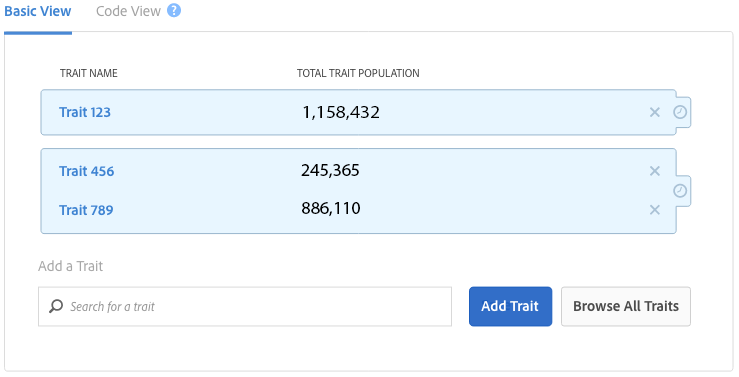

# [!UICONTROL Trait] y datos  [!UICONTROL Segment] de población en  [!UICONTROL Segment Builder] {#trait-and-segment-population-data-in-segment-builder}

Agregue y elimine [!UICONTROL traits] en [!UICONTROL Segment Builder] para ver las poblaciones [!UICONTROL trait] reales junto con los datos de población de segmentos reales y estimados. Los datos estimados del tamaño de la población le ayudan a crear el segmento adecuado para su campaña.

## [!UICONTROL Trait] Datos de población  {#trait-population-data}

[!UICONTROL Segment Builder] le muestra  [!UICONTROL Total Trait Population] el último día en el que agregó un  [!UICONTROL trait] a un segmento. Estos datos aparecen en el campo azul alrededor del [!UICONTROL trait] seleccionado en la sección [!UICONTROL Basic View].

La tabla siguiente define las métricas de población de rasgos:

| Métrica | Descripción |
---------|----------|
| [!UICONTROL Total Trait Population] | Número de ID únicos que tienen el rasgo seleccionado en su perfil. |

## Cálculo de las poblaciones de segmentos reales y estimados {#calculating-real-estimated-populations}

Cuando crea un segmento nuevo o cambia un segmento existente, el Audience Manager tarda hasta 24 horas en mostrar los resultados de las poblaciones reales de segmentos en tiempo real y totales.

Sin embargo, el Audience Manager puede calcular inmediatamente el tamaño de población total y en tiempo real del segmento. Estas estimaciones se basan en datos históricos de muestra y devuelven resultados en el intervalo de confianza del 95 %.

En [!UICONTROL Segment Builder], una barra azul en los gráficos de población estimados indica los posibles rangos superior e inferior para el tamaño del segmento. Aunque el rendimiento anterior no garantiza resultados futuros, los datos estimados pueden ayudarle a comprender el tamaño potencial de un segmento nuevo o editado.

## Información general sobre los datos de población de segmentos {#segment-populations}

[!UICONTROL Segment Builder] muestra los datos de población de segmentos a medida que crea y edita segmentos.

* Para los datos de población de segmentos estimados (en tiempo real y total), [!UICONTROL Segment Builder] no actualiza los gráficos automáticamente a medida que agrega o elimina características en un segmento. Haga clic en **[!UICONTROL Calculate Estimates]** para ver (o actualizar) los números de población estimados.

* Para los datos de población de segmentos reales (reales) (en tiempo real y en total), [!UICONTROL Segment Builder] actualiza el gráfico de segmentos automáticamente al cargar un segmento existente. Para nuevos segmentos o cuando agrega nuevas características a un segmento existente, los datos de población reales no se actualizan hasta 24 horas después de crearse el segmento.

Consulte las definiciones siguientes para obtener más información sobre los datos estimados y reales de la población del segmento.

## Datos de población de segmentos estimados definidos {#estimated-segment-population}

La tabla siguiente define las métricas de población estimadas.

<table id="table_B24503F372E34B6BBDF5204181701A59"> 
 <thead> 
  <tr> 
   <th colname="col1" class="entry"> Métrica </th> 
   <th colname="col2" class="entry"> Descripción </th> 
  </tr>
 </thead>
 <tbody> 
  <tr> 
   <td colname="col1"> 
  Población estimada en tiempo real (potencial)   
 </td> 
   <td colname="col2"> 
La cantidad estimada de visitantes únicos vistos en tiempo real durante el intervalo de tiempo especificado y que fueron calificados para el segmento en el momento en que fueron vistos por el Audience Manager. 
 
En  Generador de segmentos, las últimas poblaciones de 30 días para características ( Poblaciones totales de rasgos) pueden ser diferentes para características y segmentos evaluados en tiempo real. 
 

     <ul id="ul_CAE803D09913462CAD413A665D85C1A2"> 
      <li id="li_3E64330D6F5B4D2F8F3456730A86894F">Para las características, la última métrica de 30 días cuenta el número de usuarios únicos que cumplen los requisitos para esa característica durante los últimos 30 días. </li>
      <li id="li_FF3CACD0B6C742CDB94D66200D77CE06">En el caso de los segmentos evaluados en tiempo real, la última métrica de 30 días cuenta el número de usuarios que cumplen los requisitos para un rasgo (en ese segmento) en algún momento del pasado y que el Audience Manager ha vuelto a ver en los últimos 30 días. Por ejemplo, supongamos que tiene un usuario que cumple los requisitos para un rasgo hace 60 días y que lo vio de nuevo hace 10 días. En los datos, este usuario no se agregará al recuento de rasgos porque primero cumplía los requisitos para el rasgo hace más de 30 días. Sin embargo, se incluirán en el último recuento de 30 días para los segmentos evaluados en tiempo real. Esto se debe a que cumplen los requisitos para el segmento dentro del intervalo de tiempo de 30 días. </li>
     </ul> 
 
 
Nota: La métrica  Población en tiempo real estimada no incluye dispositivos que hayan cumplido los requisitos para un segmento en función de las conexiones proporcionadas por una  Regla de combinación de perfiles que utiliza una <a href="../../features/profile-merge-rules/merge-rule-definitions.md#device-options"> opción de gráfico de dispositivos</a>. 
 
 </td> 
  </tr> 
  <tr> 
   <td colname="col1"> 
  Población total estimada (potencial) 
 </td> 
   <td colname="col2"> 
La cantidad estimada de visitantes únicos que podrían estar en su segmento nuevo o modificado. Al igual que con casi cualquier estimación, el rendimiento anterior no garantiza resultados futuros, pero puede utilizar el total estimado para: 
 
 
     <ul id="ul_0490DD08C7C8493DADFB11B5872A73BC"> 
      <li id="li_AE38C8C8A4B24021BAC724B51A4799E2">Vea a cuántas personas puede llegar un segmento nuevo o revisado a medida que crea un segmento. </li> 
      <li id="li_E830EC2B12DC46D4B0A4DD807A8936F6">Ajuste el segmento según sus objetivos. Por ejemplo, los segmentos grandes son útiles para las campañas de sensibilización de la marca y los segmentos más pequeños son útiles para campañas de objetivo o reorientación. </li> 
     </ul> 
 
 
Nota: La métrica  Población total estimada no incluye los dispositivos que cumplen los requisitos para un segmento en función de las conexiones proporcionadas por una  Regla de combinación de perfiles que utiliza una <a href="../../features/profile-merge-rules/merge-rule-definitions.md#device-options"> opción de gráfico de dispositivos</a>. 
 
 </td> 
  </tr> 
 </tbody> 
</table>

## Datos de población de segmentos existentes (reales) definidos {#existing-segment-population}

[!UICONTROL Profile Merge Rules] afectan a los números reales de población en tiempo real y totales. Estos totales varían en función de si el [!UICONTROL Profile Merge Rule] al que pertenece un segmento utiliza o no una opción de gráfico de dispositivos. Consulte también [Opciones de reglas de combinación de perfiles definidas](../../features/profile-merge-rules/merge-rule-definitions.md).

### Datos de población de segmentos para [!UICONTROL Merge Rules] sin [!UICONTROL Device Graph Option]

La tabla siguiente define las métricas de población reales y totales cuando los segmentos se utilizan mediante una [!UICONTROL Profile Merge Rule] creada sin una opción [!UICONTROL device graph]. Estos son los ajustes de opciones del dispositivo **[!UICONTROL No Device Options]** y **[!UICONTROL Current Device Proflie]**.

<table id="table_A18C973855DB46A0B39B81F32E0E7540"> 
 <thead> 
  <tr> 
   <th colname="col1" class="entry"> Métrica </th> 
   <th colname="col2" class="entry"> Descripción </th> 
  </tr> 
 </thead>
 <tbody> 
  <tr> 
   <td colname="col1"> 
  Población en tiempo real (existente) 
 </td> 
   <td colname="col2"> 
La cantidad real de visitantes únicos vistos en tiempo real durante el intervalo de tiempo especificado y que fueron calificados para el segmento en el momento en que fueron vistos por el Audience Manager. 
 
En  Generador de segmentos, las últimas poblaciones de 30 días para características ( Poblaciones totales de rasgos) pueden ser diferentes para características y segmentos evaluados en tiempo real. 
 
 
     <ul id="ul_50D1528DDDF347858F17DA3C033B0E3F"> 
      <li id="li_ABA2BFE68FF4430DBB425C4661E1836A">Para las características, la última métrica de 30 días cuenta el número de usuarios únicos que cumplen los requisitos para esa característica durante los últimos 30 días. </li> 
      <li id="li_1519068CBB1445E893657D12E8FE42AC">En el caso de los segmentos evaluados en tiempo real, la última métrica de 30 días cuenta el número de usuarios que cumplen los requisitos para un rasgo (en ese segmento) en algún momento del pasado y que el Audience Manager ha vuelto a ver en los últimos 30 días. Por ejemplo, supongamos que tiene un usuario que cumple los requisitos para un rasgo hace 60 días y que lo vio de nuevo hace 10 días. En los datos, este usuario no se agregará al recuento de rasgos porque primero cumplía los requisitos para el rasgo hace más de 30 días. Sin embargo, se incluirán en el último recuento de 30 días para los segmentos evaluados en tiempo real. Esto se debe a que cumplen los requisitos para el segmento dentro del intervalo de tiempo de 30 días. </li> 
     </ul> 
 </td> 
  </tr> 
  <tr> 
   <td colname="col1"> 
  Población total (existente) 
 </td> 
   <td colname="col2"> 
El número real de visitantes únicos que reunían los requisitos para el segmento desde ayer. 
 </td> 
  </tr> 
 </tbody> 
</table>

### Datos de población de segmentos para [!UICONTROL Merge Rules] con una opción [!UICONTROL Device Graph]

La tabla siguiente define las métricas de población reales y totales cuando los segmentos se utilizan mediante una [!UICONTROL Profile Merge Rule] creada con una opción [!DNL device graph]. Estas son las opciones de configuración del dispositivo para las [!UICONTROL Profile Link Device Graph], [!DNL Adobe] [!DNL device graph] y otras [!DNL device graph] opciones de terceros que están disponibles para usted.

| Columna A | Columna B |
---------|----------|
| [!UICONTROL Real-Time Population (Existing) ] | El número real de dispositivos vistos en tiempo real con perfiles actuales que, cuando se combinan con hasta 100 perfiles de dispositivo conectados por el gráfico de dispositivo, contiene los rasgos que se clasifican para el segmento en el momento en que el Audience Manager lo vio. |
| [!UICONTROL Total Population (Existing)] | El número total de dispositivos con perfiles que, cuando se combinaron con hasta 100 perfiles de dispositivo conectados por el gráfico de dispositivos, se calificaron para el segmento. |

### Limitaciones debidas a expresiones de actualización y frecuencia al calcular poblaciones de segmentos

[!UICONTROL Segment Builder] admite las estimaciones de tamaño del segmento para reglas de segmentos que contienen hasta 4 expresiones de actualización y frecuencia. Al elegir más de 4 expresiones de actualización y frecuencia al crear una regla de segmento, el estimador de segmentos muestra un error al calcular la población.

### Limitaciones debidas a [!UICONTROL Merge Rules] al calcular poblaciones de segmentos

Actualmente, existe una limitación conocida porque nuestro estimador de tamaño de segmento no tiene en cuenta [!UICONTROL profile merge rules]. Por ejemplo, observe los segmentos con la **[!UICONTROL No Authenticated Profile + Current Device Profile]** [regla de combinación](../../features/profile-merge-rules/merge-rule-definitions.md). Debido a la forma en que calculamos actualmente los números de estimación de segmentos, las poblaciones estimadas incluirán perfiles autenticados. Sin embargo, las poblaciones de segmentos existentes ignorarán correctamente los perfiles autenticados.

>[!MORELIKETHIS]
>
>* [Preguntas frecuentes sobre las reglas de combinación de perfiles y el gráfico de dispositivos](../../faq/faq-profile-merge.md)
* [Vínculo de perfil](../profile-merge-rules/merge-rules-overview.md)

