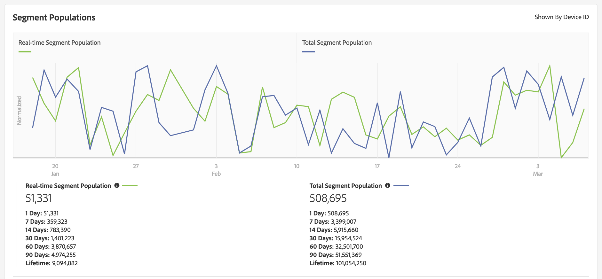

# Página Detalles del segmento {#segment-summary-view}

La página de detalles de un segmento individual proporciona una descripción general de los detalles del segmento, como el nombre del segmento, el ID, las métricas de rendimiento, las reglas que definen el segmento y las asignaciones de destino. Para ver estos detalles, vaya a **[!UICONTROL Audience Data]** > **[!UICONTROL Segments]** y haga clic en el nombre del segmento con el que desea trabajar.

## Herramientas de administración de segmentos {#segment-management-tools}

En la parte superior de la página de detalles del segmento se encuentran las herramientas que puede utilizar para administrar los segmentos:

1. **[!UICONTROL Add New]**: Utilice esta opción para activar  [!UICONTROL Segment Builder] y crear segmentos nuevos.
2. **[!UICONTROL Edit]**: Utilice esta opción para cambiar la configuración del segmento actual.
3. **[!UICONTROL Duplicate]**: Utilice esta opción para crear una copia del segmento actual.
4. **[!UICONTROL Delete]**: Utilice esta opción para eliminar el segmento actual de la cuenta de Audience Manager.
5. **[!UICONTROL Marketplace Recommendations]**: Utilice esta opción para encontrar segmentos similares a los que está viendo, desde fuentes de  [!UICONTROL Audience Marketplace] datos a las que no está suscrito. Consulte [Audience Marketplace para compradores de datos](../audience-marketplace/marketplace-data-buyers/marketplace-data-buyers.md) para obtener información sobre cómo navegar por Marketplace y encontrar segmentos similares.

## Información del segmento {#basics}

Debajo de las herramientas de administración de segmentos puede encontrar la siguiente información de segmentos:

1. **[!UICONTROL Basic Information]:** Muestra los detalles opcionales y requeridos especificados cuando se creó el segmento. Consulte [Generador de segmentos](segment-builder.md) para obtener una descripción detallada del significado de estos campos.
2. **[!UICONTROL Segment Graph]:** muestra los datos de rendimiento gráficamente y para intervalos fijos de 1, 7, 14, 30, 60 y 90 días. Explicamos los números de población del segmento en un [artículo independiente](../../features/segments/segment-builder-data.md).

   

3. **[!UICONTROL Identity Type Breakdown ]:** El informe muestra el número de personas o hogares que cumplen los requisitos para un segmento contando el número de ID entre dispositivos o ID de gráficos de dispositivos externos que están vinculados a los dispositivos que cumplen los requisitos para el segmento (mostrado por el  [!UICONTROL Total Segment Population]). Los ID entre dispositivos y los ID de gráficos de dispositivos externos que se muestran en este informe se utilizan para combinar perfiles con la regla de combinación de perfiles que utiliza el segmento. Este informe se muestra únicamente si ha seleccionado una fuente de datos entre dispositivos o un gráfico de dispositivos externos en la regla de combinación de perfiles que está utilizando el segmento.

   

   >[!NOTE]
   >
   >El Audience Manager solo muestra el informe [!UICONTROL Identity Type Breakdown] si tiene ID entre dispositivos cualificados para el segmento.

   Vea el siguiente vídeo para obtener una descripción general de [!UICONTROL Identity Type Breakdown].
   >[!VIDEO](https://video.tv.adobe.com/v/27977/)

4. **[!UICONTROL Segment Rules]:** Enumera las características del segmento junto con las reglas de clasificación.
5. **[!UICONTROL Destination Mappings]:** enumera las asignaciones de destino para el segmento.
6. **[!UICONTROL Management Tools]:** Controles que le permiten crear, editar, clonar y eliminar segmentos.
