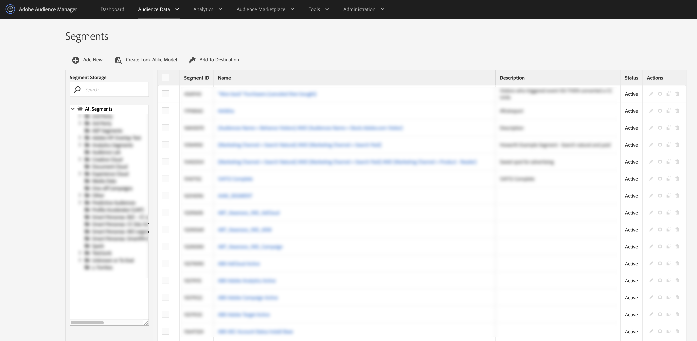

# Vista de lista de segmentos {#segments-list-view}

[!UICONTROL Segments dashboard] es un espacio de trabajo centralizado para administrar los segmentos de audiencia. Para ver el panel [!UICONTROL Segments], vaya a **[!UICONTROL Audience Data]** > **[!UICONTROL Segments]**.

La página [!UICONTROL Segments] contiene características y herramientas que le ayudarán a:

* Crear nuevos segmentos;
* Editar y eliminar segmentos;
* Clonar (duplicar) segmentos existentes;
* Ver todos los segmentos en una tabla con columnas que se pueden ordenar;
* Administrar el almacenamiento de segmentos;
* Busque segmentos por nombre.
