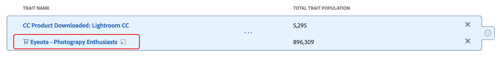

# Rasgo Recommendations

Obtenga recomendaciones de características publicadas a medida que versión sus segmentos, desde sus propias características propias y [!UICONTROL Audience Marketplace] fuentes de datos.

## Demostración Vídeo

Inicio viendo el video a [!UICONTROL Trait Recommendations] continuación, luego siga leyendo para obtener más información. La demostración en vídeo le muestra cómo trabajar con recomendaciones de sus propios rasgos propios, así como con recomendaciones de rasgos de fuentes de [!UICONTROL Audience Marketplace] datos a *las que* ya está suscrito.

>[!VIDEO](https://video.tv.adobe.com/v/26228/)

En el siguiente vídeo se describen los flujo de trabajo de [!UICONTROL Marketplace Recommendations], en el que se muestra cómo añadir características a los segmentos, basándose en las recomendaciones de las fuentes de datos de [!UICONTROL Audience Marketplace]. Estas recomendaciones se basan en fuentes de datos a *las que* no está suscrito.

>[!VIDEO](https://video.tv.adobe.com/v/29363/)

## Información general

[!UICONTROL Trait Recommendations], desarrollado por [!DNL Adobe Sensei], incorpora la ciencia de datos en su Audience Manager flujos de trabajo diario.
Con [!UICONTROL Trait Recommendations], cuando versión o edita un segmento en [el Generador de segmentos](segment-builder.md), obtiene recomendaciones sobre características adicionales que puede incluir, que son similares a las características de la segmento regla.

Audience Manager muestra recomendaciones de características tanto de sus características propias, en la **[!UICONTROL Recommendations]** sección, como de **[!UICONTROL Audience Marketplace]**, en la **[!UICONTROL Recommendations from Marketplace]** sección.

Añada las características recomendadas al segmento para aumentar la audiencia objetivo.

**En pocas palabras:**

* Audience Manager muestra características propias en la [!UICONTROL Recommendations] sección. Las recomendaciones de Marketplace de fuentes públicas y privadas a las que no está suscrito están visibles en la [!UICONTROL Recommendations from Marketplace] sección. Haga clic en el nombre fuente al que desea ir [!UICONTROL Audience Marketplace] y suscribirse.
* Audience Manager muestra un máximo de cincuenta rasgos similares a los del segmento regla.
* Puede filtrar los orígenes de datos de los cuales no desea ver ninguna recomendación.
* Al calcular las similitudes, Audience Manager considera [los](../../reference/ids-in-aam.md) UUID que calificaron para el rasgo durante los últimos 30 días.
* Si ve el mensaje de error &quot;No se encontraron características similares. Los rasgos pueden ser demasiado nuevos.&quot;, esto significa que, o bien no hubo actividad para ese rasgo en los últimos 30 días, o Audience Manager aún no ha actualizado las recomendaciones para ese rasgo. Inténtelo nuevamente en 24 horas.

## Casos de uso

Con [!UICONTROL Trait Recommendations], puede mejorar su flujos de trabajo, dependiendo de cómo use Audience Manager:

* Como experto en marketing, puede encontrar rápidamente audiencias interesadas en productos complementarios con la ayuda de rasgos similares, para que pueda aumentar su alcance.
* Si usa Audience Manager como publicador, con [!UICONTROL Trait Recommendations], puede comprender audiencia comportamiento y versión mejores segmentos para anuncios ventas o usuario Adquisición.
* [!UICONTROL Audience Marketplace] Como comprador de datos, quiero descubrir datos terceros relevantes sin tener que navegar por una gran cantidad de fuentes.
* [!UICONTROL Audience Marketplace] Como proveedor de datos, quiero recomendar datos relevantes a los compradores para poder beneficiarme de suscripciones óptimas y relevantes.

## Diferencias entre Recommendations de rasgos y modelos algorítmicos

### Modelos algorítmicos

[!UICONTROL Algorithmic Models] No solo encuentra los rasgos más influyentes, sino que también califica a los usuarios en función de esos rasgos y asigna cada usuario una puntuación individual. Seguidamente, puede crear rasgos algorítmicos para segmentar los usuarios. Con controles de precisión y alcance en el [!UICONTROL Trait Builder], puede especificar qué usuarios entre todos aquellos que tienen los rasgos influyentes desea destino.

[!UICONTROL Algorithmic Models] Permite seleccionar usuarios con diferentes niveles de precisión y prueba en [!UICONTROL Audience Lab] qué grupo de usuarios obtiene una mayor conversión. Consulte el caso de uso detallado en [Comparar modelos en Audience Lab](../../features/audience-lab/audience-lab-use-cases.md#compare-models).

En [!UICONTROL Algorithmic Models], el modelo se ejecuta cada 8 días y actualiza los usuarios cualificados para rasgos algorítmicos.

### Rasgo Recommendations

[!UICONTROL Trait Recommendations] es una forma rápida de obtener información sobre otras características similares a las que está utilizando en una segmento.

Debe utilizar [!UICONTROL Trait Recommendations] cuando:

* Necesita perspectivas rápidas cuando crea un segmento.
* Utiliza los segmentos para campañas cortas o cuando quiere suprimir rápidamente la audiencia que convierte.
* Está intentando maximizar el alcance.

## Flujo de trabajo

Al crear o editar una segmento en [el Generador de segmentos](segment-builder.md), puede explorar características similares a las del segmento regla. La [flujo de trabajo del Generador](segment-builder.md) de segmentos es muy similar para segmentos nuevos y existentes:

### Nuevo segmentos

1. Vaya a **Datos de audiencia > segmentos** y haga clic en **añadir Nuevo**.
1. En el **cuadro desplegable Características** , agregue al menos una característica al regla segmento.
1. En la sección, puede ver las características recomendadas por primera parte y [!UICONTROL Audience Marketplace] las recomendaciones de características de las **[!UICONTROL Recommendations]** fuentes a las que está suscrito. La **[!UICONTROL Recommendations from Marketplace]** sección muestra recomendaciones de características de fuentes a las que no está suscrito. Todas estas recomendaciones son similares a las características agregadas al segmento regla. Desplácese hacia abajo para ver todas las características recomendadas.
1. (Opcional) Para excluir características de origen recomendadas de ciertas fuentes de datos, haga clic en el **símbolo X** de las fuentes de datos que desea excluir.

   >[!NOTE]
   >
   >Las fuentes de datos excluidas se muestran justo encima del lista de características recomendadas. Haga clic **en X** en el cuadro gris para eliminar las exclusiones y volver a ver los resultados de las respectivas fuentes de datos.
1. Para agregar características recomendadas al regla de segmento, haga clic en el **símbolo +** .

>[!IMPORTANT]
>
>Al agregar [!UICONTROL Marketplace] características a una segmento, estas solo se utilizan para segmento estimación, hasta que se suscriba a la fuente de datos correspondiente. Las características que provienen de fuentes de datos a las que no está suscrito se marcan con un icono de carro de compras en la lista de características. Haga clic en el nombre del rasgo para ir al Página de fuente de datos y suscribirse a él.
>
>
>
>Puede guardar un segmento con características de terceros solo después de suscribirse a las fuentes de datos correspondientes.

### Segmentos existentes

1. Vaya a **[!UICONTROL Audience Data]>[!UICONTROL Segments]**, seleccione la segmento que desea editar y haga clic en .
1. Desplácese hacia abajo hasta el [!UICONTROL Traits] cuadro desplegable.
1. Se pueden ver las características recomendadas que son similares a las que ya se encuentran en la segmento regla. Desplácese hacia abajo para ver todas las características recomendadas.
1. (Opcional) Para excluir características recomendadas de ciertas fuentes de datos, haga clic en el **símbolo X** de las fuentes de datos que desea excluir.

   >[!NOTE]
   >
   >Las fuentes de datos excluidas se muestran justo encima del lista de características recomendadas. Haga clic **en X** en el cuadro gris para eliminar las exclusiones y volver a ver los resultados de las respectivas fuentes de datos.
1. Para agregar características recomendadas al regla de segmento, haga clic en el **símbolo +** .

Cuando crea o edita una segmento y agrega una característica al regla de segmento, ve un máximo de cincuenta características recomendadas, similares a la que ha agregado. Si el segmento regla contiene más de un rasgo, Audience Manager utiliza un método round robin para mostrar la mejor coincidencia para cada rasgo, luego la segunda mejor coincidencia para cada rasgo, y así sucesivamente, para los cincuenta rasgos más grandes por población, en el segmento regla.

Por ejemplo, cuando hay tres características en la segmento regla, como se muestra a continuación, las características recomendadas son:

1. Mejor coincidencia para el rasgo 3 (el rasgo con la mayor población);
1. Mejor coincidencia para el rasgo 1;
1. Mejor coincidencia para el rasgo 2;
1. Segunda mejor coincidencia para el rasgo 3;
1. Segunda mejor coincidencia para el rasgo 1, y así sucesivamente hasta llegar a cincuenta rasgos.

Para obtener recomendaciones para un rasgo específico, puede hacer clic en los rasgos en la segmento regla (1) o en los rasgos recomendados vista (2).

Al hacer clic en un rasgo de origen, se abre una ventana elemento emergente, como se muestra en la imagen siguiente. Si las características recomendadas no forman parte del segmento, puede agregarlas al segmento pulsando **+**.

>[!TIP]
>
>Las fuentes de datos excluidas del Página principal se tienen en cuenta al generar recomendaciones dentro de la ventana de elemento emergente de información de características. Y, si excluye los orígenes de datos en este vista, las exclusiones se aplicarán al Página principal.

>[!NOTE]
>
>Las características recomendadas pueden ser las de origen o las de terceros de las fuentes de datos a [!UICONTROL Audience Marketplace]las que está suscrito.

## Cómo funciona

Para producir recomendaciones de rasgos, Audience Manager calcula la [similitud](https://en.wikipedia.org/wiki/Jaccard_index) de Jaccard entre el rasgo destino y cualquier otro rasgo al que su cuenta tenga acceso, incluidos los datos terceros. Audience Manager muestra hasta cincuenta rasgos que tienen la mayor similitud.

## Puntaje de similitud de rasgos {#trait-similarity-score}

Audience Manager calcule entre [!UICONTROL Trait Similarity Score] dos rasgos calculando la intersección y el unión en términos del número de [!UICONTROL UUID]s y luego divida los dos. Para dos características A y B, el cálculo gustar este aspecto:

Véanse también los dos ejemplos siguientes.

### Ejemplo 1 - Puntuación de similitud de rasgos baja

Dados dos rasgos A y B, digamos que cada uno de los rasgos tiene una población de 1,000,000 [!UICONTROL UUID]s, 25,000 [!UICONTROL UUID]s de los cuales califican para ambos rasgos.
Usando la fórmula anterior, esto dará como resultado: 25,000 / 1,975,000 = 0.012. Este es un bajo [!UICONTROL Trait Similarity Score], los dos rasgos son muy diferentes.

### Ejemplo 2 - Puntuación de similitud de características

Si los mismos rasgos A y B tenían 400,000 [!UICONTROL UUID]s que califican para ambos rasgos, el [!UICONTROL Trait Similarity Score] es mucho más alto:
400.000 / 1.600.000 = 0,25

### Cómo interpretar la puntuación de similitud de rasgos

Utilice la siguiente tabla como una guía aproximada para caracterizar la similitud. Esta guía se basa en las puntuaciones de similitud observadas en la mayoría de los rasgos.

| [!UICONTROL Trait Similarity Score] | Importancia |
|---------|----------|
| 0.1 y posterior | Alta similitud entre características |
| 0.03 - 0.1 | Similitud media entre características |
| 0.01 - 0.03 | Baja similitud entre características |
| 0 - 0.01 | Muy poca similitud entre características |

## Control de acceso basado en roles (RBAC)

Para las empresas que utilizan [!UICONTROL Role-Based Access Controls] ([!UICONTROL RBAC]), debe tener permiso para crear y editar segmentos con el fin de ver las características recomendadas. Las recomendaciones de características que ve son solo las de las fuentes de datos a las que tiene acceso a través [!UICONTROL RBAC]de .

>[!IMPORTANT]
>
>Para agregar [!UICONTROL Marketplace Recommendations] contenido a un segmento, los usuarios deben suscribirse primero a las fuentes de datos correspondientes. Solo los usuarios con privilegios de administrador pueden suscribirse a las [!UICONTROL Audience Marketplace] fuentes de datos.

Lea más sobre los [!UICONTROL RBAC] controles [aquí](../administration/administration-overview.md).

## Limitaciones

* En este momento, Audience Manager no muestra las características de carpeta como características recomendadas. Lea más sobre las características de carpeta [aquí](../traits/manage-folder-traits.md).
* Al mostrar Recommendations de características, Audience Manager no tiene en cuenta cuenta [!DNL Boolean] operadores ([!DNL AND], [!DNL OR], [!DNL NOT]) en segmento reglas.
