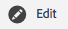

# Recommendations de rasgos

Obtenga recomendaciones de características activas a medida que genere sus segmentos, a partir de sus propias características de origen y fuentes de datos de [!UICONTROL Audience Marketplace].

## Demostración en vídeo

Empiece por ver el vídeo de [!UICONTROL Trait Recommendations] que aparece a continuación y continúe leyendo para obtener más información. La demostración en vídeo muestra cómo trabajar con recomendaciones de sus propias características de origen, así como con recomendaciones de características de [!UICONTROL Audience Marketplace] fuentes de datos a las que *ya se ha suscrito*.

>[!VIDEO](https://video.tv.adobe.com/v/40842?captions=spa)

El siguiente vídeo describe el flujo de trabajo de [!UICONTROL Marketplace Recommendations], y muestra cómo agregar características a los segmentos, según las recomendaciones de las fuentes de datos de [!UICONTROL Audience Marketplace]. Estas recomendaciones se basan en fuentes de datos a las que *no se ha suscrito*.

>[!VIDEO](https://video.tv.adobe.com/v/32756?captions=spa)

## Información general

[!UICONTROL Trait Recommendations], con tecnología de [!DNL Adobe Sensei], incorpora la ciencia de datos en los flujos de trabajo diarios del Audience Manager.
Con [!UICONTROL Trait Recommendations], cuando crea o edita un segmento en [Generador de segmentos](segment-builder.md), obtiene recomendaciones sobre características adicionales que puede incluir, que son similares a las características de la regla de segmento.

El Audience Manager muestra las recomendaciones de características tanto de las características de origen, en la sección **[!UICONTROL Recommendations]**, como de **[!UICONTROL Audience Marketplace]**, en la sección **[!UICONTROL Recommendations from Marketplace]**.

Añada las características recomendadas al segmento para aumentar la audiencia objetivo.

**En resumen:**

* El Audience Manager muestra características de origen en la sección [!UICONTROL Recommendations]. Las recomendaciones de Marketplace de fuentes públicas y privadas a las que no se ha suscrito se pueden ver en la sección [!UICONTROL Recommendations from Marketplace]. Haga clic en el nombre de la fuente para ir a [!UICONTROL Audience Marketplace] y suscribirse.
* El Audience Manager muestra un máximo de cincuenta rasgos similares al de la regla del segmento.
* Puede filtrar las fuentes de datos de las que no desea ver ninguna recomendación.
* Al calcular las similitudes, el Audience Manager tiene en cuenta [UUID](../../reference/ids-in-aam.md) que cumplen los requisitos para el rasgo durante los últimos 30 días.
* Si ve el mensaje de error &quot;No se han encontrado rasgos similares. Rasgos puede ser demasiado nuevo&quot;. Esto significa que, o bien no ha habido actividad para ese rasgo en los últimos 30 días o el Audience Manager aún no ha actualizado las recomendaciones para ese rasgo. Inténtelo de nuevo en 24 horas.

## Casos de uso

Con [!UICONTROL Trait Recommendations], puede mejorar sus flujos de trabajo en función de cómo use Audience Manager:

* Como experto en marketing, puede encontrar rápidamente audiencias interesadas en productos complementarios con la ayuda de características similares, para que pueda aumentar su alcance.
* Si usa Audience Manager como editor, con [!UICONTROL Trait Recommendations], puede comprender el comportamiento de la audiencia y generar segmentos mejores para las ventas de publicidad o la adquisición de usuarios.
* Como comprador de datos de [!UICONTROL Audience Marketplace], quiero descubrir datos de terceros relevantes sin tener que navegar por un gran número de fuentes.
* Como proveedor de datos de [!UICONTROL Audience Marketplace], quiero recomendar datos relevantes a los compradores para poder beneficiarme de suscripciones óptimas y relevantes.

## Diferencias entre modelos algorítmicos y Recommendations de rasgos

### Modelos algorítmicos

[!UICONTROL Algorithmic Models] no solo encuentra los rasgos más influyentes, sino que también puntúa a los usuarios según esos rasgos y asigna a cada usuario una puntuación individual. Seguidamente, puede crear rasgos algorítmicos para segmentar los usuarios. Con los controles de precisión y alcance de [!UICONTROL Trait Builder], puede especificar a qué usuarios quiere dirigirse de entre todos los que tienen los rasgos influyentes.

[!UICONTROL Algorithmic Models] le permite seleccionar usuarios en diferentes niveles de precisión y probar en [!UICONTROL Audience Lab] qué grupo de usuarios se convierte mejor. Consulte el caso de uso detallado en [Comparar modelos en Audience Lab](../../features/audience-lab/audience-lab-use-cases.md#compare-models).

En [!UICONTROL Algorithmic Models], el modelo se ejecuta cada 8 días y actualiza los usuarios clasificados para rasgos algorítmicos.

### Recommendations de rasgos

[!UICONTROL Trait Recommendations] es una forma rápida de obtener información sobre otros rasgos similares a los utilizados en un segmento.

Debe usar [!UICONTROL Trait Recommendations] cuando:

* Necesita perspectivas rápidas cuando crea un segmento.
* Utiliza los segmentos para campañas cortas o cuando quiere suprimir rápidamente la audiencia que convierte.
* Está intentando maximizar el alcance.

## Flujo de trabajo

Al crear o editar un segmento en [Generador de segmentos](segment-builder.md), puede explorar características similares a las de la regla de segmento. El flujo de trabajo [Generador de segmentos](segment-builder.md) es muy similar para los segmentos nuevos y existentes:

### Nuevos segmentos

1. Vaya a **Datos de audiencia > Segmentos** y haga clic en **Agregar nuevo**.
1. En el cuadro desplegable **Características**, agregue al menos una característica a la regla del segmento.
1. Puede ver características recomendadas de origen y [!UICONTROL Audience Marketplace] recomendaciones de características de fuentes a las que está suscrito en la sección **[!UICONTROL Recommendations]**. La sección **[!UICONTROL Recommendations from Marketplace]** muestra las recomendaciones de características de fuentes a las que no se ha suscrito. Todas estas recomendaciones son similares a los rasgos agregados a la regla de segmento. Desplácese hacia abajo para ver todos los rasgos recomendados.
1. (Opcional) Para excluir los rasgos de origen recomendados de ciertas fuentes de datos, haga clic en el símbolo **X** de las fuentes de datos que desee excluir.

   >[!NOTE]
   >
   >Las fuentes de datos excluidas se muestran justo encima de la lista de características recomendadas. Haga clic en **X** en el cuadro gris para quitar las exclusiones y ver de nuevo los resultados de los orígenes de datos respectivos.
1. Para agregar características recomendadas a la regla de segmento, haga clic en el símbolo **+**.

>[!IMPORTANT]
>
>Al agregar [!UICONTROL Marketplace] características a un segmento, las características solo se utilizan para la estimación de segmentos, hasta que se suscriba a la fuente de datos correspondiente. Las características de fuentes de datos a las que no está suscrito se marcan con un icono del carro de compras en la lista de características. Haga clic en el nombre del rasgo para ir a la página de fuente de datos y suscribirse a ella.
>
>
>
>Solo puede guardar segmentos con características de terceros una vez que se haya suscrito a las fuentes de datos correspondientes.

### Segmentos existentes

1. Vaya a **[!UICONTROL Audience Data]>[!UICONTROL Segments]**, seleccione el segmento que desee editar y haga clic en .
1. Desplácese hacia abajo hasta el cuadro desplegable [!UICONTROL Traits].
1. Puede ver características recomendadas, que son similares a las características que ya se encuentran en la regla de segmento. Desplácese hacia abajo para ver todos los rasgos recomendados.
1. (Opcional) Para excluir los rasgos recomendados de ciertas fuentes de datos, haga clic en el símbolo **X** de las fuentes de datos que desee excluir.

   >[!NOTE]
   >
   >Las fuentes de datos excluidas se muestran justo encima de la lista de características recomendadas. Haga clic en **X** en el cuadro gris para quitar las exclusiones y ver de nuevo los resultados de los orígenes de datos respectivos.
1. Para agregar características recomendadas a la regla de segmento, haga clic en el símbolo **+**.

Cuando crea o edita un segmento y agrega una característica a la regla del segmento, ve un máximo de cincuenta características recomendadas, similares a la que ha agregado. Si la regla del segmento contiene más de un rasgo, Audience Manager utiliza un método de round robin para mostrar la mejor coincidencia para cada rasgo, la segunda mejor coincidencia para cada rasgo y así sucesivamente, para los cincuenta rasgos más grandes por población, en la regla del segmento.

Por ejemplo, cuando hay tres rasgos en la regla del segmento, como se muestra a continuación, los rasgos recomendados son:

1. Mejor coincidencia para el rasgo 3 (el rasgo con la población más grande);
1. Mejor coincidencia para el rasgo 1;
1. Mejor coincidencia para el rasgo 2;
1. Segunda mejor coincidencia para el rasgo 3;
1. La segunda mejor coincidencia para el rasgo 1, y así sucesivamente hasta que llegue a cincuenta rasgos.

Para obtener recomendaciones para un rasgo específico, puede hacer clic en los rasgos en la regla del segmento (1) o en la vista de rasgos recomendados (2).

Al hacer clic en una característica de origen, se abre una ventana emergente, como se muestra en la siguiente imagen. Si los rasgos recomendados no forman parte del segmento, puede agregarlos al segmento presionando **+**.

>[!TIP]
>
>Las fuentes de datos excluidas de la página principal se tienen en cuenta al generar recomendaciones en la ventana emergente de información de características. Y, si excluye las fuentes de datos en esta vista, las exclusiones se aplican a la página principal.

>[!NOTE]
>
>Los rasgos recomendados pueden ser los rasgos de origen o los rasgos de terceros de las fuentes de datos a las que se ha suscrito en [!UICONTROL Audience Marketplace].

## Cómo funciona

Para generar recomendaciones de características, Audience Manager calcula la [similitud de Jaccard](https://en.wikipedia.org/wiki/Jaccard_index) entre la característica de destino y todas las demás características a las que su cuenta tiene acceso, incluidos los datos de terceros. A continuación, el Audience Manager muestra hasta cincuenta rasgos que tienen la similitud más alta.

## Puntuación de similitud de rasgos {#trait-similarity-score}

Audience Manager calcule el [!UICONTROL Trait Similarity Score] entre dos características calculando la intersección y la unión en términos del número de [!UICONTROL UUID]s y, a continuación, divida los dos. Para dos rasgos A y B, el cálculo tiene este aspecto:

Véanse también los dos ejemplos siguientes.

### Ejemplo 1: Puntuación de similitud de rasgo baja

Dados los rasgos A y B, supongamos que cada uno de los rasgos tiene una población de 1 000 000 [!UICONTROL UUID] s, de los cuales 25 000 [!UICONTROL UUID] s cumplen los requisitos para ambos rasgos.
Utilizando la fórmula anterior, esto resultará en: 25 000 / 1 975 000 = 0,012. Este es un bajo [!UICONTROL Trait Similarity Score], los dos rasgos son muy diferentes.

### Ejemplo 2: Puntuación de similitud de rasgos

Si los mismos rasgos A y B tenían 400 000 [!UICONTROL UUID] que cumplen los requisitos para ambos rasgos, [!UICONTROL Trait Similarity Score] es mucho más alto:
400 000 / 1 600 000 = 0,25

### Interpretación de la puntuación de similitud de rasgos

Utilice la siguiente tabla como guía aproximada para comprobar la similitud de rasgos. Esta guía se basa en las puntuaciones de similitud observadas en la mayoría de los rasgos.

| [!UICONTROL Trait Similarity Score] | Importancia |
|---------|----------|
| 0.1 y superior | Alta similitud entre rasgos |
| 0,03 - 0,1 | Similitud de Medium entre características |
| 0,01 - 0,03 | Baja similitud entre rasgos |
| 0 - 0,01 | Muy baja similitud entre rasgos |

## Control de acceso basado en roles (RBAC)

Para las empresas que usan [!UICONTROL Role-Based Access Controls] ([!UICONTROL RBAC]), necesita tener permiso para crear y editar segmentos a fin de ver las características recomendadas. Las recomendaciones de características que ve solo son las de los orígenes de datos a los que tiene acceso a través de [!UICONTROL RBAC].

>[!IMPORTANT]
>
>Para agregar [!UICONTROL Marketplace Recommendations] a un segmento, los usuarios deben suscribirse primero a las fuentes de datos correspondientes. Solo los usuarios con privilegios de administrador pueden suscribirse a [!UICONTROL Audience Marketplace] fuentes de datos.

Obtenga más información sobre [!UICONTROL RBAC] controles [aquí](../administration/administration-overview.md).

## Limitaciones

* Actualmente, Audience Manager no muestra las características de carpeta como características recomendadas. Obtenga más información sobre los rasgos de carpeta [aquí](../traits/manage-folder-traits.md).
* Al mostrar Trait Recommendations, el Audience Manager no tiene en cuenta los operadores [!DNL Boolean] ([!DNL AND], [!DNL OR], [!DNL NOT]) en las reglas de segmentos.
