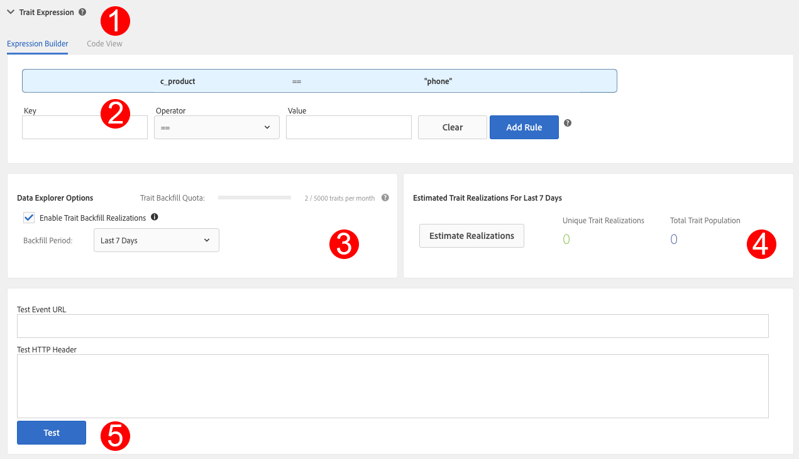

# Administración de normas de rasgos {#managing-trait-rules}

Entrada [!UICONTROL Trait Builder], el [!UICONTROL Expression Builder] permite crear y probar reglas que establecen requisitos de cualificación de audiencias. Las reglas constan de pares de clave-valor como `color == blue` o `price > 100`. Los operadores de comparación establecen la relación entre claves y valores. [!DNL Boolean] las expresiones determinan la relación entre los grupos de reglas.

<!-- c_tb_rules.xml -->

## Características de las reglas de señal principales descritas

1. El **[!UICONTROL Expression Builder]** o **[!UICONTROL Code View]** las pestañas proporcionan una visión general de las reglas del rasgo. El **[!UICONTROL Expression Builder]** La pestaña permite crear reglas con campos y menús desplegables. El **[!UICONTROL Code View]** permite crear reglas escribiendo manualmente esas expresiones como código. La ilustración anterior muestra un rasgo simple compuesto por una señal que evalúa los datos para una condición correspondiente en la que una clave de producto es igual a un valor específico, en este caso `color == "blue"`.

1. Los campos y controles de esta sección permiten crear señales a partir de pares clave-valor y establecer la relación entre ellos con un operador de comparación. Se requieren una clave, un operador y un valor.
1. El [!UICONTROL Data Explorer Options] le permite rellenar las realizaciones de rasgos para sus señales.

   >[!NOTE]
   >
   >Esta opción solo está disponible para [!UICONTROL Data Explorer] clientes. Póngase en contacto con su consultor de Adobe para obtener más información.

1. Esta sección muestra una estimación de las realizaciones de rasgos de los últimos 7 días, para las señales definidas en la variable [!UICONTROL Expression Builder], para rasgos rellenados y no rellenados.

   >[!NOTE]
   >
   >Esta opción solo está disponible para [!UICONTROL Data Explorer] clientes. Póngase en contacto con su consultor de Adobe para obtener más información.

1. Los campos de prueba permiten validar combinaciones de reglas de señal para la variable [!DNL URL]es que desea utilizar al enviar datos al Audience Manager.

## Crear una regla de rasgos {#create-trait-rule}

Las reglas (o expresiones) constan de pares de clave-valor individuales o grupos de ellos. Los operadores de comparación establecen la relación entre pares clave-valor. Para crear una regla, proporcione una clave y un valor, seleccione un operador y haga clic en **[!UICONTROL Add Rule]**.

<!-- t_tb_create_rules.xml -->

Rellene los campos obligatorios en la **[!UICONTROL Basic Information]** sección *antes* creación de reglas de rasgos.

1. Expanda el **[!UICONTROL Trait Expression]** y escriba un nombre de clave y valor. Esto crea un *`signal`*.

   >[!NOTE]
   >
   >Incluya el `c_` prefijo (o cualquier otra convención de nombres) para variable clave si las llamadas de evento envían datos a [!DNL Audience Manager] usando esa sintaxis.

1. Seleccione una [operador de comparación](../../features/traits/trait-comparison-operators.md) desde el **[!UICONTROL Operator]** desplegable. El operador de comparación evalúa la relación entre los elementos de una señal.

   >[!NOTE]
   >
   >El [!DNL Boolean] [!UICONTROL OR] establece la relación entre múltiples señales *dentro* un grupo y no se pueden cambiar.

1. Haga clic **[!UICONTROL Add Rule]**. La regla guardada aparece en el espacio de trabajo de características encima de los campos de entrada de datos.

### Ejemplo {#example-trait-rule}

En el ejemplo siguiente, un usuario ha creado una nueva regla de rasgos basada en el ID del producto. Para generar esta regla, el usuario proporcionó la clave `productkey` enlazado con un operador igual ( `==`) al valor `2093`.

Clic **[!UICONTROL Add Rule]** guarda y mueve el rasgo en [!UICONTROL Expression Builder] workspace.

## Crear un nuevo grupo de reglas {#create-rule-group}

Este procedimiento describe cómo crear un nuevo grupo de reglas.

<!-- t_tb_new_rule_group.xml -->

El rasgo debe contener al menos dos reglas para poder crear un nuevo grupo de reglas.

1. Mueva el cursor sobre la regla que desee mover para resaltarla.
1. Pase el ratón sobre el borde de regla resaltado.

   Esto separa automáticamente la regla de su grupo actual y la mueve a un nuevo grupo.

   >[!NOTE]
   >
   >Vuelva a arrastrar una regla a su grupo original si la mueve de forma involuntaria.

1. Seleccione una [!DNL Boolean] operador ([!UICONTROL AND], [!UICONTROL OR], [!UICONTROL AND NOT]) en el menú desplegable para establecer la relación entre los grupos de reglas.

## Mover reglas entre grupos {#move-rules-between-groups}

Para mover una regla, haga clic en y arrástrela a otro grupo.

## Editar una característica {#edit-trait}

Este procedimiento describe cómo editar un rasgo.

<!-- t_tb_edit.xml -->

1. En el [!UICONTROL Traits] panel, pase el ratón sobre **[!UICONTROL Actions]** para la característica que desea editar. Esto abre los iconos de administración de características.
1. Haga clic en el lápiz para editar la característica.

   

## Eliminar una regla de rasgos {#delete-trait}

Este procedimiento describe cómo eliminar una regla de rasgos.

<!-- t_tb_delete_rule.xml -->

1. En el [!UICONTROL Traits] panel, pase el ratón sobre [!UICONTROL Actions] para la característica que desea editar y haga clic en el icono de lápiz. Esto abre los iconos de administración de características.
1. Expanda el [!UICONTROL Trait Expression] sección.
1. Pase el ratón sobre la regla que quiera eliminar y haga clic en el icono X. La regla se elimina inmediatamente.

>[!MORELIKETHIS]
>
>* [Crear un nuevo grupo de reglas](../../features/traits/manage-trait-rules.md#create-rule-group)
>* [Mover reglas entre grupos](../../features/traits/manage-trait-rules.md#move-rules-between-groups)
>* [Crear una regla de rasgos](../../features/traits/manage-trait-rules.md#create-trait-rule)
>* [Eliminar una regla de rasgos](../../features/traits/manage-trait-rules.md#delete-trait)
>* [Mover reglas entre grupos](../../features/traits/manage-trait-rules.md#move-rules-between-groups)

