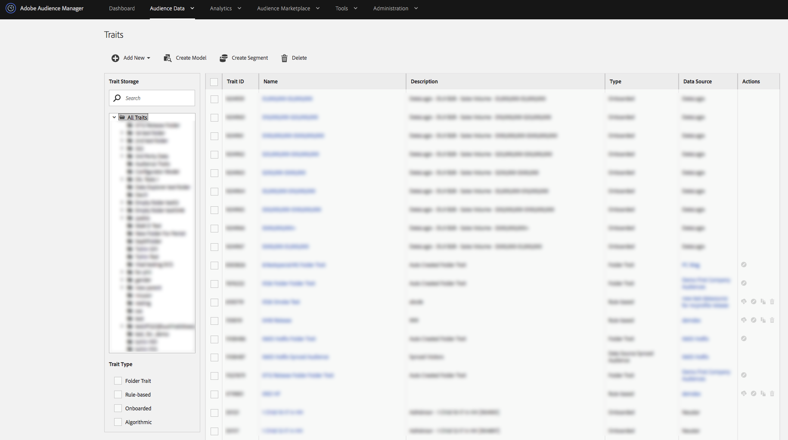

# Panel de rasgos {#traits-dashboard}

El panel de características es un espacio de trabajo centralizado para administrar características. Para ver el panel [!UICONTROL Traits], vaya a **[!UICONTROL Audience Data]** > **[!UICONTROL Traits]**.

<!-- c_tb_dashboard.xml -->

El panel [!UICONTROL Traits] contiene características y herramientas que le ayudarán a:

1. Vea todos sus rasgos y detalles relacionados en una tabla con columnas que puede ordenar.
2. Revise y trabaje con [Características de audiencia activa y Características sincronizadas de datos de Source](../../features/traits/client-activity-synced-audience-traits.md).
3. Crear, editar y eliminar rasgos.
4. Ver y administrar carpetas de almacenamiento de rasgos.
5. Busque rasgos por nombre, ID, descripción o fuente de datos. Haga clic en una carpeta mientras busca para limitar los resultados a esa carpeta y sus subcarpetas.
6. Filtrar rasgos por tipo de rasgos (incorporados, basados en reglas, algorítmicos, de carpeta).
