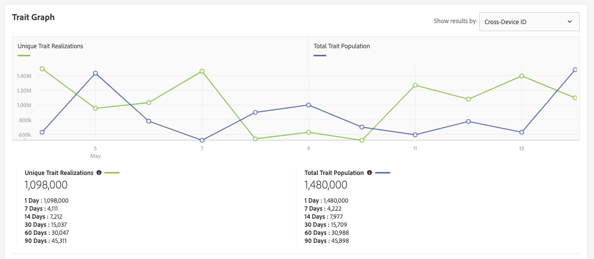

# Página Detalles de la característica {#trait-details-page}

La página de detalles de una característica individual proporciona una visión general de los detalles de la característica, como el nombre de la característica, el ID, las métricas de rendimiento, las expresiones que definen la característica, los segmentos a los que pertenece y el registro de auditoría de características. Para vista de estos detalles, vaya a **[!UICONTROL Audience Data]** > **[!UICONTROL Traits]** y haga clic en el nombre de la característica con la que desea trabajar.

## Herramientas de administración de características {#trait-management-tools}

En la parte superior de la página de detalles de características se encuentran las herramientas que puede utilizar para administrar sus características:

1. **[!UICONTROL Add New]**:: Utilice esta opción para crear nuevas características basadas en reglas, algorítmicas o integradas.
2. **[!UICONTROL Edit]**:: Utilice esta opción para cambiar la configuración de la característica actual.
3. **[!UICONTROL Delete]**:: Utilice esta opción para eliminar la característica actual de la cuenta del Administrador de Audiencias.
4. **[!UICONTROL Marketplace Recommendations]**:: Utilice esta opción para encontrar características similares a la que está viendo, a partir de [!UICONTROL Audience Marketplace] tarifas de datos a las que no está suscrito. Consulte [Audiencia Marketplace for Data Buyers](../audience-marketplace/marketplace-data-buyers/marketplace-data-buyers.md) para obtener información sobre cómo navegar por Marketplace y encontrar características similares.

## Información sobre características {#basics}

La [!UICONTROL Trait Information] sección muestra detalles sobre los campos opcionales y requeridos que completó al crear la característica. Esto incluye aspectos como el tipo de característica, la ID de característica, la descripción, la fuente de datos y otros metadatos. Estos detalles varían según el tipo de característica (carpeta, integrado o basado en reglas).

## Gráfico de características {#trait-graph}

El [!UICONTROL Trait Graph] proporciona métricas de rendimiento de un vistazo para la característica seleccionada. Mantenga el cursor sobre una línea de tendencia para ver datos adicionales de la característica seleccionada.

[!UICONTROL Unique Trait Realizations] representan un recuento de usuarios únicos que agregaron esta característica a su perfil durante un intervalo de tiempo determinado. El [!UICONTROL Total Trait Population] indica el número de usuarios únicos cualificados actualmente para esta característica.

* Para las características basadas en reglas, la calificación de características se realiza en tiempo real, ya que los usuarios cumplen los requisitos para una característica en su explorador.
* En el caso de las características integradas, la calificación de características se produce después de procesar un archivo entrante, es decir, el archivo entrante se [introduce en el Administrador](../../faq/faq-inbound-data-ingestion.md) de Audiencias y se produce cuando se califica la característica.
* **[!UICONTROL Unique Trait Realizations]**:: Recuento de usuarios únicos que agregaron esta característica a su perfil durante un intervalo de tiempo determinado.
* **[!UICONTROL Total Trait Population]**:: El número de usuarios únicos cualificados actualmente para esta característica.

   

* **[!UICONTROL Identity Type Breakdown]**:: Las tres primeras entradas muestran los tres primeros orígenes de datos entre dispositivos con el mayor recuento de población que se ha clasificado para la característica, en orden descendente. La cuarta entrada muestra la suma de todos los demás [!DNL DPUUIDs] ([!DNL CRM IDs]) calificados para la característica, de las fuentes de datos entre dispositivos que no se encuentran entre las tres primeras. Este informe aparece solamente si selecciona la ID entre dispositivos en el menú [!UICONTROL Show Results By] desplegable en la parte superior derecha de la página. La opción desplegable predeterminada es [!UICONTROL Device ID], donde no se muestra este informe.

   

   >[!NOTE]
   >
   >El Administrador de Audiencias solo muestra el [!UICONTROL Identity Type Breakdown] informe si tiene ID de varios dispositivos calificados para la característica.

   >[!VIDEO](https://video.tv.adobe.com/v/27977/)

## Expresión de características {#trait-expression}

La [!UICONTROL Trait Expression] sección muestra los criterios que los usuarios deben cumplir para cumplir con la característica. Estas reglas se establecen al [crear o editar una característica](../../features/traits/about-trait-builder.md).

## Segmentos de características {#trait-segments}

La [!UICONTROL Segments with this Trait] sección lista todos los segmentos a los que pertenece la característica seleccionada. Puede hacer clic en el nombre de un segmento para ver los detalles de dicho segmento.

## Registro de historial/auditoría de características {#trait-audit-history}

En el caso de las características basadas en reglas y integradas, el [!UICONTROL Trait Expression Change History] muestra los últimos 10 cambios realizados en las reglas de expresión de características y quién los realizó. Si su característica tiene más de 10 cambios, haga clic en **[!UICONTROL Export to CSV]** para descargar el registro de auditoría completo. El registro de auditoría no está disponible para características algorítmicas o de carpetas.

>[!NOTE]
>
>[!UICONTROL Not Available] en la [!UICONTROL By User] columna significa que la cuenta de ese usuario se ha eliminado.

