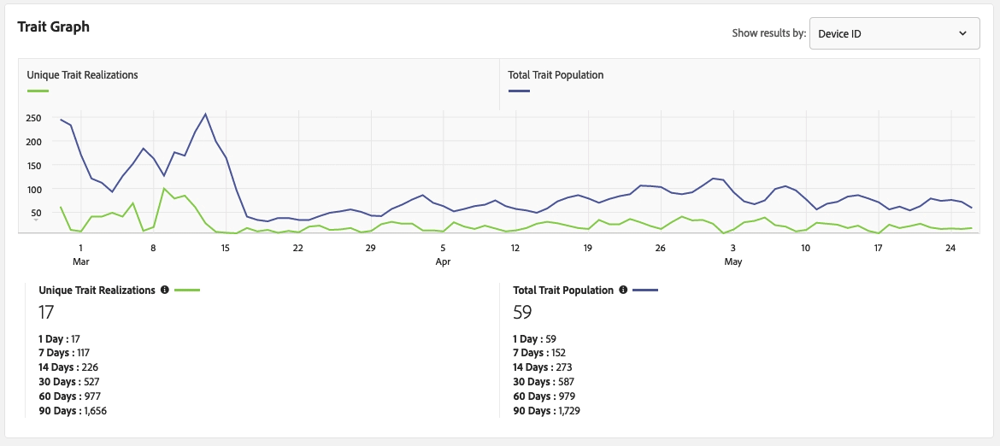

# Página de detalles de [!UICONTROL Trait] {#trait-details-page}

La página de detalles de un(a) [!UICONTROL trait] individual(a) proporciona una descripción general de los detalles de [!UICONTROL trait], como el nombre de [!UICONTROL trait], el identificador, las métricas de rendimiento, las expresiones que definen a [!UICONTROL trait], los segmentos a los que pertenece y el registro de auditoría [!UICONTROL trait]. Para ver estos detalles, vaya a **[!UICONTROL Audience Data]** > **[!UICONTROL Traits]** y haga clic en el nombre del [!UICONTROL trait] con el que desea trabajar.

## Herramientas de administración de [!UICONTROL Trait] {#trait-management-tools}

La parte superior de la página de detalles de [!UICONTROL trait] contiene las herramientas que puede usar para administrar su [!UICONTROL traits]:

1. **[!UICONTROL Add New]**: utilice esta opción para crear [!UICONTROL rule-based], [!UICONTROL algorithmic] o [!UICONTROL onboarded traits] nuevos.
2. **[!UICONTROL Edit]**: utilice esta opción para cambiar la configuración del [!UICONTROL trait] actual.
3. **[!UICONTROL Delete]**: utilice esta opción para eliminar el(la) [!UICONTROL trait] actual(a) de su cuenta de Audience Manager.
4. **[!UICONTROL Marketplace Recommendations]**: usa esta opción para encontrar [!UICONTROL traits] similares al que estás viendo, a partir de [!UICONTROL Audience Marketplace] tarifas de datos a las que no estás suscrito. Consulte a [Audience Marketplace de compradores de datos](../audience-marketplace/marketplace-data-buyers/marketplace-data-buyers.md) para obtener información sobre cómo navegar por [!UICONTROL Marketplace] y encontrar características similares.

## Información de [!UICONTROL Trait] {#basics}

La sección [!UICONTROL Trait Information] muestra detalles acerca de los campos obligatorios y opcionales que completó al generar [!UICONTROL trait]. Esto incluye elementos como el tipo [!UICONTROL trait], el identificador [!UICONTROL trait], la descripción, [!UICONTROL data source] y otros metadatos. Estos detalles varían según el tipo [!UICONTROL trait] ([!UICONTROL folder], [!UICONTROL onboarded] o [!UICONTROL rule-based]).

## [!UICONTROL Trait Graph] {#trait-graph}

[!UICONTROL Trait Graph] proporciona métricas de rendimiento de un vistazo para los [!UICONTROL trait] seleccionados. Mantenga el cursor sobre una línea de tendencia para ver datos adicionales de la [!UICONTROL trait] seleccionada.

[!UICONTROL Unique Trait Realizations] representan un recuento de usuarios únicos que agregaron este(a) [!UICONTROL trait] a su perfil durante el intervalo de tiempo dado. [!UICONTROL Total Trait Population] indica la cantidad de usuarios únicos calificados actualmente para este(a) [!UICONTROL trait].

Para [!UICONTROL rule-based traits], la calificación de [!UICONTROL trait] se produce en tiempo real, ya que los usuarios cumplen los requisitos para [!UICONTROL trait] en su explorador.

Para [!UICONTROL onboarded traits], la calificación de [!UICONTROL trait] se produce después de procesar un archivo entrante, es decir, el archivo entrante es [introducido en el Audience Manager](../../faq/faq-inbound-data-ingestion.md) y es entonces cuando se produce la calificación de [!UICONTROL trait].

[!UICONTROL Trait Graph] le muestra la siguiente información:

* **[!UICONTROL Show results by]**
   * **[!UICONTROL Cross-Device ID]**: seleccione esta opción para ver los resultados de [!UICONTROL traits] que están recopilando datos para perfiles autenticados. Al seleccionar esta opción, sólo se ven datos en el informe [!UICONTROL Cross-Device ID], y no habrá datos presentes en el informe [!UICONTROL Device ID].
   * **[!UICONTROL Device ID]**: seleccione esta opción para ver los resultados de [!UICONTROL traits] que están recopilando datos para perfiles de dispositivo. Al seleccionar esta opción, sólo se ven datos en el informe [!UICONTROL Device ID], y no habrá datos presentes en el informe [!UICONTROL Cross-Device ID].

     

* **[!UICONTROL Unique Trait Realizations]**: un recuento de usuarios únicos que agregaron este(a) [!UICONTROL trait] a su perfil durante el intervalo de tiempo especificado.
* **[!UICONTROL Total Trait Population]**: número de usuarios únicos cualificados actualmente para este(a) [!UICONTROL trait].

* **[!UICONTROL Identity Type Breakdown]**: las tres primeras entradas muestran las tres [!UICONTROL cross-device data sources] principales con el mayor recuento de población que cumplen los requisitos para [!UICONTROL trait], en orden descendente. La cuarta entrada muestra la suma de todos los otros [!DNL DPUUIDs] ([!DNL CRM IDs]) que cumplen los requisitos para [!UICONTROL trait], de los [!UICONTROL cross-device data sources] que no están entre los tres primeros. Este informe solo aparece si selecciona [!UICONTROL Cross-device ID] en el menú desplegable [!UICONTROL Show Results By] en la parte superior derecha de la página. La opción desplegable predeterminada es [!UICONTROL Device ID], donde no se muestra este informe.

  

  >[!NOTE]
  >
  >El Audience Manager solo muestra el informe [!UICONTROL Identity Type Breakdown] si cuenta con [!UICONTROL cross-device] ID calificados para [!UICONTROL trait].

  >[!VIDEO](https://video.tv.adobe.com/v/27977/)

## Expresión [!UICONTROL Trait] {#trait-expression}

La sección [!UICONTROL Trait Expression] le muestra los criterios que los usuarios deben cumplir para poder optar a [!UICONTROL trait]. Estas reglas se establecen cuando [crea o edita un rasgo](../../features/traits/about-trait-builder.md).

## [!UICONTROL Trait] Segmentos {#trait-segments}

La sección [!UICONTROL Segments with this Trait] enumera todos los segmentos a los que pertenece el [!UICONTROL trait] seleccionado. Puede hacer clic en un nombre de segmento para ver detalles sobre ese segmento.

## [!UICONTROL Trait] Registro de auditoría/historial {#trait-audit-history}

Para [!UICONTROL rule-based] y [!UICONTROL onboarded traits], [!UICONTROL Trait Expression Change History] muestra los últimos 10 cambios realizados en las reglas de expresión de [!UICONTROL trait] y quién los realizó. Si su [!UICONTROL trait] tiene más de 10 cambios, haga clic en **[!UICONTROL Export to CSV]** para descargar todo el registro de auditoría. El registro de auditoría no está disponible para [!UICONTROL folder] o [!UICONTROL algorithmic traits].

>[!NOTE]
>
>[!UICONTROL Not Available] en la columna [!UICONTROL By User] significa que la cuenta de ese usuario se ha eliminado.

