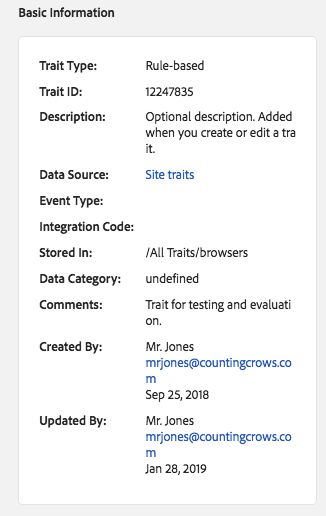

# Trait Details Page {#trait-details-page}

La página de detalles de una característica individual proporciona información general sobre información como el nombre de característica, el ID, las métricas de rendimiento, las expresiones que definen el rasgo, los segmentos a los que pertenece y el registro de auditoría de características. To vew these details, go to [!UICONTROL Audience Data > Traits] and click the name of the trait you want to work with.

## Información básica {#basics}

The [!UICONTROL Basic Information] section shows details about required and optional fields you completed when building the trait. Esto incluye el tipo de característica, el ID de características, la descripción, la fuente de datos y otros metadatos. Estos detalles varían según el tipo de característica (carpeta, infiltrado o basado en reglas).

## Trait Graph {#trait-graph}

[!UICONTROL Trait Graph] Proporciona métricas de rendimiento de vistazo para el rasgo seleccionado. Mantenga el cursor sobre una línea de tendencias para ver datos adicionales para el rasgo seleccionado.

[!UICONTROL Unique Trait Realizations] representan un recuento de usuarios únicos que han agregado esta característica a su perfil durante un intervalo de tiempo determinado. [!UICONTROL Total Trait Population] Indica el número de usuarios únicos que están actualmente cualificados para esta característica.

* Para las características basadas en reglas, la cualificación de características se produce en tiempo real, ya que los usuarios cumplen los requisitos de un rasgo en el navegador.
* For onboarded traits, trait qualification happens after an inbound file is processed, i.e. the inbound file is [fed into Audience Manager](../../faq/faq-inbound-data-ingestion.md) and that is when the trait qualification happens.
* **Realización de características únicas**: Recuento de usuarios únicos que agregaron esta característica a su perfil durante un intervalo de tiempo determinado.
* **Población total de características**: Número de usuarios únicos que actualmente están cualificados para esta característica.

## Trait Expression {#trait-expression}

The [!UICONTROL Trait Expression] section shows you the criteria users must meet to qualify for the trait. These rules are set when you [create or edit a trait](../../features/traits/about-trait-builder.md).

## Trait Segments {#trait-segments}

The [!UICONTROL Segments with this Trait] section lists all the segments the selected trait belongs to. Puede hacer clic en un nombre de segmento para ver los detalles de ese segmento.

## Trait Audit/History Log {#trait-audit-history}

For rule-based and onboarded traits, the [!UICONTROL Trait Expression Change History] shows you the last 10 changes made to trait expression rules and who made them. If your trait has more than 10 changes, click **[!UICONTROL Export to CSV]** to download the entire audit log. El registro de auditoría no está disponible para características de carpeta o algoritmos.

>[!NOTE]
>
>[!UICONTROL Not Available] en [!UICONTROL By User] la columna significa que se ha eliminado la cuenta de ese usuario.

