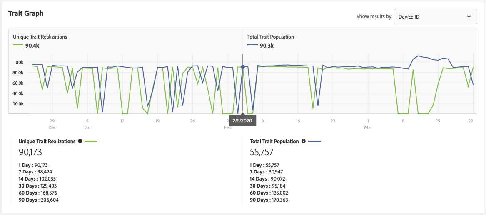

# Referencia de calificación de características {#trait-qualification-reference}

La cualificación de características, o realización de características, se trata de forma diferente en Audience Manager, según el tipo de característica. Consulte la tabla siguiente para obtener información detallada sobre la calificación de rasgos.

## Cualificación de características por tipo de característica {#trait-type}

| Tipo de característica | Criterios de cualificación |
|---|---|
| Características basadas en reglas | La calificación de características se realiza en tiempo real, ya que los usuarios cumplen los requisitos para una característica en su explorador. Los usuarios empezarán a cumplir los requisitos para una característica basada en reglas aproximadamente 4 horas después de [crear la característica](create-onboarded-rule-based-traits.md#create-rules-based-or-onboarded-traits) en la interfaz de usuario. Las características basadas en reglas le permiten utilizar controles de [actualización y frecuencia](../segments/recency-and-frequency.md) para los límites de frecuencia de publicidad y otros casos de uso. |
| Características integradas | La calificación de características se produce después de procesar un archivo entrante, es decir, el archivo entrante se [importa en Audience Manager](../../faq/faq-inbound-data-ingestion.md) y es cuando se produce la calificación de características. Debe esperar aproximadamente 4 horas después de crear una característica integrada antes de cargar un archivo de entrada para su procesamiento. Para las características integradas, el número máximo de cualificaciones para un perfil de usuario es 1. |
| Características algorítmicas | Para las características algorítmicas, el número máximo de cualificaciones para un perfil de usuario es 1. |
| Características de la carpeta | Una característica de carpeta resume las calificaciones de características de las características que contiene. Leer características [de la carpeta: Acerca](about-folder-traits.md) de para obtener más información. |
| Características de audiencias activas y características sincronizadas de fuentes de datos | Una [!UICONTROL Active Audience] característica contiene todos los dispositivos que se administran en su cuenta de Audience Manager. [!UICONTROL Data Source Synced Traits] realizar un seguimiento de todos los usuarios asociados a un origen de datos. Obtenga más información sobre las características de audiencia [activa y las características](client-activity-synced-audience-traits.md)sincronizadas de fuentes de datos. |

## Realizaciones únicas de características y población total de características {#unique-trait-realizations}

El [!UICONTROL Unique Trait Realizations] recuento del número de visitantes que agregaron la característica a su perfil, dentro de diferentes intervalos de tiempo.

La [!UICONTROL Total Trait Population] representa el número de visitantes que tienen esta característica en su perfil.

Piensen en los números de esta manera. En la imagen anterior, desde la vista Detalles [de](../../features/traits/trait-details-page.md) características, 90.173 representa el número de dispositivos activos que visitaron sus propiedades ayer. El [!UICONTROL Total Trait Population] total de 55.757 usuarios representa la cantidad de usuarios que actualmente cumplen los requisitos para esta característica. La [!UICONTROL Total Trait Population] figura muestra la cantidad total de usuarios que podrían utilizarse para segmentación/segmentación. Normalmente, los usuarios permanecerán como parte de una característica durante 120 días.

Porque ejecutamos dos trabajos computacionales diferentes para calcular las dos poblaciones, las [!UICONTROL Total Trait Population] mismas siempre están rezagadas en 24 horas [!UICONTROL Unique Trait Realizations] . En el gráfico de arriba se pueden ver unos 90.400 [!UICONTROL Unique Trait Realizations] y un [!UICONTROL Total Trait Population] de unos 90.300 para el 5 de febrero. Los 90.400 perfiles se agregan al [!UICONTROL Total Trait Population] día siguiente.

Para llevar el punto a casa, si experimentaste un pico de 10.000 visitantes en este momento, aparecerían en la página de mañana [!UICONTROL Unique Trait Realizations], pero solo aparecerían 24 horas después en la [!UICONTROL Total Trait Population].

Cualquier cambio en la realización de rasgos se refleja en las poblaciones de segmentos.

## Población de segmentos en tiempo real y población total de segmentos {#real-time-segment}

El [!UICONTROL Real-time Segment Population] recuento cuenta el número de dispositivos que se han cualificado para el segmento seleccionado y que han alcanzado sus propiedades, dentro del intervalo de tiempo seleccionado.

El [!UICONTROL Total Segment Population] recuento del número de dispositivos que se han cualificado para el segmento seleccionado dentro del intervalo de tiempo seleccionado. El [!UICONTROL 1 Day] informe representa el recuento de población de segmentos más actualizado.

Piensen en los números de esta manera. En la imagen anterior, desde la vista Detalles [del](../../features/segments/segment-summary-view.md) segmento, 9.993 representa el número de dispositivos activos que visitaron sus propiedades ayer y calificaron para el segmento. El [!UICONTROL Total Segment Population] total de 699.532 representa el número total de dispositivos cualificados actualmente para este segmento. La [!UICONTROL Total Segment Population] figura está pensada para mostrar el número total de dispositivos que se pueden usar para segmentación/segmentación.

Porque ejecutamos dos trabajos computacionales diferentes para calcular las dos poblaciones, las [!UICONTROL Total Segment Population] mismas siempre están rezagadas en 24 horas [!UICONTROL Real-time Segment Population] . En el gráfico de arriba se puede ver un 8.116 [!UICONTROL Real-time Segment Population] y un [!UICONTROL Total Segment Population] 742.000 para el 2 de febrero. Los 8.116 perfiles se agregan al [!UICONTROL Total Segment Population] día siguiente.

Para llevar el punto a casa, si experimentaste un pico de 10.000 visitantes en este momento, aparecerían en la página de mañana [!UICONTROL Real-time Segment Population], pero solo aparecerían 24 horas después en la [!UICONTROL Total Segment Population].

## Límite de cualificación de características {#trait-qualification-limit}

Aplicamos un límite de 150.000 cualificaciones de características para cada perfil de usuario, ya sea un perfil autenticado ([DPUUID](../../reference/ids-in-aam.md)) o un ID de dispositivo ([UUID](../../reference/ids-in-aam.md)). Tenga en cuenta que aunque los DPUUID son exclusivos de una instancia específica de [!DNL Audience Manager], los UUID se comparten en la [!DNL Audience Manager] plataforma. Para [!UICONTROL UUID]los adultos, imponemos una política de equidad al almacenar las calificaciones de rasgos. Un algoritmo garantiza que una parte igual del [!UICONTROL UUID] perfil esté disponible para cada instancia de [!DNL Audience Manager].
