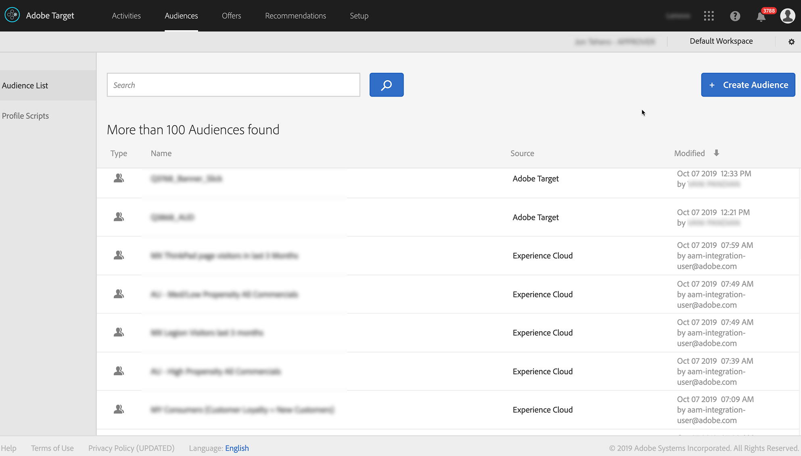

# Integrar Audience Manager Con [!DNL Target] {#integrate-audience-manager-with-target}

Esta integración le permite enviar segmentos de Audience Manager a Adobe [!DNL Target].

Una integración de Audience Manager - [!DNL Target] requiere:

* El [servicio Experience Cloud](https://experienceleague.adobe.com/docs/id-service/using/home.html?lang=es). Si no usas este servicio, consulta las [guías de implementación](https://experienceleague.adobe.com/docs/id-service/using/implementation/implementation-guides.html?lang=es) para comenzar.
* [!DNL Profiles and Audiences]. Si no se le ha proporcionado [!DNL Profiles and Audiences], póngase en contacto con el Servicio de atención al cliente para comenzar.

Todos los segmentos de Audience Manager aparecerán en [!DNL Target] poco después de completar estos pasos en el proceso de implementación. Busque en **[!UICONTROL Audiences > Audience List]** para ver sus segmentos de Audience Manager en [!DNL Target]. Identifique los segmentos de Audience Manager mediante Experience Cloud en la columna **[!UICONTROL Source]** y `aam-integration-user@adobe.com` en la columna **[!UICONTROL Modified]**.

