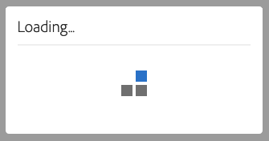

# Accesibilidad en el Audience Manager {#accessibility}

## Información general {#overview}

La accesibilidad se refiere a una serie de características que hacen que un producto de software sea utilizable, con el menor esfuerzo posible de usuarios con diversas discapacidades, como visual, auditiva, cognitiva, motora u otro tipo.

Adobe es un líder del sector en accesibilidad y apoya la creación de experiencias web destacadas al alentar a los desarrolladores a producir contenido rico y atractivo accesible a todos los usuarios. Para obtener más información sobre el compromiso del Adobe con la accesibilidad, consulte [Accesibilidad al Adobe](https://www.adobe.com/accessibility.html).

Las funciones de accesibilidad más comunes que se encuentran en los productos de software son: navegación mediante el teclado, estructura semántica, suficiente contraste entre elementos en primer plano y elementos en segundo plano, compatibilidad con la tecnología de asistencia, etiquetas de elementos claras, etc.

Para que [!DNL Audience Manager] sea más fácil de usar para todos, hemos desarrollado soporte para múltiples funciones de accesibilidad.

## Navegación por teclado {#keyboard-navigation}

[!DNL Audience Manager] admite la accesibilidad completa del teclado:

* La clave `Tab` y las flechas se desplazan entre elementos individuales de la interfaz de usuario.

   

* Las teclas `Return` (`Enter`) y `Space` activan el elemento seleccionado.

## Clasificación de tabla accesible {#table-sorting}

Los encabezados de tabla se pueden seleccionar al navegar mediante la clave `Tab` y puede cambiar el orden de clasificación presionando `Space`.

## Compatibilidad con tecnologías de asistencia {#assistive-technologies}

Mediante el uso de código semántico y [ARIA](https://www.w3.org/WAI/standards-guidelines/aria/), los elementos interactivos dentro de la interfaz de usuario [!DNL Audience Manager] incluyen etiquetas correspondientes, nombres accesibles y funciones que identifican tanto su propósito como su estado actual.

Esto garantiza que las tecnologías de asistencia, como los lectores de pantalla, puedan leer las etiquetas y otra información a los usuarios para que puedan interactuar fácilmente con los controles de aplicación.

Todos los elementos interactivos dentro de la interfaz de usuario del Audience Manager incluyen las etiquetas correspondientes. Esto garantiza que las tecnologías de asistencia, como los lectores de pantalla, puedan leer las etiquetas a los usuarios.

## Colores y contraste {#colors-contrast}

La interfaz de usuario [!DNL Audience Manager] se esfuerza por proporcionar suficiente contraste en la aplicación para garantizar una experiencia de visualización accesible para los usuarios con deficiencias de visión o color bajas.

Por ejemplo, las pantallas de carga incluyen un control de giro de carga dentro de un cuadro modal en blanco, todo ello encima de una superposición en gris oscuro.

## Lectura adicional {#further-reading}

[!DNL Audience Manager] se esfuerza por proporcionar un grado cada vez mayor de accesibilidad, facilitando el uso del producto para todos.

Le recomendamos que utilice el [Formulario de comentarios de accesibilidad del Adobe](https://www.adobe.com/accessibility/feedback.html) para enviarnos sugerencias de mejora y problemas de accesibilidad con los que se encuentre. Estaremos encantados de tener en cuenta sus comentarios y mejorar [!DNL Audience Manager].
