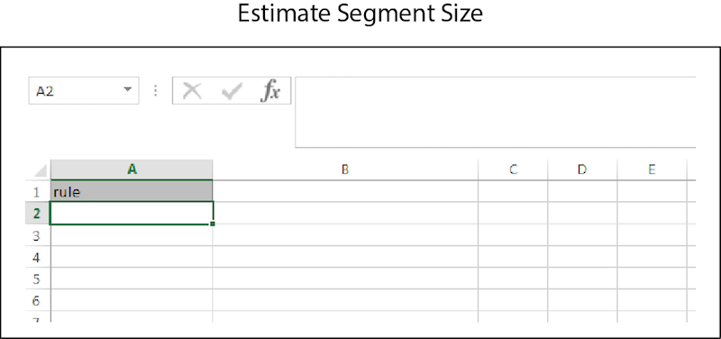

# Estimaciones masivas{#bulk-estimates}

Una estimación masiva devuelve datos de tamaño del segmento basados en las reglas del segmento. Siga estas instrucciones para realizar una solicitud de estimación masiva.

>[!IMPORTANT]
>
>Las herramientas de administración masiva no son una oferta de Adobe oficialmente compatible. La resolución de problemas y la asistencia técnica a través del Servicio de atención al cliente se gestionarán caso por caso.

<!-- 

t_bulk_estimates.xml

 -->

>[!NOTE]
>
>[Los permisos de grupo RBAC](../../features/administration/administration-overview.md) asignados en la interfaz de usuario de [!DNL Audience Manager] se respetan en [!UICONTROL Bulk Management Tools].

Para realizar actualizaciones masivas, abra la hoja de cálculo [!UICONTROL Bulk Management Tools] y:

1. Haga clic en la ficha **[!UICONTROL Headers]** y copie el encabezado [!UICONTROL Estimate Segment Size].
2. Haga clic en la ficha **[!UICONTROL Estimate]**.
3. Pegue el encabezado de estimación en la primera fila de la hoja de cálculo de estimación.
4. Pegue o escriba los datos que desea cambiar en una columna correspondiente basada en la etiqueta del encabezado.
5. En la barra de herramientas de la hoja de cálculo, haga clic en el botón Crear que coincida con el elemento que está actualizando.
Esta acción abre el cuadro de diálogo [!UICONTROL Account Information].
6. Proporcione la [información de inicio de sesión](../../reference/bulk-management-tools/bulk-management-intro.md#auth-reqs) necesaria y haga clic en **[!UICONTROL Submit]**.

Esta acción crea una columna [!UICONTROL Response] en la hoja de cálculo que contiene datos estimados del tamaño del segmento. Antes de introducir datos, la hoja de cálculo de estimación masiva debe tener un aspecto similar al siguiente:

Si su actualización masiva devuelve un error o falla, consulte [Solución de problemas para herramientas de administración masiva](../../reference/bulk-management-tools/bulk-troubleshooting.md).
