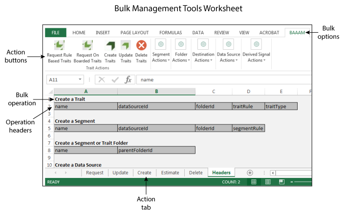

# Getting Started With Bulk Management{#getting-started-with-bulk-management}

Las herramientas de administración masiva permiten crear y gestionar varios objetos a la vez con una sola operación. Puede utilizar las herramientas de administración masiva para trabajar con fuentes de datos, señales derivadas, destinos, carpetas, segmentos y características.

<!-- 

c_bulk_start.xml

 -->

>[!NOTE]
>
>[!UICONTROL Bulk Management Tools]*No* se admite [!DNL Audience Manager]en. Esta herramienta se proporciona para su comodidad y solo como cortesía. For bulk changes, we recommend that you work with the [Audience Manager APIs](../../api/rest-api-main/aam-api-getting-started.md) instead. [Los permisos de grupo RBAC](../../features/administration/administration-overview.md) asignados en [!DNL Audience Manager] la interfaz de usuario se aceptan en [!UICONTROL Bulk Management Tools]la.

## Información general {#overview}

This feature uses a Microsoft Excel spreadsheet with macros that make secure, authenticated calls to the [!DNL Audience Manager] APIs. La API proporciona los métodos y servicios que permiten realizar cambios de forma masiva. No tiene que saber cómo crear código o trabajar con nuestras API para usarlo. La hoja de cálculo contiene encabezados de columna y fichas que realizan funciones de cambio masivas específicas. Para realizar cambios masivos, basta con agregar los encabezados predefinidos a hojas de cálculo específicas, proporcionar la información que desee cambiar de forma masiva y hacer clic en un botón de acción. La hoja de cálculo y las API realizan el resto del trabajo por usted.

## Requisitos previos {#prereqs}

To use the [!DNL Bulk Management Tools], you need the following:

* Your [!DNL Audience Manager] user name and password. Como cliente, ya debería tener estas credenciales.
* ID de cliente de API y clave secreta. El administrador de cuentas puede proporcionarle estos datos.
* The [!UICONTROL Bulk Management Tools] worksheet. **[Descargue la hoja de cálculo](assets/BAAAM_August_2018.xlsm)** para obtener la versión más reciente.

* Microsoft Excel running on [!DNL Windows] or in a [!DNL Microsoft Windows] virtual machine running on [!DNL macOS X]. You must use 32-bit Excel for the [!UICONTROL Bulk Management Tools] to work.

## Actions and operations {#actions-ops}

The [!UICONTROL Bulk Management Tools] worksheet consists of action tabs, action buttons, and a **[!UICONTROL Headers]** tab. **[!UICONTROL Headers]** La ficha contiene los encabezados de columna preformateados utilizados por las fichas de acciones. Las fichas de acción contienen macros que realizan la operación masiva seleccionada. Para realizar una operación masiva, copie un conjunto de encabezados en la ficha de acción adecuada, introduzca los datos del encabezado y haga clic en un botón de acción.

Abra la hoja de cálculo y haga clic en un botón de acción para comenzar.

The table below lists the operations you can perform and items you can manipulate with the [!UICONTROL Bulk Management Tools] worksheets.

<table id="table_B9B3E09B692E42BAA52FB32C18B00709"> 
 <thead> 
  <tr> 
   <th colname="col1" class="entry"> Acciones </th> 
   <th colname="col2" class="entry"> Objetos </th> 
  </tr> 
 </thead>
 <tbody> 
  <tr> 
   <td colname="col1"> 
Las acciones por lotes aparecen en fichas en la parte inferior de la hoja de cálculo e incluyen: 
 
 
     <ul id="ul_49F46B9E00C045D29E40258EB7BDCFBB"> 
      <li id="li_193C41EA19EF4D738FBA037D2BF9B05C">Solicitudes </li> 
      <li id="li_5BE2E13D839F4958AAA5C01B7EFC5096">Actualización </li> 
      <li id="li_4CCCC739795945DF8C89787F9A67EB88">Crear  </li> 
      <li id="li_C7D36D2BDF0448CEAF3A5EABE41038E8">Estimar </li> 
      <li id="li_07A3E94326124A3092362D9896EB7732">Eliminar </li> 
     </ul> 
 </td> 
   <td colname="col2"> 
The objects you can change in bulk are located under the <b> Headers</b> tab and include: 
 
 
     <ul id="ul_A7A96F2B1B63430B9A1E1184AC5FA8F2"> 
      <li id="li_E3D9E2E190B04BE685337AC6140C371C"> <a href="../../features/datasources-list-and-settings.md#data-sources-list-and-settings"> Fuentes de datos</a> </li> 
      <li id="li_B645385E40684FA28770913EAF18CB2C"> <a href="../../features/derived-signals.md"> Señales derivadas</a> </li> 
      <li id="li_9059F8C4A41A410899BDEFC76D3F5949"> <a href="../../features/destinations/destinations.md"> Destinos</a> </li> 
      <li id="li_BB5A445150754E53AA38C78461326932"> <a href="../../features/traits/trait-storage.md#trait-storage"> Carpetas de características</a> y carpetas de segmentos </li> 
      <li id="li_7A27DBF64E0945CF8AE8C96E8C6EDA09"> <a href="../../features/segments/segments-purpose.md"> Segmentos</a> </li> 
      <li id="li_A4640A34930040DEA8555EAF0AE2A702"> <a href="../../features/traits/trait-details-page.md"> Características</a> </li> 
     </ul> 
 </td> 
  </tr> 
 </tbody> 
</table>

**Ejemplo de operación masiva**

Como ejemplo, veamos cómo crear varias características al mismo tiempo. Para crear varias características en una operación masiva, debe:

1. Click the **[!UICONTROL Headers]** tab and copy all the labels under the [!UICONTROL Create a Trait] option.

2. Click the **[!UICONTROL Create]** tab and paste the labels starting in row 1, column A.
3. Provide information related to each column header and click **[!UICONTROL Create Traits]**. Esta acción le solicita que inicie sesión. Your bulk job runs after you successfully authenticate (see the [authentication requirements](../../reference/bulk-management-tools/bulk-management-intro.md#auth-reqs) below). Marque la esquina inferior izquierda de la hoja de cálculo para una notificación de estado de trabajo.

>[!NOTE]
>
>Al trabajar con solicitudes grandes, es posible que la hoja de cálculo deje de responder y aparezca inactiva. En estos casos, solo déjelo en blanco. La hoja de cálculo será adaptable cuando se complete la solicitud masiva. If the worksheet does not respond for a long period of time, see the [troubleshooting section](../../reference/bulk-management-tools/bulk-troubleshooting.md).

## Authentication requirements and options {#auth-reqs}

Los cambios masivos requieren autenticación. Cuando selecciona una acción, la hoja de cálculo le solicita que inicie sesión. Puesto que la hoja de cálculo realiza llamadas de API, debe configurarla para que lea la clave secreta. And, the **[!UICONTROL Domain]** field lets you make bulk changes in a staging/test environment or against your live, production account.

**Requisitos de autenticación de API**

Para configurar la autenticación de API, debe:

* Copie y guarde la clave secreta en un archivo de texto (.txt).
* Asigne un nombre al archivo de texto con su ID de cliente de API. Por ejemplo, si su ID de cliente es &quot;Usuario masivo&quot;, guarde la clave en un archivo llamado &quot;User-User. txt&quot;.
* Guarde la clave secreta y la hoja de cálculo en la misma carpeta.

Cuando realice cambios masivos, tendrá que introducir un nombre de usuario, contraseña, ID de cliente y dominio, pero la autenticación de API es automática.

**Opciones de autenticación de dominio**

La autenticación de dominio le permite probar solicitudes masivas o aplicarlas directamente a su cuenta de producción. Realizar cambios masivos en el entorno de prueba no afectará a su cuenta de producción. Los cambios de producción son efectivos inmediatamente. **[!UICONTROL Domain]** El campo acepta las direcciones siguientes, según el entorno en el que desee trabajar:

* Pruebas: `api-beta.demdex.com`
* Producción: `api.demdex.com`

>[!MORE_ LIKE_ THIS]
>
>* [Descargar la hoja de cálculo de administración masiva](assets/BAAAM_August_2018.xlsm)

