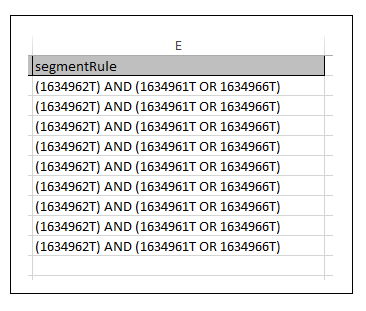

# Creación o actualización de reglas de rasgos y reglas de segmentos{#create-or-update-trait-rules-and-segment-rules}

Las hojas de cálculo de creación y actualización aceptan un encabezado traitRule que permite aplicar varias reglas en una sola operación. Siga estas instrucciones para realizar solicitudes de reglas masivas.

>[!IMPORTANT]
>
>Las herramientas de administración masiva no son una oferta de Adobe oficialmente admitida. La resolución de problemas y la asistencia técnica a través del Servicio de atención al cliente se gestionarán caso por caso.

<!-- 

c_bulk_rules.xml 

 -->

>[!NOTE]
>
>[Los permisos de grupo RBAC](../../features/administration/administration-overview.md) asignados en la interfaz de usuario de [!DNL Audience Manager] se respetan en [!UICONTROL Bulk Management Tools].

## Uso de reglas de rasgos {#trait-rules}

En la hoja de cálculo, la columna de regla de rasgos devuelve y acepta reglas compuestas de expresiones booleanas, operadores de comparación y expresiones regulares. Puede crear reglas con el generador de rasgos o segmentos en [!DNL Audience Manager] y copiarlas en la hoja de cálculo. O bien, si está familiarizado con la sintaxis de reglas, puede escribir expresiones directamente en las hojas de cálculo.

## Ejemplo del generador de reglas {#rule-builder-example}

Veamos un ejemplo que muestra cómo utilizar [!UICONTROL Segment Builder] para crear una regla que se pueda agregar a la hoja de cálculo masiva. Sin embargo, no se trata de un conjunto de instrucciones paso a paso para esas herramientas. En su lugar, vamos a empezar con una regla simple que ya se ha creado. Para obtener instrucciones sobre cómo usar los generadores de reglas, consulte [Generador de segmentos](../../features/segments/segment-builder.md) y [Generador de rasgos](../../features/traits/about-trait-builder.md).

Con el generador de reglas visual, hemos creado una regla de segmento con 3 características y un operador booleano [!UICONTROL AND].

Haga clic en **[!UICONTROL Code View]** para obtener la versión de texto de esta regla.

>[!TIP]
>
>Haga clic en **[!UICONTROL Validate Expression]** para comprobar la lógica de la regla. Esto ayudará a evitar que cargue una regla no válida.

Pegue la regla en la hoja de cálculo [!UICONTROL Bulk Management Tools] y confirme los cambios para actualizar las reglas de segmentos de forma masiva.

## Creación de sus propias reglas {#create-rules}

Puede escribir sus propias reglas fuera de [!UICONTROL Rule Builder]. Antes de empezar, asegúrese de leer la documentación que cubre aspectos como los operadores, las expresiones y las variables requeridas. Le recomendamos que revise lo siguiente:

* [Trabajando Con Operadores De Comparación En El Generador De Características](../../features/traits/trait-comparison-operators.md)
* [Orden de operaciones](../../features/traits/trait-operator-precedence.md)
* [Requisitos de prefijo para variables clave](../../features/traits/trait-variable-prefixes.md)
* [Expresiones de muestra con operadores booleanos y de comparación](../../features/traits/trait-expression-samples.md)
