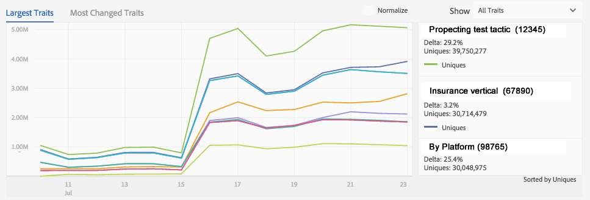
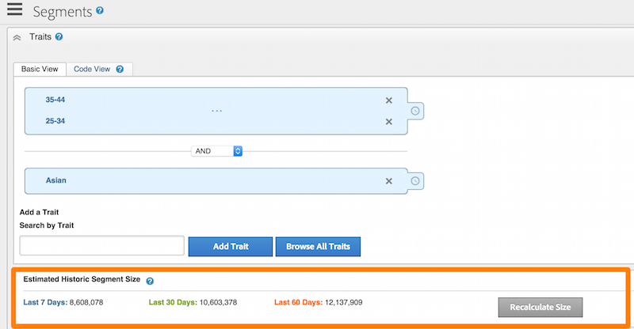
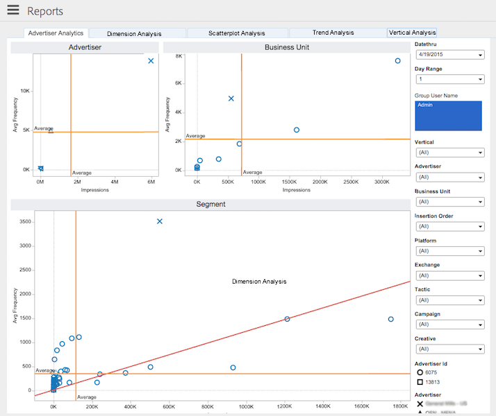

# Componentes de procesamiento de datos{#data-processing-components}

Los componentes de procesamiento de datos incluyen Hadoop, Snowflake, SOLR y Tableau.

<!-- 

c_comproc.xml

 -->

Audience Manager utiliza los siguientes componentes para procesar datos:

## Hadoop {#hadoop}

En [!DNL Audience Manager], Hadoop es la base de datos principal que contiene todo lo que [!DNL Audience Manager] sabe sobre un usuario. Por ejemplo, cuando los [servidores de caché de perfiles](../../reference/system-components/components-data-collection.md) crean archivos de registro que contienen datos sobre los usuarios, envían esos datos a Hadoop para su almacenamiento. Otros elementos importantes de Hadoop incluyen:

* **Hive:** Un almacén de datos para Hadoop. Hive administra consultas ad hoc a los datos almacenados en Hadoop.

* **HBase:** Una base de datos de Hadoop muy grande. Procesa y administra datos de entrada y salida, reglas de rasgos, información de modelado algorítmico y realiza muchas otras funciones relacionadas con el almacenamiento y el movimiento de datos a diferentes sistemas.

Los clientes no tienen acceso directo a estos sistemas. Sin embargo, los clientes sí trabajan con ellos indirectamente, ya que estos componentes almacenan datos importantes sobre los visitantes del sitio.

## Snowflake {#snowflake}

[Snowflake](https://www.snowflake.net/) es una base de datos en la nube masiva. Proporciona datos a muchos de los gráficos de tableros y a sus cuadros de texto relacionados que muestran el cambio porcentual para cada elemento del gráfico. Si usa [!DNL Audience Manager] y observa los informes del tablero, está interactuando con los datos proporcionados por [!UICONTROL Snowflake].

Esta no es una lista completa, pero algunos informes comunes del tablero de los que es responsable [!UICONTROL Snowflake] incluyen:

* [Informe de variación del rasgo diario](/help/using/reporting/audience-optimization-reports/daily-trait-variation-report.md)
* Todos los informes de superposición (consulte la sección [Informes interactivos](/help/using/reporting/dynamic-reports/dynamic-reports.md) para obtener información sobre cada informe de superposición).
* [Informe de señales no utilizadas](/help/using/reporting/dynamic-reports/unused-signals.md)

## SOLR {#solr}

SOLR es una base de datos de código abierto y un sistema de servidor de Apache. Proporciona capacidades de búsqueda sólidas y rápidas en comparación con nuestros grandes conjuntos de datos. Como cliente de [!DNL Audience Manager], puede ver el SOLR en acción cuando genere segmentos. Proporciona datos al informe [!UICONTROL Estimated Historic Segment Size]. SOLR es ideal para este papel debido a su velocidad. Por ejemplo, SOLR puede actualizar los datos de tamaño históricos a medida que crea reglas y añade nuevas características a un segmento.

## Tableau {#tableau}

[!DNL Audience Manager] usa [Tableau](https://www.tableausoftware.com/) para mostrar datos en [informes interactivos](../../reporting/dynamic-reports/dynamic-reports.md#interactive-and-overlap-reports) y en [informes de Audience Optimization](../../reporting/audience-optimization-reports/audience-optimization-reports.md). Los informes interactivos muestran los datos de rendimiento y superposición de características y segmentos. En lugar de utilizar números organizados en columnas y filas, devuelven datos con diferentes formas, colores y tamaños. Además, puede elegir puntos de datos individuales o en grupos y explorar en profundidad los resultados del informe para obtener más información. Estas técnicas de visualización y la interactividad de informes ayudan a comprender grandes cantidades de datos numéricos.

