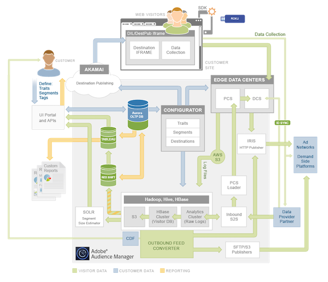

# Arquitectura de plataforma: mapa del flujo de datos{#platform-architecture-data-flow-map}

Este mapa contiene los principales sistemas de Audience Manager. Representa visualmente cómo fluyen los datos hacia y desde los componentes de Audience Manager, así como entre ellos.

## Cómo leer este mapa {#compmap}

<!-- 

c_compmap.xml

 -->

En el mapa, el cuadro gris contiene [!DNL Audience Manager] sistemas. Algunos componentes son completamente internos y otros se sitúan en el límite entre [!DNL Audience Manager] y el mundo exterior. Como cliente de [!DNL Audience Manager], los componentes internos suelen ser transparentes o inaccesibles. Sin embargo, a veces puede interactuar con estos sistemas a través de la interfaz de usuario o las integraciones de datos. Los sistemas del extremo del cuadro recopilan y envían datos entre [!DNL Audience Manager] y el mundo exterior.

Los colores definen el tipo de datos que fluyen dentro y fuera de [!DNL Audience Manager]. Verde son los datos del cliente, azul son los datos del cliente (personas que visitan el sitio) y naranja son los datos utilizados para el sistema de informes.

Para obtener descripciones y resúmenes del sistema, consulte las secciones de datos [action](../../reference/system-components/components-data-action.md), [collection](../../reference/system-components/components-data-collection.md), [processing](../../reference/system-components/components-data-processing.md) y [tag management](../../reference/system-components/components-tag-management.md).

