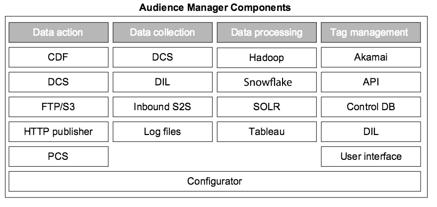

# Componentes clave en el sistema de Audience Manager{#key-components-in-the-audience-manager-system}

Audience Manager agrupa sus sistemas y procesos en cuatro categorías principales: administración de etiquetas, recopilación de datos, organización de datos y capacidad de acción de datos.

<!-- 

c_compstack.xml

 -->

La siguiente ilustración muestra los componentes principales y la tecnología subyacente (hardware y software) que alimentan [!DNL Audience Manager]. Aunque algunos procesos realizan funciones específicas y otros tienen funciones multipropósito, todos los sistemas trabajan juntos para ayudarle a administrar etiquetas, recopilar datos, analizar el rendimiento, sincronizar información con otros sistemas y tomar medidas con esa información.

