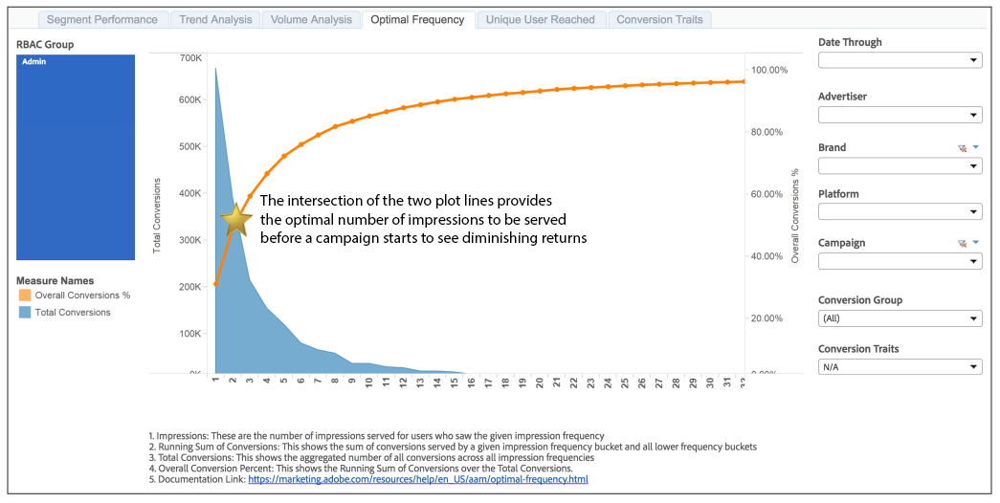

# Informe de frecuencia óptima{#optimal-frequency-report}

El informe de frecuencia óptima le ayuda a descubrir el equilibrio óptimo entre el número de impresiones y conversiones servidas. Le permite ajustar el número de impresiones que desea mostrar antes de comenzar a ver una disminución de los retornos.

El informe tiene un intervalo retrospectivo de 30 días, a partir de la fecha elegida en el selector [!UICONTROL Date Through].

El volumen de conversión suele disminuir con bloques de frecuencia de impresión más altos. Menos usuarios ven el mayor número de impresiones. Esto significa que los bloques de mayor frecuencia tienen menos conversiones.

Sin embargo, el porcentaje de conversión global aumenta con cada bloque de frecuencia de impresión. Se generan más conversiones con cada bloque, por lo que la suma de conversiones (el numerador) se aproxima al número total de conversiones posibles (el denominador) y, por lo tanto, el % aumenta.

Como se muestra en el informe de muestra, la intersección de las parcelas de 2 líneas proporciona una guía para la frecuencia de impresión &quot;óptima&quot;, es decir, el número óptimo de impresiones que se deben proporcionar, antes de que el cliente comience a ver rendimientos decrecientes.

## Informe de ejemplo

