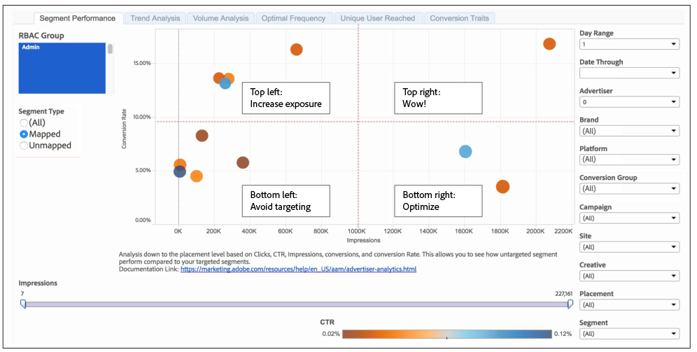

# Informe de Rendimiento del segmento{#segment-performance-report}

El informe [!UICONTROL Segment Performance] compara segmentos asignados y no asignados por impresiones y tasas de conversión. Un segmento asignado es un segmento que se crea y se envía a un destino para su objetivo. Un segmento sin asignar es un segmento que ha creado pero que no ha enviado a un destino para su objetivo. La comparación de estos diferentes tipos de segmentos dentro de los informes y entre ellos le ayuda a optimizar las campañas existentes y a encontrar los segmentos que se han pasado por alto y que quizá desee enviar a un destino para el objetivo.

## Cómo leer los resultados del segmento asignado {#read-mapped-segment-results}

El informe [!UICONTROL Segment Performance] asignado muestra todos los segmentos que ha creado y enviado a un destino para su objetivo.La posición de los segmentos asignados en un informe puede indicar en gran medida qué segmentos tienen buen rendimiento y dónde podría necesitar realizar algunos ajustes.

Para leer el informe, ayuda a dividir los resultados en 4 secciones con líneas imaginarias (en rojo) y las categorías mostradas en el informe de muestra a continuación.

Las etiquetas del ejemplo y de la tabla siguiente pueden ayudarle a comprender el rendimiento de los segmentos y a responder a estos resultados.

<table id="table_A29253B30DFA4CD7B3B7C320DE0BDEA4"> 
 <thead> 
  <tr> 
   <th colname="col1" class="entry"> Posición </th> 
   <th colname="col2" class="entry"> La ubicación indica </th> 
  </tr> 
 </thead>
 <tbody> 
  <tr> 
   <td colname="col1"> 
 <b>Superior izquierda</b> 
 </td> 
   <td colname="col2"> 
Buenas tasas de conversión. 
 
Puede obtener más conversiones aumentando las impresiones. 
 </td> 
  </tr> 
  <tr> 
   <td colname="col1"> 
 <b>Inferior izquierda</b> 
 </td> 
   <td colname="col2"> 
Tasas de conversión bajas. 
 
Puede que desee evitar tener como objetivo estos segmentos. Los segmentos de esta sección convierten a los buenos candidatos en comparaciones con los de los resultados de segmentos sin asignar. Algunos de los segmentos sin asignar pueden funcionar mejor que los segmentos a los que ya está dirigiendo. 
 </td> 
  </tr> 
  <tr> 
   <td colname="col1"> 
 <b>Superior derecha</b> 
 </td> 
   <td colname="col2"> 
Rendimiento sólido. Deje estos segmentos en paz. 
 </td> 
  </tr> 
  <tr> 
   <td colname="col1"> 
 <b>Inferior derecha</b> 
 </td> 
   <td colname="col2"> 
Tasas de conversión bajas e impresiones elevadas. 
 
Los segmentos de esta sección no tienen un buen rendimiento. Es posible que desee desplazar el presupuesto de estos segmentos a segmentos en el cuadrante superior izquierdo del informe. Esto ayudará a reducir las impresiones y puede ayudar a mejorar las tasas de conversión de los segmentos en esta sección inferior derecha. Además, compare estos segmentos asignados con los segmentos sin asignar. Algunos de los segmentos sin asignar pueden funcionar mejor que los segmentos a los que ya está dirigiendo. 
 </td> 
  </tr> 
 </tbody> 
</table>

## Cómo leer los resultados del segmento sin asignar {#read-unmapped-segment-results}

Ver segmentos sin asignar en un informe [!UICONTROL Segment Performance] es una buena manera de encontrar nuevos segmentos que no ha considerado para objetivos. De hecho, algunos de estos segmentos pueden superar el rendimiento de los segmentos asignados. Esto se debe a que un segmento sin asignar tiene que cumplir un conjunto de criterios de calificación que se incluirán en este informe. Para incluirse en este informe, un segmento sin asignar debe:

* Tenga buenas las conversiones que superen el promedio de todos los segmentos asignados.
* Esté entre los 100 segmentos sin asignar principales por tasa de conversión.

Para leer este informe, ayuda a dividir los resultados en 4 secciones con líneas imaginarias (en rojo) y categorías que se muestran en el informe de muestra a continuación.

En este informe, solo desea centrarse en esos segmentos sin asignar en la sección superior izquierda. Estos segmentos sin asignar exhiben tasas de conversión altas para un bajo nivel de impresiones en comparación con los segmentos de las otras tres secciones.

>[!NOTE]
>
>Los períodos de 7 días y 30 días de consulta solo están disponibles para las fechas de los domingos **[!UICONTROL Date Through]**.
